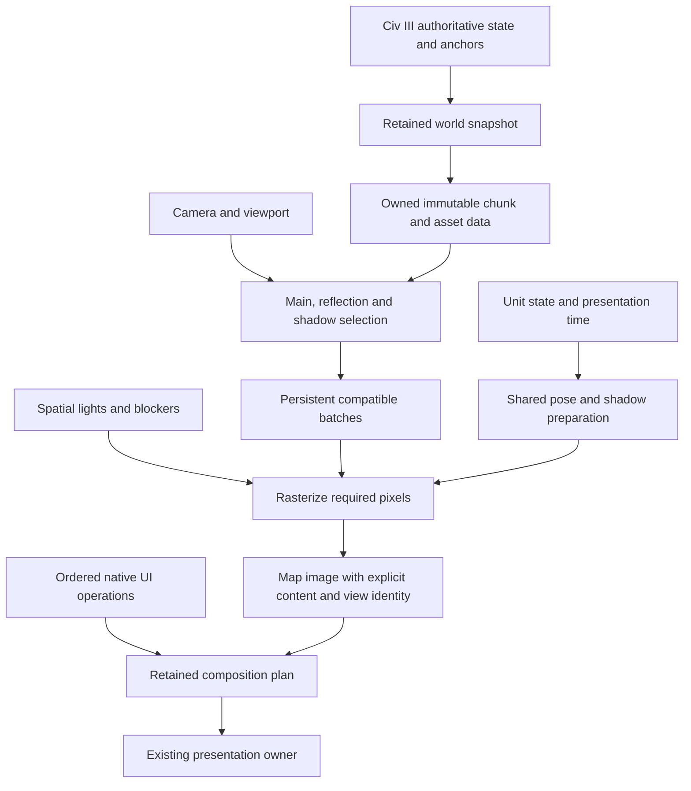

# Performance engineering review — September 29, 2026

## Recommendation

Prioritize the cost of drawing a **busy, changing view**. A quiet scene that
animates at 60 FPS does not establish responsive scrolling, zoom, or a developed
map with cities and units. The architecture should make camera changes select
and project existing world data, with work bounded by contributing objects and
pixels. Native capture and composition then need their own latency budget.

The existing renderer already contains valuable parts of this architecture.
The work is to finish their separation and remove repeated work, while keeping
the current graphics and authoritative Civ III behavior. A new graphics API,
larger caches, or more rendering threads are not prerequisites.

This review supplements the [earlier measurements](renderer_performance_audit.md)
and [0 A.D. review](0ad_renderer_review.md). It checks the current working tree,
including pre-existing uncommitted work. It does not implement performance fixes
or create a new milestone ladder. Wonders and District renderer work remain
deferred.

### Performance and perceptual quality target

The user clarified that the target is sustained 60 FPS across supported scenes
and actions, including realistic busy cases. Intermediate improvements do not
complete that goal. Report missed 16.67 ms frame deadlines, stalls and time to
the correct new view, alongside frame-time distributions.

The user also permits imperceptible differences and very brief detail reductions
during transitions, such as showing a less detailed destination for a few frames
after a map jump. Preserve the full-quality settled appearance. Screen-space LOD,
progressive refinement and similar techniques are valid candidates when their
perceptual benefit and recovery are demonstrated. Pixel identity on every
transition frame is not required. Assess sequences at normal playback speed,
and measure both frames and milliseconds to full quality, including repeated
input that might otherwise prevent refinement. Preserve authoritative placement,
visibility, selection and interaction correctness throughout. Persistent visible
degradation does not meet this policy. These clarifications supersede stricter
blanket statements about temporary detail reductions in earlier audit guidance.

## Evidence and limitations

Reviewed paths include injected map capture and camera handoff, scene publication,
x86/x64 transport, worker scheduling, geometry preparation and residency, main/
reflection/shadow/water passes, unit selection and animation, city lights,
retained native composition, GPU presentation, asset representation, and the
measurement harnesses. Offline importer work matters to load time and resident
data size; it is not counted as per-frame execution. This is a rendering and
interaction audit, not a benchmark of Civ III AI or turn processing.

The checkout is at `6e73b668` plus local changes. The isolated build uses the
production `C3X_RENDERER64_FRESH` translation unit, optimized x64 compilation,
and the existing standalone client. It is not installed or staged. Local
receipts are under `Renderer/native/build/performance-review-current/`.
`source-before.json` records 440 C/C++/shader inputs; its sorted `path:hash`
fingerprint is `b35c3a7356f4df807fc9ad4918b3eb674436091e582f7982faf3bc25fb8a6c33`.
The DLL SHA-256 is
`bafb4e85359286ac61957e0e8d513fdbce70ca3be4609d58c12fccb03a411821`.

Source findings below are confirmed behavior; their individual time savings
remain estimates until measured. Existing live results belong to their recorded
binary and scene. They must not be relabeled as measurements of this build.
0 A.D. was inspected locally at
`0ed48b3a1fb1b4b718a78869fa497185af55e086`; it was not benchmarked alongside C3X.

### New isolated measurements

These runs use the Windows 11 Parallels VM at 2240×1260, one scene sample,
the existing full-detail packs/control shader tree, water/waves/reflections on,
and normal `Present(1,0)`. No game, compiler or second GPU test ran concurrently.
The source hashes still matched after these runs. Pack contents were not frozen
and fingerprinted before these runs, so these are diagnostic measurements rather
than a complete release-acceptance receipt. The run scripts preserve the selected
definitions, shader root and scene identity.

| Workload | Warm samples | Median ms | p95 ms | Worst ms |
| --- | ---: | ---: | ---: | ---: |
| Terrain-heavy idle, 1× | 177 | 16.66 | 17.14 | 34.28 |
| Same scene held at 1.25× | 117 | 16.67 | 17.38 | 215.30 |
| Same scene, changing 1×–1.25×, A | 87 | 133.24 | 188.71 | 401.87 |
| Changing zoom repeat B | 87 | 132.71 | 192.20 | 441.09 |
| Existing developed-object generator, noon, changing zoom | 87 | 133.30 | 155.93 | 402.73 |
| Same object generator, midnight, idle | 117 | 16.66 | 33.44 | 217.99 |
| Same object generator, midnight, changing zoom | 87 | 184.01 | 366.29 | 421.43 |
| Six-city developed fixture, noon, changing zoom | 87 | 133.34 | 232.84 | 300.06 |
| Six-city developed fixture, midnight, changing zoom A | 87 | 601.05 | 1393.29 | 1839.00 |
| Six-city midnight repeat B | 87 | 600.36 | 1249.99 | 1316.58 |

These are wall-clock `draw + Present` call durations. The synthetic clock advances
one 30 Hz source step per call; the loop is not a real-time input replay. In-place
zoom changes the real projection. The roughly 133 ms median reproduces the earlier
severe zoom result on current source. Held zoom versus changing zoom demonstrates
how much the quiet result depends on retained pixels. The midnight zoom median
is about eleven 16.7 ms frame budgets.

In zoom A, median CPU/driver draw span is 21.08 ms and median `Present` span is
110.75 ms. Selection/shadows, reflection, static redraw and water spans are
2.47/6.04/8.49/3.33 ms respectively. In midnight object zoom, draw/Present medians
are 26.29/158.68 ms. Do not infer that `Present` itself performs all that work:
GPU backpressure, synchronization and VM presentation behavior can surface there.
Pass quantiles do not add to total quantiles.

The existing supposedly dense generator actually produces nine city sites in
this world, with just **two city tile rectangles intersecting the initial view**.
That count comes from the CSV and generator predicate, not GPU visibility.
It supplies many improvements/resources but is insufficient for the requested
many-city case. `dense-city-sites.json` records the check. Its object variant
raises reported records from 23,709 to 28,964 and cached geometry from about
1.17 GB to 1.29 GB. It still has at most four synthetic actors.

An additional synthetic developed-map fixture permits six city sites in the
initial view. Eight planned nonwater city sites across the world were changed
to their existing base terrain so the generator could place cities there;
coastline and relief elsewhere were retained. The initial image was inspected.
This is a controlled workload, not a recorded save. The fixture, changed sites,
and hash are in `developed-scene.csv` and `developed-scene.json`. It raises records
to 29,441 and reported cached geometry to 1.30 GB. The night run demonstrates a
much worse populated-scene failure than the two-city result. It still does not
exercise the production many-unit path or native labels/composition.

The midnight/noon difference changes lighting, shadows and emissive state
together; it is not an isolated timing of the local-light loop. A further control
copied the shader tree into the ignored audit directory and made only
`q8_local_irradiance` return zero in its ten scene-sized shader copies. Nighttime
environment, geometry, emission and all other features stayed enabled. Complete
shader source participates in the compiled shader cache key, so the changed
copies compiled independently. Production sources and packs were not edited.

That diagnostic control measured **129.74 ms median, 293.82 ms p95 and 1057.33 ms
worst** over 87 warmed calls, compared with the repeated approximately 600 ms
night baseline. It also had 25.9 seconds of scene/swapchain priming and a
2264.37 ms initial transition at frame 2, preserved in the receipt. This is
strong causal evidence that local-light shading causes
most of the additional median night cost in this fixture. It is not a precise
GPU timer, a measured speedup from spatial indexing, or a quality-preserving fix.
It also leaves approximately 130 ms of full-scene cost to address. The scripts,
shader changes and source-tree identities are recorded in `light-ablation.json`
and `run-light-check.bat`.

Many-unit production costs remain unmeasured here, and the busy-scene contract
below must remain an open requirement.

The 1.25× synthetic pan branch measured 126.37 ms median/134.08 ms p95, versus
16.67 ms median while held. Because of the camera-path defect below, this is
evidence that the invalidation branch is costly, not a verified scrolling FPS
or pixel-correct camera result. Do not use its 1× counterpart as a live baseline.

Process-cold preparation was roughly 17–40 seconds across the unmodified diagnostic
workloads, uploading about 872 MiB for the original scene or 986–998 MiB for the
developed scenes, followed by priming. That is whole-fixture preparation;
it is not a measured live-game loading time.

### Measurement corrections

1. **Standalone camera motion is not the production camera path.**
   `client_x64.cpp` copies `prepared_frame`, changes its clock, and passes separate
   camera offsets to `c3x_sandbox_draw_fresh`. In `fresh_pipeline.h`, applying those
   offsets to `geometry_viewport_settings` is inside
   `#ifndef C3X_RENDERER64_FRESH`. The audit build defines that macro. Production
   obtains the view transform from authoritative frame preparation instead.
   Thus these standalone scroll/jump arms exercise invalidation and cache motion
   without establishing equivalent geometry movement or camera adoption. Their
   timings can expose expensive branches, but cannot qualify live scrolling.
   This also qualifies the earlier audit's standalone scroll/jump conclusions.
2. **Initial stalls now have separate records.** The current client logs its
   first three frames as `CLIENT_TRANSITION`; the warmed distribution still
   excludes them. Preserve both. The earlier report's statement that those frames
   were simply discarded describes its older client.
3. **Verify the input actually changed.** The held-zoom option clamps a supplied
   value to at least 1. Clearing that environment variable selects animated zoom;
   setting it to zero holds 1×. The first two nominal zoom arms in this review
   exposed that setup error and are preserved as `fixed1-control-*`, excluded
   from changing-zoom results. Corrected arms have their actual zoom trace.
4. The first launch used a noninteractive guest session and failed swapchain
   creation with `0x887a0022`. Its `noninteractive-*` receipts are excluded.
   Subsequent runs use the repository's current-user VM dispatcher.
5. The standalone synthetic unit path draws at most four actors. It does not
   exercise the full production `UnitInstances` selection and `draw_real` path.
   Its small unit timing cannot establish the cost of 64 or 128 visible units.
6. CPU/driver spans and `Present` waits are not GPU pass timings. Submission FPS
   is not physical scanout or input-to-correct-view latency. The virtual adapter's
   timestamps need the existing validity checks; forced completion probes alter
   scheduling and are diagnostic only.

### Changes already present

Do not schedule these again as newly discovered fixes:

- Native operation/transaction success logs are now gated by diagnostic level.
- `RetainedComposition::draw` no longer performs the extra mid-frame `Flush`.
- Geometry-projected 1× image conversion has a single-fetch path.
- Vegetation already uses hardware instancing, an append/discard instance stream,
  and an alpha depth pass. Draw constants already have a D3D11.1 stream.
- Reflection has guarded visible-water bounds; retired views release live recipes.
- Meshes, materials, animation palettes and shader compilation are already cached.

These changes do not eliminate the remaining full display copy, broad pass lists,
camera-dependent invalidation, or dense-unit/city scaling costs.

## Findings and changes needed

### 1. World content, view selection, and pixel validity are coupled

**High confidence; highest general navigation priority.**

`RendererState::geometry_matches` compares selection, geometry signature, tile
count, each tile's content and each anchor delta. When a viewport changes its
tile membership, reuse can fail even though most world meshes are resident.
The replacement path clears selected geometry records and increments
`tile_geometry_epoch`. `SandboxFreshPipeline::scene_revision` incorporates that
epoch, so a lifetime/selection change can invalidate the resident occurrence
list, static pixels and shadow references together.

The epoch protects real pointer lifetimes. Removing it or weakening its key is
unsafe. Instead, give immutable mesh generations stable owned handles and keep
separate revisions for world content, visibility/occurrence selection, light
inputs, and raster projection. Use the existing publication journal to dirty
affected chunks. A camera entering a new strip should acquire those chunks and
change transforms; unchanged chunks should retain their data and pass batches.

Native 64/128 tile-width changes remain another preparation route. Normalized
mesh data already exists in some providers; extend that representation where
geometry is truly scale-independent. Do not assume all procedural relief,
placement, depth and raster-phase inputs can share a key without checking them.

**Acceptance:** resident pan, zoom, wrap and jump build/upload no unchanged static
mesh data; a real local edit invalidates the affected dependency closure; old
views remain safe until retirement. Test the actual native camera route and the
first correct frame, including city-centered native zoom.

Sources: `native/c3x_renderer.cpp` (`geometry_matches`, geometry replacement near
line 7460); `sandbox/fresh_pipeline.h` (`scene_revision`, `capture`).

### 2. Fixed zoom above 1× also loses scrolling pixel reuse

**Confirmed expensive branch; a separate issue from changing zoom.**

`SandboxFreshPipeline::draw` invalidates static and reflected state both when
projection zoom changes **and whenever the camera moves at any zoom other than
exactly 1×**. Consequently, even a settled 1.25× view abandons the scrolling cache
on the next camera step.

Changing zoom requires reprojecting geometry; reusing old projected color/depth
as if it were current would be wrong. At a fixed zoom, however, an orthographic
camera translation is still a translation. Investigate a cache in projected
coordinates with correct fractional phase, guarded coverage and depth offsets.
Only reuse pixels when those conditions match. Do not round away subpixel motion
or stretch a completed image to simulate geometry zoom.

This is a potentially focused improvement beside the larger world-data work.
Even perfect scrolling reuse will not make continuous zoom cheap: the renderer
must also draw the fully rerasterized scene within budget.

**Acceptance:** fixed 1.25×/1.5×/3× pans match independent renders for seams,
depth, wrap and fractional phases; distinguish reused pixels from full redraws.
Continuous zoom must separately meet the frame budget with real geometry.

Source: `sandbox/fresh_pipeline.h`, invalidation near line 1990 and region fill/
restore near lines 2075–2150; `native/scene_projection.h`.

### 3. Select contributors before building and uploading pass batches

**High confidence; impact grows with busy forests, cities and coasts.**

`capture` copies records into a resident list, adds horizontal wrap occurrences,
then scans for main and reflection candidates. It is a broad selection; later
draw calls apply inverse-projection bounds again. Reflection's water rectangle
is computed after that selection. Shadow receiver input includes the union of
main and reflected candidates, including repeated occurrences. Scissors limit
rasterization but do not eliminate submitted vertex or CPU work.

Vegetation admits a record by bounds and then uploads all its instances. Rigid
objects batch only adjacent compatible records in a 256-record flush. City
material records bind material state and issue individual draws, often followed
by an emission draw. A busy view amplifies these costs across multiple passes.

Use a coarse world grid or chunk index, then conservative per-object tests for
main view, reflected-water coverage, and shadow receivers/casters. World wrapping
should select occurrence transforms for intersecting chunks. Preserve tree tops,
cross-tile geometry, reflection distortion and offscreen shadow reach. Group
compatible opaque/cutout draws by pipeline, mesh and material, retaining those
groups across camera changes when possible. Keep ordering for transparent draws.

Retain static instance attributes on the GPU; change compact selections and
per-view constants when possible. Existing append/no-overwrite streams are a
good fallback for genuinely dynamic data. Do not replace them with frequent
synchronous buffer creation or readback.

**Acceptance:** report candidates versus submitted records, instances, triangles,
draws, binding changes and upload bytes per pass. Demonstrate smaller submitted
work and identical contributing geometry, not merely fewer vector entries.

Sources: `sandbox/fresh_pipeline.h` (`capture`, `reflected_water_bounds`,
`issue_records`, `draw_vegetation_instances`, `SandboxSceneShadow::render`);
`native/render_core/instance_stream.h`, `draw_parameter_stream.h`.

### 4. Nighttime city lighting has a multiplicative worst case

**Confirmed algorithm; high priority for a developed nighttime map.**

The six-city zoom repeated at roughly 600 ms median; removing only this shader
contribution in a disposable control reduced the median to roughly 130 ms.
Treat spatial light/blocker selection as immediate work alongside navigation
costs, without waiting for the larger world-data refactor.

`update_city_lights` gathers lights from selected city records. `SceneLights::upload`
rebuilds/uploads the selected light and blocker field, including unchanged inputs.
The local-light shader first rejects pixels outside a single scene envelope,
then loops over **every selected light**. For a light that passes distance and
orientation tests, it can loop over **every selected blocker**. Early exits help,
but do not bound each pixel to nearby lights and buildings. Two distant cities
also enlarge the empty area enclosed by the global bounds.

The work has an upper-bound structure of `pixels × lights × blockers`, with
distance/orientation/occlusion rejection reducing actual work. This is not a
claim that every pixel always executes every test. Daylight sets the local light
count to zero, so noon measurements entirely miss this risk.

Build spatial light lists for receiver chunks or screen tiles. Preselect each
light's possible blockers from its finite influence volume and preserve exact
ray/box tests for that smaller set. Cache immutable light/blocker data and update
selection only when scene/view/light state changes. A small CPU-built spatial
grid may suffice before adding a GPU clustered implementation. Keep all lights
that can contribute; do not impose a lossy per-city light cap.

This follows the established idea of assigning lights to affected regions in
[clustered shading](https://research.chalmers.se/en/publication/161725). The C3X
adaptation is a proposal, not a claim that 0 A.D. implements this lighting path.

**Acceptance:** the same developed scene at noon, dusk and night; several nearby
cities and separated cities; unchanged lighting and blocker results; measured
light/blocker tests and upload bytes. Reuse cached pixels where valid, while
also measuring camera/zoom frames that must shade again.

Sources: `native/city_fidelity/scene_lights.h`, `local_lights.hlsl`, `gpu.h`;
`sandbox/fresh_pipeline.h::update_city_lights`. The preserved control shaders
contain the same nested local-light/blocker loops.

### 5. Busy units require a different assessment from four synthetic actors

**Confirmed repeated work; exact frame-time share is unmeasured at busy density.**

- `UnitInstances::scene_poses` scans captured tiles to find each eligible unit's
  visible occurrence. This is up to `eligible units × captured tiles`, including
  wrap comparisons. Build one indexed occurrence selection per authoritative
  view and preserve native visibility and stack representative rules.
- `UnitPoseTransitions::retain` searches the visible vector for each saved facing
  and pose state. It runs at the start of reflected and main `draw_real` calls.
  Replace repeated membership scans with one incarnation-aware set or mark pass.
- `draw_real` repeats ground sampling, action checks, facing access, shadow fitting
  and self-shadow rendering for reflected and main views. Joint palette sampling
  already caches the same timestamp; the rest is not automatically shared.
- Reflection considers the real-unit list with a broad viewport guard. Give it
  conservative reflected-water contributor selection before pose/shadow work.
- Unit/material parts still require multiple draws and updates. Count actual
  figures, parts, skinned vertices and distinct rigs in addition to logical units.

Prepare each visible pose and light-dependent self-shadow once per relevant
revision, then consume it in the necessary passes. The current shared scratch
self-shadow texture cannot simply be reused later for every unit: use a bounded
atlas/pool or schedule each unit's consumers while its shadow remains valid.
Cache frozen/explored poses according to native animation rules; preserve action
events, ID reuse, death, reveal, stack selection and accepted movement.

Compute skinning may amortize repeated vertex transforms for many multipart
units, but should follow measurements. The current vertex skinning and immutable
palettes are already useful. CPU animation membership fixes and shared preparation
can be done without a compute rewrite or changes to gameplay progression.

**Acceptance:** at least 32/64/128 visible body selections, mixed authored rigs,
workers, native moves and combat transitions; count reflected contributors
separately. Record selection, pose preparation, self-shadow and body costs.
The total roster and hidden stacked units are separate from rendered bodies.

Sources: `native/render_core/unit_instances.h::scene_poses`,
`native/render_core/unit_pose_transition.h::{retain,sample}`,
`sandbox/direct_units.h::{draw_real,draw_self_shadow,unit_low_ground}`.

### 6. The native composition graph can amplify a small animated change

**Confirmed dependency mechanism; sparse live evidence makes this a core priority.**

An advancing map sample changes node revisions. Dependent native copy, mask,
format-conversion, projected-selection and overlay operations may then rerun.
`RetainedComposition::draw` collects/evaluates dependencies, assembles the front,
displays it, and copies the full display to a retained buffer. Existing pools,
direct-input shortcuts and partition optimizations already avoid some work.
They do not imply a minimal per-frame execution plan.

Compile stable graph topology into a reusable plan, cache map-independent UI,
and propagate changed rectangles through the operations that actually depend on
them. Compact overwritten history while preserving read-before-write aliases.
Count full-surface sweeps, copies and assembly pixels. Investigate making the
retained display copy demand-driven for explicit readback/handoff; preserve
`trial_surface_pixels` and ownership transitions that consume it.

Batch compatible operations and fuse compatible output conversions only when
their integer rounding, dithering, blending and ordering remain exact. Native
555/565 behavior and fixed-size text are real requirements. Globally sorting
native operations by texture or flattening every layer would violate them.

At 2240×1260, a BGRA read/write sweep is about 22.6 MB, or 1.35 GB/s at 60 Hz.
FP16 RGBA doubles that. These are traffic estimates, not measured bandwidth.
Several passes can be expensive on the VM despite small CPU submission spans.

**Acceptance:** dense city labels, selection, unit HUD, route text, advisor/menu
transitions and partial updates; exact composition pixels and bounded retired
history; lower operations/copies/pixels for the same final output.

Sources: `native/retained_composition.h::{collect,evaluate,assemble,draw}`,
`native/gpu_composition_session.h`, `native/gpu_view_transform.h`,
`native/c3x_renderer.cpp` direct visual and diagnostic surface paths.

### 7. Asynchronous publication does not by itself bound camera latency

**Confirmed serialization; scheduling contribution needs matched measurement.**

The game thread copies and posts work. The transport thread executes ordered
request/response RPCs through one shared channel; each call waits for a helper
reply. The helper then services renderer work through the existing owner.
Camera requests are replaceable; reliable image/action/lifetime events are not.
An already executing obsolete request also survives queue coalescing until its
next cancellation boundary.

The 128 MiB/8,192-packet queue limit is a failure bound, not an interactive latency
budget. A fast producer can still leave the display far behind. Batch native
operations into bounded ordered packets, with barriers at observable reads,
aliases, lifetimes and final transfers. Keep the latest replaceable camera
request; maintain reliable gameplay/UI order and a scoped reconciliation path.
Make background preparation yield at bounded work boundaries.

The cadence tries every 16,667 microseconds and retries BUSY sooner. A DXGI
not-ready opportunity returns PENDING instead. Coordinate input availability,
presentation readiness and the timer in one scheduler so an available frame
does not wait needlessly for another period. Keep one immediate-context owner;
Microsoft's [D3D11 threading guidance](https://learn.microsoft.com/en-us/windows/win32/direct3d11/overviews-direct3d-11-render-multi-thread-intro)
supports parallel preparation with serialized context/DXGI use.

**Acceptance:** one clock from input/accepted native camera decision through
capture, queue, preparation, adoption and first correct presentation. Report
oldest queue age/bytes, service spans, BUSY/PENDING reasons and frame intervals.
Continuous animation of the old camera must not count as a responsive new view.

Sources: `sandbox/async_publication.h`, `async_scene_client.h`,
`native/helper_trial/scene_client.h`, `scene_workload.cpp`,
`native/visual_cadence.h`, `presentation_permit.h`.

### 8. Native capture still expands small map redraws into broad work

`patch_Map_Renderer_m71_Draw_Tiles` expands the clip for asynchronous rendering
and traverses the full visible native map. `capture_custom_renderer_topology`
validates anchors and captures a 12-tile topology halo plus an appearance halo,
using a temporary occupancy allocation. `prepare_custom_renderer_frame` also
expands the asynchronous frame clip to the full surface.

These choices preserve a coherent view; deleting them would reintroduce partial
capture bugs. Instead, separate a retained authoritative snapshot from dirty
updates, keep a reusable bounded capture workspace, and use existing accepted
mutation/visibility notifications for scoped updates. Authoritative coordinates
and native UI ordering remain the source of truth. Whole-world topology audits
are conditional already; there is no evidence of one on every ambient frame.

Source: `injected_code.c`, functions above. This is a follow-on integration
change after renderer-side costs are isolated; no new patch-table symbol has
been established as necessary by this review.

### 9. Residency needs a total budget and useful preparation outside interaction

Keep separate: authoritative known state, compiled CPU/streamable data, GPU
residency, and completed pixel caches. A known world is not necessarily drawable
without preparation. Cold asset/action loads and native reduced city zoom need
their own results. Warm cache performance must not hide seconds of first use.

The terrain-heavy fixture has about 1.17 GB of reported cached geometry before
all targets, materials and composition resources. These accounting fields are
not a complete GPU allocation inventory. Larger cities, unit rigs, shadows,
retained history and queued input compete for the same machine's memory.
Track shared allocation identity to avoid counting one mesh once per instance.

Preserve CPU/streamable backing where it avoids expensive reconstruction after
GPU eviction, but budget it too. Compile independent immutable chunks in existing
workers, prewarm likely unit actions, and admit/uploads in bounded batches.
Do not hold the display transaction across a cold world's entire preparation.
Keep background work subordinate to current visible demand.

Vertex formats are already specialized (including 32-byte shared meshes,
48-byte features, 88-byte city and 92-byte natural vertices). Other terrain
records remain wider. Audit the active pass's consumed channels and index/cache
ordering before changing representation. Remove redundant fields and share
immutable data without discarding authored normals, UVs or detail. DDS compressed
textures and mip data already exist; texture compression is not a missing basic.

### 10. Secondary CPU overhead and maintenance

Reuse selection/batching container capacity or a bounded frame arena, and cache
city-light selections by revision. Avoid repeated global shader-resource table
bindings where a pass binds its own material closure. Retain append-only dynamic
streams and check feature support for no-overwrite constant buffers.

Diagnostic cleanup is partly complete. `RendererTrace` still defaults to level 1;
`fresh-callback`, `fresh-scene-phases`, and `fresh-unit-snapshot` use important
records that bypass its ordinary throttling. Some formatting happens before the
trace checks its level. Native map-complete/handoff records also remain. Aggregate
ordinary success counters and keep detailed records opt-in; benchmark attached
and unattached collectors. This is a small, bounded cleanup, not an explanation
for a hundred-millisecond standalone full redraw.

The production DLL includes a 15,000-line legacy implementation through the
sandbox translation unit. That makes active versus retired paths hard to audit.
After the critical fixes, extract explicit preparation/drawing interfaces and
rename production owners. Do not treat deleting unused code as an FPS win, or
replace established lifetime/correctness tests with tests of obsolete paths.

## What to borrow from 0 A.D.

| Source behavior at the inspected revision | C3X application |
| --- | --- |
| `TerrainRenderer::Submit` reuses patch render data; `CPatchRData::Update` rebuilds on dirty flags | Keep world mesh ownership independent of the current camera's records. Local mutation changes chunks; camera movement changes selection. |
| `SceneRenderer::EnumerateSceneObjects` selects main, shadow, reflection and refraction groups separately; water bounds constrain reflection | Select each pass's contributors before upload and draw. C3X's orthographic/native basis determines its bounds. |
| `ModelRenderer` buckets opaque models by technique/mesh/material and preserves distance order for transparency | Extend compatible object/city batches; preserve native operation ordering separately. |
| Model preparation deduplicates dirty skinned submissions across cull groups | Prepare unit pose/light/shadow inputs once, reuse across passes. |
| Terrain/model batching uses a scoped linear allocator; frame submission lists are cleared while render data survives | Reuse bounded frame storage while keeping asset/chunk lifetimes explicit. |
| GPU skinning has resident source/output buffers and upload phases | Consider shared skinned output when repeated multipass vertex work is demonstrated at busy density. |

Primary source links: [terrain patches](https://gitea.wildfiregames.com/0ad/0ad/src/commit/0ed48b3a1fb1b4b718a78869fa497185af55e086/source/renderer/PatchRData.cpp#L826),
[pass enumeration](https://gitea.wildfiregames.com/0ad/0ad/src/commit/0ed48b3a1fb1b4b718a78869fa497185af55e086/source/renderer/SceneRenderer.cpp#L1152),
[model batching](https://gitea.wildfiregames.com/0ad/0ad/src/commit/0ed48b3a1fb1b4b718a78869fa497185af55e086/source/renderer/ModelRenderer.cpp#L298),
[unique model preparation](https://gitea.wildfiregames.com/0ad/0ad/src/commit/0ed48b3a1fb1b4b718a78869fa497185af55e086/source/renderer/SceneRenderer.cpp#L189).
These files were read from the local pinned checkout; the web mirror was
unavailable to the browsing tool during this review.

Do not idealize the reference engine. Its unit renderer still scans units and
has explicit TODOs for spatial selection/offscreen animation. Its texture cache
still notes missing expiration. `InstancingModelRenderer::RenderModel` at this
revision issues a draw per model; that class name is not proof of hardware
instancing, which C3X vegetation already has. It also does not have to preserve
Civ III's cross-process native image semantics.

The transferable advantage is disciplined ownership, submission and data reuse.
The visual/unit-count comparison does not establish a hardware-matched speed
ratio. C3X's compatibility layer adds work, but does not require rebuilding world
data on a camera change or testing unrelated lights at every pixel.

## Priority and implementation order

The intended separation is:

Cache identity must express the dependencies of each box. A changed view should
not imply changed world meshes; a changed unit pose should not invalidate static
city geometry; a changed map sample should not redraw independent UI. Pixel
caches additionally depend on projection, lighting, depth and covered region.
The full uncached path must remain fast enough for continuous zoom and mutations.

| Order | Work | Expected reach | Effort / principal risk |
| --- | --- | --- | --- |
| 0 | Correct the production-path camera witness; use a dense acceptance scene and bounded CPU/GPU/queue counters | Makes subsequent claims reliable; keep this a small extension of existing tools | Small–medium; timestamp validity and workload identity |
| 1 | Separate world-content/mesh lifetime from view selection; tighter pass selection and persistent compatible batches | General scroll/zoom/jump cost; busy terrain/cities/foliage | Large, incremental; pointer lifetime, wrapping, cross-tile contributors |
| 1, alongside | Spatial city-light/blocker lists | Confirmed large cost on developed nighttime views | Medium; exact influence bounds, occlusion and cross-city contribution |
| 2 | Recover valid fixed-zoom scrolling reuse while making full rerasterization cheaper | Specific 1.25×+ pan cliff and continuous zoom | Medium; fractional pixel/depth phase and cache validity |
| 3 | Indexed unit occurrence selection and shared dense-unit preparation | Many visible unit parts, main/reflected passes | Medium; native actions, incarnation and self-shadow lifetime |
| 4 | Compact the native composition execution plan; reduce full-surface copies; batch ordered IPC and coordinate cadence | Sparse and busy live integration; input responsiveness | Medium–large; native alias/order/format contracts |
| 5 | Bounded cold preparation, residency and native scale reuse | First jumps, city zoom, large maps and long sessions | Large; incomplete authority/residency and memory pressure |
| Alongside | Aggregate diagnostics, reuse transient storage, remove proven redundant bindings | Small cumulative CPU savings | Small; preserve failure evidence and GPU hazards |

Lighting, unit preparation and native composition can progress independently of
the main scene refactor. Dense native UI may put composition first for a live
case even when the standalone scene is fast. This is a dependency-aware
recommendation, not a claim that one universal ordering fits every frame. Keep
changes small enough to compare against the same control.

Do not start with a Vulkan/D3D12 migration, a second presenter, a full ECS rewrite,
more immediate-context threads or unlimited whole-world caching. Eliminate work
that cannot affect the requested image. Evaluate perceptual LOD and brief
progressive refinement under the quality policy above when they materially help
meet the frame deadline; their place in the order should follow the evidence.
More sophisticated occlusion and compute skinning remain candidates when measured
costs justify them.

## Busy-scene qualification contract

These are proposed realistic stress workloads, not claimed existing passes.
Use an actual developed save when available, augmented by deterministic fixtures
for reproducible counts. Count **visible bodies and multipart figures**, not
every unit hidden in a Civ III stack. Preserve native stack representatives.

| Workload | Required contents and actions |
| --- | --- |
| Developed urban/coastal view | Target 6–12 cities where legal visible spacing permits; developed roads/rail/farms/mines/resources, forest/relief, water and reflections, city labels and borders; mixed unit types |
| Busy unit view | 32, 64 and 128 visible body selections; report multipart figures, bones, materials and triangles; ambient/work actions plus accepted motion/combat transitions; preserve realistic native concurrency |
| Dense night | The same populated view at dusk/night, including separated cities and overlapping local lights/blockers; continuous pan/zoom while the light field is active |
| Navigation | Pan at 1× and settled 1.25×/1.5×/3×, continuous zoom and reversals, diagonal pan, wrap, minimap jump, selected-unit centering, action following, native city 64/128 zoom |
| Mutation under motion | Fog reveal/hide, unit birth/death/reused ID, one improvement/city change, labels/selection/route updates while scrolling |
| Capacity | Standard 100×100 map (5,000 actual tiles), then Huge (12,800); resident, first visit, evicted revisit and post-edit; longer traversal and UI opening/closing to expose history growth |

Use the current full-quality appearance as the control, including geometry
projection, materials, normals, shadows, water, waves, reflections, animation and
native UI. Evaluate permitted perceptual or transient detail changes against
that control with the recovery measurements above. Simply leaving an effect off
does not pass this contract. The existing
`--dense-scene` fixture supplies cities/infrastructure; `--visual-units` currently
tops out at 32, and older native benchmark modes must be qualified against the
current asynchronous fresh path before their results are used.

Target a 16.7 ms steady visual frame budget, with p50/p95/p99 and worst intervals
reported separately, and the existing under-33 ms p95 target for coherent prepared
navigation. Cold/evicted views get explicit first-correct-frame timings. Report
initial preparation and memory peaks separately; never omit transition frames
from the latency result. Use enough frames for tail statistics; a 90-frame
diagnostic is not a p99 qualification.

Every result needs source/binary/pack identity, viewport, camera trace, counts,
clock/presentation mode, normal memory budgets, CPU/driver/GPU distinctions,
and image/depth/ownership checks. Reuse the executable tests for capture,
invalidation, wrapping, native composition, unit lifecycle and config-off.

No performance implementation in this review requires a new patch-table entry.
If later native notification work establishes a concrete missing hook, follow
the existing patch dependency ledger. Do not edit `civ_prog_objects.csv`.

## Code entry points

Paths are relative to `Renderer/` unless stated otherwise. Line numbers describe
the reviewed working tree and are navigation aids, not stable identifiers.

| Topic | File and entry point |
| --- | --- |
| Geometry selection and lifetime | [c3x_renderer.cpp](../native/c3x_renderer.cpp), `geometry_matches` at 6970; replacement at 7450–7463 |
| Selection revision and capture | [fresh_pipeline.h](../sandbox/fresh_pipeline.h), `scene_revision` at 997; `capture` from 1023 |
| Camera pixel invalidation | [fresh_pipeline.h](../sandbox/fresh_pipeline.h), condition at 1989; static cache reuse from 2084 |
| City light gathering | [fresh_pipeline.h](../sandbox/fresh_pipeline.h), `update_city_lights` at 1679 |
| City light uploads | [scene_lights.h](../native/city_fidelity/scene_lights.h), `SceneLights::upload` |
| Light/blocker shader loops | [local_lights.hlsl](../native/city_fidelity/local_lights.hlsl), `q8_local_irradiance`; frozen control copies contain the same loops |
| Native unit occurrence selection | [unit_instances.h](../native/render_core/unit_instances.h), `scene_poses` at 350 |
| Unit membership and pose cache | [unit_pose_transition.h](../native/render_core/unit_pose_transition.h), `retain` at 63 and `sample` |
| Main/reflected unit preparation | [direct_units.h](../sandbox/direct_units.h), `draw_real` at 542 |
| Native composition and retained copy | [retained_composition.h](../native/retained_composition.h), `collect` at 148; draw and full copy at 704–725 |
| Standalone workload and timings | [client_x64.cpp](../sandbox/client_x64.cpp), study options, draw loop and `CLIENT_CYCLE` aggregation |
| Authoritative native capture | [injected_code.c](../../injected_code.c), `patch_Map_Renderer_m71_Draw_Tiles`, `capture_custom_renderer_topology`, `prepare_custom_renderer_frame` |
