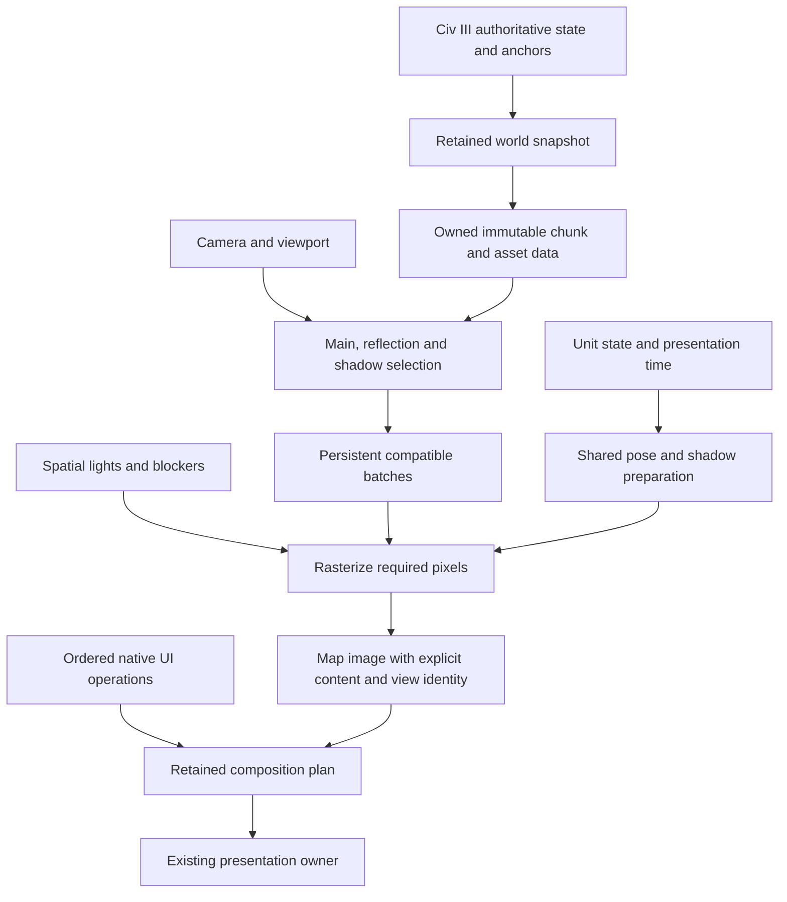

# Performance engineering review — September 29, 2026

## Evidence retention — October 1

At the user's request, obsolete generated raster/depth sequences, videos and
build object files from completed experiments were deleted to recover disk
space. Earlier verification receipts describe checks performed before that
cleanup; they do not imply every historical raw output remains available.
The deletion inventory is `Renderer/.cache/disk-cleanup/deletion-receipt.json`.
Current frame-delivery work, ordered-cold evidence, the predecessor raster used
by its cross-quality comparison, recovered I2 evidence, asset packs, saves,
source snapshots, binaries, logs, result tables and contact sheets were retained.
The cleanup left `Renderer/packs.zip` untouched; the user later removed it themselves.
Future runs should retain a bounded current/control set and evidence of unresolved
defects, then remove superseded bulk outputs after analysis. Do not accumulate
full raster sequences or duplicate archives for completed investigations.

## Active assignment: integrated navigation and submission refactor — October 3

The user explicitly requests one substantial implementation covering all obvious
remaining refactors, followed by code review and game measurements. This replaces
the earlier instruction to stop after the profiling-off baseline and the separate
delivery gates below. Finish the bounded baseline already running, retain its
evidence, then proceed directly with implementation. Do not wait for another
assignment or perform a full gameplay benchmark after each component.

Implementer owns the integrated implementation and VM verification. Root reviews
the resulting diff and, at the user's request, directly fixes confirmed review
findings while Implementer keeps source edits and VM runs paused. Existing agent/model settings remain unchanged;
Implementer may delegate independent work according to its configured settings.
Use internal commits and focused tests to keep the combined refactor reviewable.

### Root review and direct fixes — October 3

Reviewed the 25-file refactor at `577069a9e0a0030483330bd3f09739efd531155d`
and verified its source and baseline bindings before applying these fixes:

- **Correct presentation across rotating buffers.** `RetainedComposition::draw`
  previously displayed only the latest damage rectangle. The live caller rotates
  two `FLIP_SEQUENTIAL` buffers with `Present(0,0)`, so the next target may contain
  older pixels outside that rectangle. Keep changed-fragment assembly, but draw
  the complete retained canvas into each changed frame's presentation target.
  The host regression fails on the submitted code and passes with this fix.
- **Preserve unchanged fragments across native commits.** `assemble_front`
  now compares each fragment's owner, output, rectangle and revision rather than
  recopying the whole canvas whenever the front commit or any fragment changes.
  Tests cover replacement, output changes, reordering, splitting, merging,
  failed display retry, sparse fallback and optional storage refusal.
- **Repair and strengthen the native test.** The final-display fixture now uses
  BGRA, the format its display API accepts; existing native 555/565 sampling and
  HUD checks remain. It alternates presentation targets against the full oracle
  to exercise the actual rotating-buffer contract.

Two focused host tests pass. Native GPU execution and the integrated light/busy
comparison remain required; these changes do not establish an FPS gain. A root
invocation of the native wrapper failed during sandboxed Parallels startup before
test execution. Implementer should run the native checks through its established
VM workflow. No injected source changed.

**Remaining batching limitation:** the new nonrigid range merge requires a shared
vertex/index buffer, contiguous indices and identical draw parameters. Prepared
water geometry currently has separate per-tile owners, so ordinary neighboring
water tiles cannot merge through that predicate. Do not report cross-tile water
batching as complete. If water submission remains material in the integrated run,
the next structural change is shared prepared spatial buffers plus per-occurrence
placement parameters, preserving transparent order and bounded reader leases.
Reuse existing draw counters to establish the actual affected draw count; do not
start a separate profiling framework or a benchmark per component.

### Implement the connected path in one delivery

- **Resident selection and preparation:** in `native/c3x_renderer.cpp`,
  `reuse_geometry_for_translation`, canonical membership, and
  `render_core/geometry_draws.h`, preserve immutable mesh/material owners across
  camera movement. Select references to resident spatial content, update changed
  membership/placements and reuse unchanged proof results. Keep exact entering
  and leaving contributors. Remove repeated copying, rebuilding and whole-world
  checking on camera-only changes where the existing authority proves reuse.
  Linear visible-list selection can be legitimate; do not create elaborate
  indexing merely to eliminate a cheap loop. Keep generation/asset/device/viewer
  recovery and the full validation fallback.

- **Ready-frame delivery:** in `sandbox/async_scene_client.h`,
  `native/native_composition_owner.h`, the existing transport and renderer camera
  worker, make completion available promptly without repeated queued readiness
  RPCs followed by avoidable native poll turns. Prefer publishing one immutable
  completion descriptor with the existing wake/transport mechanism, then queue
  adoption behind the flushed old-ticket prefix. Readiness must never retire
  an image; only ordered adoption does so. Preserve exact ticket/session/source
  identity, descriptor lifetime, native destination lifetime, cancellation and
  stale-result rejection. If extending the wire is necessary, update and stage
  the matching bridge/helper/DLL and protocol tests together. Keep queues bounded
  and latest-camera replacement; never discard reliable native operations.

- **Native composition:** in `native/retained_composition.h`,
  `gpu_composition_session.h` and `gpu_spatial_composition.h`, retain unchanged
  operation plans and assembled surfaces. Carry changing world bindings separately
  from unchanged native HUD/UI operands where semantics permit. Remove redundant
  intermediate copies and repeat assembly; propagate real damage and extend
  compatible batching across the current safe boundaries. Preserve dependent
  reads, overlap, native color keys, partial UI writes, attached labels and
  CPU-access barriers. Do not replace the presenter or hide delayed cameras by
  counting extra presentations of the previous image.

- **Drawing batches and bounded residency:** in `sandbox/fresh_pipeline.h`,
  `issue_records`, shared placement streams and
  `native/render_core/ordered_rigid_submission.h`, prepare spatial/material groups
  from canonical content and draw compatible ranges together. Include water and
  foreground/static/city/infrastructure paths; leave animation as time/pose inputs
  to those groups. Preserve transparent ordering by joining only compatible
  ordered ranges where arbitrary sorting is invalid. Replace scope-long packet
  accumulation with lease-safe retirement or direct shared-placement addressing;
  unchanged capacity refusal must not repeatedly repack the same data. Release
  duplicate/replaced representations after their readers finish before tuning
  residency budgets. Preserve the loading-time RAM/GPU work and normal effects.

- **Zoom and scheduling:** reuse the same content/submission/composition changes
  throughout zoom; keep its existing copied target and independent visual clock.
  No native world recapture per intermediate scale. Keep live water/unit animation
  and sharp fixed UI. Remove unnecessary serialization and repeated work before
  adding jobs; use existing workers for independent immutable preparation while
  preserving game-thread authority and immediate-context ownership. Separate
  borrowed native/visual service in `service_camera_preparation` from world
  preparation cost and prevent obsolete camera work delaying current demand.
  If full-quality rendering still misses the authorized 40–50 FPS zoom target,
  implement bounded transient resolution/resampling with full-quality settling
  within this delivery where it is a practical fix, rather than opening another
  approval phase. It must not conceal a slow adoption path or freeze animation.

These are implementation directions, not instructions to force a speculative
algorithm into code. Fix adjacent obvious waste in the same pass. Where current
code already satisfies a direction, identify the existing path and move on;
where correctness prevents a proposed simplification, implement the safe useful
portion and report the specific remaining dependency. Do not spend the assignment
tuning obsolete structures or adding a replacement profiling framework.

### Review before expensive verification

The user explicitly requests root code review before spending time on another
large test run. Complete the connected refactor, then hand off its stable
diff/commit for one integrated root review **before** the broad verification
suite, staging or full VM gameplay comparison. Cheap compilation and focused
correctness checks remain appropriate during implementation. This is one review
of the complete change, not a new review/benchmark gate for every component.

The review-ready handoff must identify changed entry points, the recurring work
removed from each, any assignment items already satisfied by existing code, and
specific unresolved dependencies. Root checks the full request-to-display path,
hidden repeated work, invalidation scope, source/viewport identity, old-ticket
ordering, cancellation, memory lifetime and whether the tests cover the changed
contracts. Fix review findings before the integrated performance run. Code review
cannot establish FPS; the subsequent comparison must still measure that.

After root review, use existing focused tests for actual changes: async publication/native camera
transactions, canonical membership and mutation, ordered submission, composition,
wrap/fog, zoom/animation/picking and device/ownership recovery. Run the approved
injected compile smoke test only if injected C or C3X.h changes. Build the matching
production trio, then make one integrated comparison on the existing full-VM
light and busy routes with normal effects and profiling/census off. Reuse the
baseline already being collected; repeat only for a concrete failure or changed
candidate. Keep source/workload/Present joins and bounded evidence.

Report actual FPS/frame-time tails and input-to-correct-view latency for idle,
scroll, zoom and map jumps, plus completed-frame-to-Present delay. Target 60 FPS
ordinary play/scroll and 40–50 FPS zoom. Include distinct displayed movement,
not merely counter increments, and keep startup time separate. Return the code
diff/commit, tests, exact runtime identities, paired results and unresolved
critical costs together. Root then reviews the measurements and any changes since
the code review before accepting the result. A checklist of caches or passing synthetic tests is not a claim that
the navigation performance problem is resolved.

## Light-scene navigation is a required result — October 3

The user reports poor scrolling and zoom even in a new game with no cities and
few units, compared with the earlier renderer. Preserve the retained world and
loading work. Treat fast navigation in the existing light-save route as a direct
acceptance requirement, alongside the busy route. Historical initial-save FPS
is context only until save, route, dimensions and effects are matched.

Finish the profiling-off pair already in progress as the baseline, then continue
with the integrated assignment above. Diagnostic overhead can
distort comparisons but does not explain the user's ordinary gameplay symptom.
Use the same exact-source evidence to distinguish camera preparation, completed
camera waiting for adoption, composition, and successful presentation. FPS must
be accompanied by distinct displayed camera/zoom progress and latency: repeated
presentations of an older view do not establish responsive navigation.

The next navigation delivery should implement the following concrete behavior:

1. **Cheap camera selection over prepared content.** In
   `RendererState::render`, inspect the `reuse_geometry_for_translation` and
   canonical membership paths. A leaving tile currently disables the covered
   membership shortcut; that is not itself a defect. Keep exact entering and
   leaving membership, native ordering, visibility and shadow contributors, but
   make the changed selection cheap. Reuse overlapping content handles and
   unchanged dependency results; no source loading, mesh compilation or world
   GPU upload should recur on a fully prepared unchanged light-map revisit.
   At `SandboxFreshPipeline::capture`, distinguish actual ordered content changes
   from view-only selection changes before changing invalidation. Never suppress
   valid alpha-order, reveal or shadow invalidation to improve a counter.

2. **Prompt adoption and composition.** Use the existing
   `AsyncSceneClient::camera_poll` readiness/adoption and
   `CompositionOwner::poll_camera` transaction. Remove measured redundant waiting
   and repeated surface work while preserving the old-ticket native command
   prefix. A completed camera must not spend several display opportunities waiting
   for avoidable queue/poll turns. Keep unchanged native surfaces and compose
   actual damage, subject to read/overlap/colorkey dependencies. Do not replace
   the existing presenter. Camera preparation borrows native/visual service on
   the same rendering thread; measure that service separately, preserve reliable
   operations and live animation, and supersede obsolete camera-only work.

3. **Cheap displayed zoom.** The current wheel path already publishes a copied
   target without native world recapture. Preserve that property. Zoom changes
   projection and necessarily invalidates some raster/reflection results; it must
   retain canonical meshes/materials and avoid unrelated scene preparation.
   Apply the shared batching/composition delivery to those frames. If remaining
   full-quality raster cost prevents 40–50 FPS in motion, use the authorized
   transient resolution/resampling approach, with live animation, sharp UI and
   prompt full-quality settling. Do not use it to conceal slow camera adoption.

Use the existing full-VM light and busy routes with normal effects. Target
16.7 ms displayed intervals for scrolling and roughly one to two frames of
response for prepared nearby navigation; report p95 and worst stalls rather than
declaring success from an average. Check reversals, viewport-boundary crossings
and actual displayed motion using bounded existing evidence. If native stepped
camera movement remains visibly coarse after latency is fixed, assess the
documented renderer-owned smooth-pan contract separately, preserving displayed
picking, attached overlays, wrapping and native camera authority. A high Present
counter alone cannot close that user-visible issue.

## Current coding handoff: R5 regression — October 3

The user requests active source-level guidance. R5 is now committed as
`a0055781`. Root joined the ten strictly matched scroll destinations to the exact
remote camera completion, native adoption and successful Present. The means are:

| Span | Control | R5 |
| --- | ---: | ---: |
| Acceptance to camera completion | 746 ms | 1497 ms |
| Camera completion to native adoption | 482 ms | 807 ms |
| Native adoption to correct Present | 485 ms | 536 ms |
| Nested render preparation/assembly | 212 ms | 928 ms |
| Nested scene draw submission | 405 ms | 395 ms |

The render preparation span includes borrowed native/visual service, which rises
from 40 to 242 ms per matched camera. Those times overlap; do not add them to
the enclosing spans. Shadow work improves in the sampled matched windows. Another
shadow-cache rewrite does not follow from this regression evidence.

**Correct the measurement path first.** `RendererState::memory_sample` performs
`AddressSpaceSample::capture` and a complete resident-mesh buffer/GetDesc walk
whenever `C3X_RENDERER_PROFILE=1`. `render` invokes it at frame start and after
target setup, with more calls at allocation boundaries. The larger preloaded
world increases the diagnostic work. Buffer-inventory trace brackets alone
average 7.47/25.11 ms and reach 258.63 ms in R5. Other gaps around address-space
sampling are larger, but those are not isolated measurements of that function.
`benchmark_workflow.md` already requires cadence without detailed profiling.
The recent profiled comparisons cannot establish production playback speed.

1. Root has drafted `Renderer/.cache/auditor-r5-guidance/opt-in-memory-census.patch`.
   Apply/review it after preserving the completed source. It adds the explicit
   `C3X_RENDERER_MEMORY_CENSUS=1` opt-in around only the expensive diagnostic
   inventories; ordinary phase and owner counters remain available. Admission,
   headroom checks, native ownership and failure diagnostics are unchanged.
   The patch passes `git apply --check` against R5; native compilation is pending.
   It is not installed and must not be described as a demonstrated game speedup.

2. Run the control and R5 with **PROFILE=0 in both**, preserving normal effects,
   exact source/workload/Present evidence, route deadlines and equally warm
   shaders. `resident_scene.cpp` already emits workload facts under the route
   witness and phase facts under TRACE; they do not require the expensive
   profiling switch. Keep TRACE/ROUTE_WITNESS identical. Assert those joins exist
   before proceeding, and mark optional GPU/memory census rows unavailable rather
   than inventing zero timings. Record the environment explicitly. Use the same
   original busy and light routes; do not run another profiling matrix. If a
   particular evidence field really needs PROFILE, use identical PROFILE=1 with
   MEMORY_CENSUS=0 builds for a bounded attribution check, separately labeled.

3. Use the resulting camera chain to direct the next code change. If preparation
   remains dominant, time the existing world-plan/geometry assembly and unit-ready
   waits separately from `service_camera_preparation`; the `cancelled()` callback
   can execute old-front/native work, so its time is not mesh compilation. Keep
   RAM loading and the successful shadow fix. A residency-pressure diagnosis must
   establish allocation/eviction cost before reducing resident content or changing
   limits. Do not attribute a profiled memory walk to the residency algorithm.

4. If completed-frame delivery remains dominant, implement roadmap delivery 2
   using the existing transaction. Preserve the two-phase lifetime contract:
   `CompositionOwner::poll_camera` flushes old-ticket native commands before
   adoption; `AsyncSceneClient` first peeks and later queues adoption after that
   prefix. Blindly combining the two remote calls can retire a map while old
   image commands still need it. Separate queue admission/execution, the next
   native poll, import and composition using the existing publication observer;
   label the two `post` sites `camera-ready` and `camera-adopt` if needed. Remove
   the demonstrated wait/repeated work, preserving old-ticket commands, live
   animations and exact source identity. No new presenter or queue expansion.

Retain the corrected matched results as the integrated assignment's baseline.
This supersedes any suggestion to roll back working shadow retention
solely because the total profiled scroll result worsened. The roadmap below
continues after this correction. Reproducible root audit and raw hash bindings:
`Renderer/.cache/auditor-r5-guidance/audit_r5.py` and
`Renderer/.cache/auditor-r5-guidance/r5-critical-path-review.json`.

## Performance delivery roadmap — October 3

This records the earlier ordered roadmap. The active integrated assignment above
combines its navigation, composition and submission work into one delivery and
supersedes its intermediate stop/review gates. Keep
useful loading/visibility work; simplify or disable a losing optional shadow
retention path independently. The review below describes the current assignment.

### 1. Close the current loading and shadow correction

R4 loads 1,697,233,444 of 2,050,456,746 required world GPU bytes in the busy
fixture, deferring 353,223,302 bytes under the measured admission policy. A smaller
fully resident witness performs zero world compile/restore/upload during its
twelve destinations; placement updates remain separate. That establishes useful
mechanism behavior, not a busy navigation win. R4 matched scrolling worsens from
1784 to 2940 ms and zoom from 980 to 1338 ms; idle improves from 14.3 to 16.3
successful Present returns/s. These are single comparisons. R5's broad-change
shadow validation fallback is in native qualification; do not claim its result
before the completed route is analyzed.

Exit: return the final matched results and source, keeping each demonstrated
benefit and identifying the simplest safe choice for any losing shadow path.
Use the existing load hooks; no loading UI, CSV additions or disk world backing.

### 2. Make a requested camera frame reach native presentation promptly

Own the complete path from camera request through rendering, map adoption,
native composition and successful Present. `AsyncSceneClient::camera_poll`
currently queues a readiness query and later queues ordered adoption on another
poll. Consolidate completion delivery where the existing native operation prefix
allows it: publish the completed immutable view and its adoption state without
waiting for a redundant polling cycle. Keep the correct source/ticket/session,
CPU-access barriers and native overlay ordering. Supersede only obsolete
camera-only work before execution; never drop reliable native mutations.

Address composition in the same delivery. The R4 matched-scroll population
averages about 243 copy operations and 29.5 million copied pixels per successful
presentation. Its composition span averages 81 ms, including overlapping
preparation; neither this nor the 182 ms unclassified inter-presentation gap is
all proven queue delay. Trace one existing exact completion chain to identify
which surfaces and commands repeat, then remove those concrete copies/assemblies.
Extend current batching and retained native surfaces so unchanged contents remain
available and only damaged regions are composed. Coalesce compatible operations
without crossing readback, overlap, colorkey, ordering or ownership boundaries.
Use the existing presenter and bounded queues. This is implementation work on
the known path, not a new tracing framework or another presenter design.

Exit: lower matched input-to-correct-view latency and composition/copy work,
with generation/order/CPU-access tests and native overlays intact. Report the
time after render completion separately so renderer speed cannot conceal a
slow handoff. Reorder delivery 3 ahead only if the completed R5 chain shows it
dominates the remaining delay; document that evidence before switching.

### 3. Submit retained geometry in batches and reduce its memory footprint

The busy R4 idle water-related pass submits 2640 draws and costs about 11 ms
on the CPU/API wall clock. `SandboxFreshPipeline::issue_records` still reaches
per-record buffer binding and `DrawIndexed` for much of that content. Prepare
spatial/material batches from canonical geometry, with per-occurrence parameters
in a shared GPU stream. Each animation frame changes the clock/poses and selected
ranges; it should not reconstruct the same geometry or issue a draw per tile.
Preserve blending order for water and transparent foreground layers; sort/group
only where semantics permit, otherwise combine consecutive compatible ranges.
Preserve depth, shorelines, reflections, emissive response and normal effects.

Apply the same retained submission ownership to the expensive static/city/farm
paths reached by scroll and zoom. Replace scope-long admission into the full
64 MiB ordered packet store with generation/lease-safe working-set retirement or
direct shared placement indexing, choosing the simpler production path. Unchanged
capacity rejection must not retry expensive packing every frame. Share source
meshes, indices and placement data across passes; release replaced producers once
their readers finish. Avoid baking more per-camera copies. These memory changes
must precede further tuning of GPU residency budgets so the budget is based on
the final representation rather than duplicated data that will be removed.

Exit: a substantial measured drop in water/foreground draw submissions and frame
cost, reduced per-camera static work, stable bounded residency and improved busy
idle/scroll/zoom. Draw count alone is not acceptance. Recalculate unique world
bytes/headroom and admit the remaining world at load when it fits safely. If it
does not fit, report the actual limiting allocation and use the existing RAM
fallback; do not invent free memory by increasing nominal limits.

### 4. Close the remaining frame budget with the final architecture in place

Use the resulting full-size busy workload to target only the remaining critical
CPU/GPU path. Keep unchanged world preparation outside animation frames and use
worker jobs for independent changed content; keep immediate-context and native
game-state ownership on their existing threads. Do not add workers to hide
repeated work or assume invalid GPU timestamps measure GPU cost.

If full-quality zoom rendering alone still exceeds the accepted 40–50 FPS
transition target, use the user's authorized temporary resampling or reduced
render resolution during motion, settling promptly at full quality. Keep unit
and water animation advancing, authoritative visibility current and UI sharp.
This is conditional on measured rendering cost after batching, not a substitute
for fixing seconds of delivery delay. Scrolling and ordinary animation still
target 60 FPS, a 16.7 ms presentation interval.

For every delivery report matched full-VM busy idle, active scroll and zoom,
first jump, warm return, correct-view latency and frame-time tails; retain the
small-map guard and normal effects. Use bounded evidence and existing tests.
The query-on/off witness found only about 0.17 ms difference in its setup span;
it does not explain the busy 10 ms gap or establish production FPS. Close that
profiling hypothesis unless new production evidence justifies reopening it.
These four deliveries are a prioritized implementation plan, not a promise that
four commits alone will reach the frame target on this VM.

## Current review and corrective implementation — October 3

Commit `082c9962` completes the retained visibility/shadow group. Root verified
its 17 owned file hashes, the final receipt and all 18 bound receipts; 18 focused
host tests passed. Visibility reuse and fixed-pose shadow/fog parity are useful,
but this group has **not established an overall busy-scene speedup**.

At 2240 by 1260 with normal effects, strict matched destinations show:

| Measure | Control | Candidate |
| --- | ---: | ---: |
| Scroll correct-view latency, six destinations | 1731 ms | 1841 ms |
| Zoom correct-view latency, two destinations | 895 ms | 1014 ms |
| First jump to an unshown area | 4146 ms | 7682 ms |
| Warm return | 2132 ms | 1379 ms |

Busy idle records 15.1 versus 16.8 successful Present returns/s, but the reflected
unit workloads differ, so this does not establish an idle gain. Light idle is
eligible and records 51.8 versus 54.0/s. These are single pairs. Active cadence
includes prior-view presentations and must remain separate from correct-view
latency; invalid VM GPU timestamps do not establish GPU cost or physical scanout.

### Next assignment: finish preparation that navigation still repeats

Keep the existing loading flow. Shared sources already enter through
`patch_load_scenario`; restored/new world facts finish through existing native
completion hooks. Do not add a loading bar, patch-table entry or renderer-owned
startup workflow. A world-dependent operation must wait until the map and viewer
are valid; that requires the existing later hook, not a speculative early map.

1. **Prepare feasible GPU world residency during loading.**
   `RendererState::render` sets `backing_only` whenever `loading_world_only` is
   true (`c3x_renderer.cpp`, currently line 8907). The loading command sets that
   flag unconditionally. Therefore 289/289 prepared regions certify RAM recipes,
   not completed GPU residency. The strict first-jump pair uploads the same
   357,935,824 bytes in both arms; geometry/assembly alone takes 2848/5543 ms.
   This is a concrete navigation workload to move into loading, although the
   single-pair difference is not isolated causal evidence.

   Separate camera-free recipe preparation from GPU admission in the existing
   world owner. Use the same canonical generations, allocation path and demand
   keys that foreground rendering consumes. After RAM preparation, admit all
   permitted world geometry that fits measured physical/DXGI capacity, with
   space reserved for targets, textures, units, shadows and transient overlap.
   Do not simply unset the world-only flag and draw a synthetic viewport, raise
   a nominal cap, duplicate world storage or evict useful buffers during the
   loading sweep. Retain compact RAM fallback for genuine capacity limits.
   Complete changed recipes/uploads through existing interturn preparation;
   unchanged generations stay resident. Preserve scope/device retirement and
   first-front correctness. Report unique required, admitted and deferred bytes
   and the reason for deferral. When the tested world fits, first navigation
   should select prepared buffers without bulk world restoration/upload.

2. **Retain shadow dependency work as well as shadow pixels.**
   In `SandboxSceneShadow::render`, a membership change clears `atlas_inputs`,
   expands dependencies, immediately validates them again, then projects every
   caster against every page twice and sorts all page keys before selecting
   reusable pages. One all-25-page-hit event still costs 181.564 ms. The exact
   contribution of each operation is unmeasured, but the repeated work is in
   the production path and the warm camera shadow spans worsened.

   Keep producer generations and exact dependency registrations across camera
   changes. Retain projected bounds by caster generation, wrapped occurrence
   and light basis; project once when those inputs change. Update page membership
   for entering, leaving or changed contributors, and validate retained content
   through the existing revision journal. Unchanged page selection must not
   re-expand all immutable dependencies or rebuild all contributor vectors.
   Invalidate old and new affected pages on changes; preserve off-screen casters,
   visibility, wrap, light/quality changes, journal-overrun recovery and exact
   content equality. Keep memory accounting and resource lifetime bounded.
   Reuse the current page-depth/PCF oracle. If the added retention path still
   loses against forced rebuild for the same work, keep a measured simpler
   fallback rather than accepting a regression on architectural grounds.

### Keep qualification focused

First show the upload and shadow-work reductions on bounded witnesses; then run
the existing matched busy route and light guard against `082c9962`, with original
deadlines and normal effects. Warm both arms' validated shader caches equally;
report cold startup separately. The candidate's 27 newly keyed shader compiles
explain most of the earlier startup excess and must not confound navigation.

The neutral diagnostic leaves about 10 ms of enclosing setup unattributed. Its
GPU queries remain active despite invalid timestamps. A short identical-workload
comparison with GPU queries disabled can check observer cost while preserving
the minimal endpoint evidence; do not build another telemetry framework or
claim that cost is already explained. Delivery delay, 2640 water draws and
64 MiB packet saturation remain visible follow-ups, not extra rewrites in this
assignment. Preserve working visibility reuse and publication ordering.

Deliver actual busy cadence and correct-view latency changes, memory/readiness
coverage, regressions and bounded evidence; restore the VM and stop for review.
Root evidence: `Renderer/.cache/retained-view-step/auditor-review.json`.

## Completed implementation assignment — October 3

The corrective assignment above supersedes this completed group.

Commit `ea135a9b` completes the preparation/submission group. Root checked all
86 committed source hashes and 18 receipt/raw-log hashes and reran 23 host
tests covering loading, interturn, first presentation, object identity and image
backpressure; all passed. Root evidence is
`Renderer/.cache/prepared-submission-step/root-r8-review.json`.

The current busy native route completes 30 commands, with 29 exact successful
destination presentations and one deliberate supersession. All six source
readiness milestones and 289 regions complete before the first native map draw.
All 27 reported foreground preparation rows have zero ground/terrain/object
compiler calls. Generated-world file reads/writes are zero. This establishes
useful loading and residency behavior, not fast navigation. Native new-game,
busy interturn modal coverage and whole-scene pixel acceptance remain open;
the native two-turn witness uses the quiet saved game.

The final R8 diagnostic at 2240 by 1260, with normal effects, records about
12.96 successful presentations/s during the initial idle window, mean scroll
destination latency 1616.58 ms, mean zoom destination latency 884.33 ms, and
3329.74 ms for the first jump to a previously unshown area. Loading readiness is
91.95 seconds. These are observations from one profiled, unpaired run, not a
causal comparison or physical-scanout measurement. Historical R4 single pairs
are mixed and cannot qualify final R8 performance. The older roughly 22 FPS
result must not be presented as the measured speed of this final candidate.

The next implementation is **retain preparation across animation and camera
changes**. Keep the completed loading/RAM architecture. Do not reopen the
loading-bar question or build another generic cache framework.

1. **Prepare visibility once per authoritative input change.**
   `RendererState::compose_resource_animations(frame, true)` calls
   `VisibilityCoverage::capture` on every visual frame. That clears/rebuilds
   two ordered maps, scans the captured tiles and looks up nine neighbors per
   rendered tile. It also rechecks water/river occurrence visibility each time.
   Bind immutable coverage/state to the copied scene and its visibility and
   occurrence layout; reuse it for clock-only frames. Preserve viewer/map scope,
   fog/exploration changes, duplicate/wrapped anchors, resize and reveal/hide
   behavior. A pointer, camera coordinate or clock alone is not a valid key.
   Separate actual animated resource pose work from coverage and unused legacy
   backdrop bookkeeping. Keep resource, water and unit animation advancing.
   The enclosing setup/resources span averages 13.835 ms in this idle trace;
   split that span before claiming how much belongs to visibility or poses.

2. **Retain shadow geometry, placement groups and page contents independently
   of viewport membership.** `SandboxSceneShadow::render` in
   `Renderer/sandbox/fresh_pipeline.h` clears instance groups, terrain patch
   buffers and caster selections when the prepared membership/box changes,
   then calls `batch_terrain_casters` and `prepare_instances`. Small scrolls
   already preserve most canonical geometry, yet their city/shadow span averages
   246.822 ms. Use the existing canonical content generations and light-space
   grid to own stable caster batches and page contributor proofs. Camera changes
   select pages and update transforms; rebuild only pages whose exact caster
   content, light basis, wrapping or coverage changed. An entering caster can
   invalidate an existing page. Preserve off-screen contributors, cutout masks,
   resolution, depth and light response. Do not retain stale frame scratch or
   keep retired sources alive through unbounded strong-reference chains.
   Decouple shadow-only changes from body/reflection placement-union rebuilds.

3. **Account for delivery delay while implementing the view changes.** Root
   joined all 16 scroll endpoints by map ticket and copied source. Mean spans
   are acceptance to camera completion 811.467 ms, completion to publication
   359.303 ms, and publication to correct successful Present 445.807 ms.
   The first interval contains mean render work of 687.870 ms: geometry/assembly
   259.074 ms and submission 428.796 ms. Shadow work is nested in submission.
   The latter intervals include native capture/composition/service work; they
   are not proven queue waits. Use a bounded split of existing spans to identify
   repeated work or avoidable handoff waits, then remove demonstrated causes.
   Preserve reliable native operation order and exact first-front completion.
   Do not enlarge queues, discard reliable operations or add another presenter.

The same idle trace has 2640 water/foreground draws per update and a mean
13.066 ms water-scene CPU/API span. The ordered farm/mine packet store reaches
its 64 MiB allowance and records 440,370 cumulative refused admission attempts
over the route, using the existing fallback path. These are not omitted objects
or unique misses. Keep them visible in the next report. Do not start a second
packet rewrite or increase its budget without establishing its current critical
cost. Its current scope-only retirement also means later destinations cannot
replace earlier admitted packets; any future replacement must preserve active
leases and avoid cycling an oversized visible set every frame.

Qualification should use final R8 as the control, one bounded busy diagnostic
to fill the attribution gaps, then a matched normal-effects performance route
and light guard on the actual final candidate. Preserve original route deadlines,
copied workload/source checks, fixed-pose shadow/fog pixel oracles and bounded
evidence retention. Report idle and active scroll/zoom cadence separately from
destination latency, plus warm return and first-unshown jump. GPU timestamp
samples in the reviewed R8 trace are invalid; zero values are not zero GPU cost.
Production rendering, preparation and composition wall spans overlap and must
not be added together. Deliver measured busy-frame and navigation changes,
including regressions, then stop for review. No new loading UI or patch rows.

## Previous implementation plan — October 2

The October 3 review above supersedes this completed assignment. The
memory-residency requirement and R10 review below superseded the earlier broad instruction
to add composition batching and unchanged-static validation: the R4 candidate has
implemented both, and the live counters show they work. Preserve those gains.
The user requires substantial busy idle, scrolling and zoom improvements, with
normal effects and settled visual quality. The eventual goal remains 60 FPS;
40–50 FPS during zoom is an accepted practical target. An ownership milestone,
lower operation count or faster idle with slower navigation is not completion.

### User direction: keep prepared world content in RAM and GPU memory

The user rejects runtime disk backing for prepared world geometry. Replace that
store with owned RAM content and GPU residency; do not merely disable writes and
force compilation on every miss. Normal source-pack reads during loading remain
distinct from a generated world cache used by navigation. Earlier instructions
to preserve `backing_only` file persistence are superseded: preserve useful
preparation and restore semantics through the memory owner instead.

Prepare permitted world recipes and shared assets during loading, and update
changed content during interturn. Ground/object identity and dependency proofs
remain independent. Size CPU/GPU admission against measured physical memory and
adapter budgets, including other renderer resources and in-flight allocations.
The current 2 GiB geometry ceiling is a policy limit, not a measured requirement
to spill to disk. Keep GPU-ready content where capacity permits, with compact
prepared RAM content for GPU evictions; avoid duplicate ownership or unbounded
growth. First-view recipe misses still need exact cause attribution.

**Loading completion is a readiness barrier.** The user explicitly prefers doing
one-time expensive work while the loading bar is visible, before showing the
playable map. Complete the permitted world snapshot, required asset decoding,
shader/material setup, terrain/object preparation and feasible GPU residency
there. Cover the active scenario's unit meshes, textures, clips and bounds and
known city/object recipes. Report progress from actual completed work. Initial
capture must still wait for authoritative map/viewer initialization and run on
the game thread; the presentation barrier must not move those reads earlier
than their native lifetime permits.

The current initial preparation loop stops after 60 seconds and proceeds even
if regions remain pending. Replace that best-effort policy for required startup
work with explicit ready, cancelled or failed completion. Budget exhaustion or
missing inputs must not silently convert into first-navigation compilation.
Reuse completed content on reload when its exact scenario/assets/world proofs
allow it. After interturn, prepare changed dependencies before releasing normal
player interaction; retain unchanged world/assets rather than rebuilding all.

Prove the startup barrier using saved and new games, including the full busy
save: immediately jump to several previously unshown unchanged explored areas
and exercise zoom/scroll. Check zero first-use asset reads, shader compilation
and avoidable ground/object compilation, with runtime disk backing disabled.
Report CPU-prepared and GPU-resident content separately, including any measured
capacity limit that prevents complete GPU residency. Faster startup does not
count as an improvement if it postpones required work into play.

Implement this correction within the active assignment before further disk-cache
tuning or broad qualification. Keep the repeated draw/composition work moving:
removing disk backing alone does not address the roughly 22 presentations/s busy
idle result. Verify ordinary load-complete navigation uses no generated-world
file I/O, preserves content/visual correctness, and reports RAM/GPU usage and
remaining compilation/upload counts on the full busy route and light control.

### R10 review: reduce repeated pass work and complete preparation ahead of navigation

Commit `e88a6309` implements owner resolution before dispatch, independent
ground/object preparation and publication before optional persistence. The
original full busy route now completes all 30 requests: 29 exact destination
Presents and one deliberately superseded request. Maximum acceptance-to-Present
is 1.646 seconds. All 27 post-adoption queue observations show required/expected/
consumed cardinality equality, no unneeded ready bytes and no needed-result
evictions. These drained observations do not prove peak parallel occupancy.

The short busy first-visit jump improves from 6.971 to 1.611 seconds. Here,
"first visit" means an area not previously displayed in this renderer session;
it does not mean unexplored territory. Mean scroll changes from 942 to 913 ms,
zoom from 762 to 827 ms, and startup from 53.275 to 50.605 seconds. Eleven of
twelve destinations qualify for comparison; reverse-return has different unit
membership. Busy idle remains about 22 successful presentations/s. Light scroll
improves from 631 to 551 ms, while zoom changes from 527 to 542 ms. These are
single observations, with no general warm-navigation or 60 FPS claim.

Root verified the nine final receipt hashes, three paired report hashes and
the full-route raw core log. The 32-test host run found 31 passes and one stale
source-extraction anchor following a production variable rename. Root corrected
that one test line; the affected compiled contract then passed. No production
code changed in this review. The accepted installed runtime remains restored.

**The next implementation group is prepared busy-frame submission.** Current
idle traces still show 2,935 forward draws and 47 parameter uploads per update,
with mean water/foreground CPU/API submission of 8.674 ms. `water_scene_order`
includes roads, city parts and other foreground geometry, so this is not a count
of water surfaces alone. All 77 units enter reflection; their material buffers
already reuse correctly. Current material allocation and terrain preparation
are therefore not the next idle optimization. Implement:

1. The reviewed current-pose unit reflection certificate and retained water
   parameter pages. Both drafts still apply to R10. Preserve main/shadow inputs,
   conservative fallback and independent animation. Keep the strict route
   comparator default; an explicit reflection-removal comparison must preserve
   authoritative ordered draw/action facts and main/shadow masks, with separate
   fixed-pose reflected-water pixel checks.
2. Actual compatible draw reduction, using the existing per-layer census in one
   bounded diagnostic capture. Retaining constants alone leaves thousands of
   draws. Build reusable compatible submission ranges with exact mesh/material/
   pass state and owned lifetimes. Preserve primitive and transparency order;
   do not move foreground geometry into the static pass without proving its
   blend/depth/water dependencies. Camera changes should update selection and
   projection rather than repack unchanged geometry.
3. Composition remains material: the full busy idle window has mean 35.556 ms
   composition, including 19.730 ms overlapping scene preparation; the residual
   is 15.825 ms. These are nested wall spans, not additive GPU measurements.
   Qualify the existing spatial-dispatch draft as a bounded companion change if
   native timing confirms benefit. Preserve exact ordered HUD operations and
   the existing numerical compositor oracle. Do not redo completed borrowing or
   material-cache work. Texture aliasing and bloom remain conditional follow-ups.

**Warm navigation needs both render and publication work.** Full-route sequence
4 builds zero terrain tiles yet spends 385.111 ms in render, including 72.663 ms
geometry and 312.448 ms submission. Its city/shadow preparation is 112.654 ms.
`SandboxSceneShadow::render` rebuilds receiver/caster and instance preparation on
membership changes; subsequent work should retain exact unchanged contributors
and update affected coverage, preserving off-screen shadow contributors.

Root joined the 16 full-route scroll endpoints by exact map ticket and source:
mean acceptance-to-camera-complete is 405.660 ms, camera-complete-to-source-
publication 196.812 ms, and publication-to-correct-Present 368.185 ms, totaling
970.657 ms. These ownership milestones include native capture, composition and
scheduling; they are not pure queue delays. They supersede using the older
29 ms ready-to-Present statistic as a description of the current whole delivery
path. Attribute those intervals before choosing a presentation fix. Four optional
region preparations in the first post-publication interval total only 9.793 ms;
their presence alone does not explain that interval's 357.596 ms.

**Preparation ahead of navigation is an end-architecture requirement.** The
user expects all permitted known state and anticipated shared assets ready at
load, followed by changed-state preparation during interturn. R10 reports all
289 regions prepared, but switches to compressed backing near the geometry
budget: startup has 2,092,359,278 geometry bytes and 167,052,032 backing bytes.
Region completion does not mean all GPU resources remain resident. The first
jump restores 592 components, uploads 435 ground components, and compiles 680
object components. The trace does not establish why those object recipes miss.
During the next bounded diagnostic, distinguish missing backing, eviction,
changed exact recipe/dependencies, and newly permitted authority. Compare
preparation and demand identities for unchanged objects. Fix avoidable identity
or scheduling gaps; do not normalize first-view compilation as inevitable.
Assess GPU admission against actual device/host headroom and unique content
bytes, rather than treating the current policy ceiling as physical exhaustion.

Preserve the full-route completion gate, busy/light checks, normal effects,
bounded disk evidence and the separate unresolved pixel oracle. R10 matches all
14 corresponding depth files; its color differences from R9 are sparse, but
the inherited initial-origin outlier remains open. No visual acceptance or
reference replacement is implied. Root evidence and draft identities are in
`Renderer/.cache/busy-performance-audit/r10-root-review.json`.

### R9 review: resolve useful work before dispatch

Commit `b4bfa73b` improves the eligible short busy pair: idle 19.454 to 22.028
presentations/s, mean scroll destination latency 1,889.750 to 941.567 ms, and
zoom 1,512.778 to 762.439 ms. Eleven of twelve noncanceled endpoints qualify;
reverse-return differs in native adoption history and unit membership. Startup
increases from 35.766 to 53.275 seconds while genuinely preparing 289 permitted
regions; the control had counted 279 unavailable attempts among 289 finished
attempts. The light pair qualifies all twelve endpoints, with 57.782 idle
presentations/s, but zoom and reverse-return regress. These are single pairs.

The full busy route fails at destination 26. The worker finishes 19.277 seconds
after request acceptance, after the deadline. It built 1,378 records, uploaded
about 389 MiB, and reached the 2 GiB geometry policy ceiling. Its preparation
queue reports 317 evictions and ends with 64.02 MiB ready. Per-job elapsed totals
include 14.160 seconds terrain and 2.826 seconds upload/backing work; the consumer
waits 18.025 seconds. These overlapping totals are not additive wall time or
isolated GPU durations. The full route has no primary performance qualification.

**A concrete scheduling defect now takes priority.** Job planning checks ordinary
compiled views before resolving the reusable shared world owner. The later
`shared_hit` branch skips `world_queue.take`, leaving work that was scheduled
unnecessarily. The raw trace provides two exact reconciliations:

| Request sequence | Jobs scheduled | Results consumed | Late shared-owner hits | Ready bytes left |
| --- | ---: | ---: | ---: | ---: |
| 24 | 991 | 421 | 570 | 58.42 MiB |
| 25, failed destination | 1,378 | 1,214 | 164 | 64.02 MiB |

`ContentPreparation::run` reserves 16 MiB per active result and blocks ordinary
producer starts when ready bytes leave insufficient capacity; a directly joined
key bypasses that pressure. Unused ready results can therefore limit useful
parallel work. The count equality and source ordering establish wasted dispatch;
the amount of the 19-second stall caused by reduced lane occupancy remains a
testable inference. Do not label this a deadlock or assume a fourfold speedup.

Next implementation scope, in order:

1. Resolve and pin exact ordinary/shared owners **before** constructing jobs.
   Reuse the same validated owner decision at adoption. Schedule only work the
   consumer actually lacks; keep an explicit set of required component keys
   separate from urgency. Retire ready results that are no longer needed by the
   current request, preserving active immutable input leases and cancellation
   barriers. Existing keys, proofs, native order and per-pass contributors remain
   authoritative. This is a preparation/adoption contract, not another cache.
2. Extend that contract through the existing ground/object component blueprint:
   separate recipe identities, queue entries, backing records and GPU owners.
   Ground hits precede scheduling; object arrival cannot rebuild/upload ground.
   Publish demanded ready content before optional persistence; preserve loading
   jobs that explicitly prepare backing only. Keep compression and compaction
   from blocking first correct presentation. Do not expand worker counts or disk
   caps to mask duplicate jobs; reconsider capacity only after measuring the
   unique component working set and actual memory headroom.
3. Include queue checks with this implementation: expected consumed keys, unused
   ready bytes, active lane occupancy, capacity-wait time, needed-result evictions
   and ground/object compile/upload counts. The focused regression must include
   many late shared hits, a nearly full ready queue, retargeting and four lanes.
   Re-run the failed full route under its original deadline after the focused
   ownership/lifetime checks; extending the timeout is not a performance fix.
4. Then take the reviewed unit/water draw-reduction group. Keep compositor,
   texture alias and bloom hypotheses behind evidence that their phases matter.

**Warm scrolling remains a separate critical path.** The sampled short-route
sequences 4 and 5 build zero and one tile respectively, yet spend 352 and 252 ms
inside rendering. City/shadow preparation is 116 and 84 ms in those frames.
Consequently the ground split cannot be credited with eliminating all warm
scroll latency. In fourteen completed diagnostic full-route scroll endpoints,
mean acceptance-to-ready is 886 ms and ready-to-Present 29 ms. Preserve this
boundary distinction and use existing request identities to attribute remaining
native capture, membership/pass assembly and preparation work after the queue
repair. Do not resume tuning presentation admission as the assumed main cause.

The reviewed raw counts, report hashes and source identities are in
`Renderer/.cache/busy-performance-audit/r9-priority-review.json`. The strict
visual oracle remains open: the corrected control reproduces depth-edge variance,
but the candidate also has a new initial-origin color outlier. Keep its fixed
inputs and crops in the next gate; no tolerance relaxation or visual acceptance
is implied. The accepted installed runtime was restored and verified. The user
subsequently authorized resuming work. Implementer has received this cohesive
preparation/residency assignment, with the original full-route deadline and a
report-and-review checkpoint before the following draw-reduction group.

### Resource audit and urgent priorities — October 2

#### Forward pass closed; next implementation handoff

The additional audit is ready for implementation. Seven isolated patches apply
both individually and in sequence to copies of the current production files;
the temporary copies were removed after verification. The earlier canopy/world
input patch is already present and must not be applied again. Exact identities
and combined compatibility checks are in
`Renderer/.cache/busy-performance-audit/forward-pass-apply-review.json` and
`forward-pass-combined-review.json`. `forward-pass-combined.patch` is a convenient
merged draft, not a qualified build or an instruction to adopt every hypothesis.
The separate patches remain available for the groups below.

Before testing reduced reflection work, extend the route witness deliberately:
`resident_scene.cpp` currently includes all pass bits in `facts_digest`, and
`analyze_matched_native_route.py::compare` requires that digest and reflected
counts to match. Preserve this strict default. Add a separate digest of the
same authoritative draw/instance/action records before hashing their pass bits,
plus an explicit comparison mode for reflection removal. That mode must require
the same ordered native occurrences, draw facts, camera/source joins and main/
shadow bits; reflection bits may only change from present to absent. Report the
removed work and require the fixed-pose water-pixel qualification separately.
Do not bypass workload checks globally or infer pixel equivalence from fewer
draws. The existing default comparison will correctly refuse unequal workloads.

| Order | Concrete implementation | Completion evidence |
| --- | --- | --- |
| Current gate | Finish exact selected membership and native order. Prune departed shadow contributors; remove unsupported omission of newly selected guards. | Return-to-view canopy color agrees at fixed visual time, plus the existing busy/light route and native gameplay checks. Preserve reusable immutable world owners when membership changes. |
| Next busy-frame build | Apply current-pose unit reflection selection and retained water submission. Include the bounded unit occurrence index and startup device-capability query as supporting work. Use the existing per-layer water census to merge compatible persistent ranges where it finds repeated draws. | Unchanged unit main/shadow membership and deterministic water pixels; fewer actual reflected/submitted draws and less CPU/API preparation; paired presentation cadence and correct-destination latency. Constant-page reuse alone is not draw reduction. |
| Navigation architecture | Implement the ground/object component split in the existing preparation queue, backing store and GPU owners. Publish demanded GPU-ready content before optional backing work. | Object-only arrival causes zero ground compilation/upload, including worker work; backing restores ground across changed object identity; first-visit, scroll, zoom and jump latency improve without incomplete views. |
| Conditional support | Compare the spatial compositor draft if composition remains material. Qualify texture aliasing and five-sample bloom in the relevant planned build after the critical paths. | Exact compositor output; texture/reset ownership checks; bloom filtering/FP16/edge qualification. Keep changes only with useful native evidence; do not turn these into another long tuning phase. |

The current membership defect supplies an important constraint for the next
builds: a record outside the screen rectangle can still affect a world-space
shadow receiver. A screen-footprint miss is not a proof that the record is absent
from every pass. Keep exact membership now. Any later omission must prove absence
for each consuming pass, including shadows, reflections and the retained scroll
region. CPU/GPU world residency remains independent of this selected membership.

For the navigation change, moving `world_backing.put` below `upload.create` is
insufficient: `compile_world_job` still has not returned its ready result. The
owned result must become available to the consumer before optional encoding,
compression or file work starts. Keep that work bounded by the existing worker,
byte and generation lifetimes; bypass optional persistence when its queue is
full. Preserve `backing_only` preparation, which has no GPU-ready publication.
Do not move shared file seeks outside their mutex without changing the I/O
ownership. Fold this into the component-owner change rather than optimizing the
whole-tile predecessor again.

One paired route after each coherent implementation group is the decision gate.
Use the same busy 1498 AD save, actual full-screen VM client dimensions (the last
busy captures were 2240 by 1260), normal water/reflection/wave effects and a light
game comparison. Report idle, continuous scroll, zoom and jump separately;
successful presentations per second and milliseconds until the correct view are
different measurements. Include tails and failures. New passes, faster private
fixtures or clean patch application do not establish a live FPS improvement.

The new common-seed **control** reports 19.454 presentations/s, 1,890 ms mean
scroll destination latency and 1,513 ms mean zoom destination latency. Its first
scroll includes 592.562 ms of city/shadow preparation and 260.758 ms of static
rendering. This control still contains the duplicate dependency work repaired
in the candidate; it must not be described as the performance of all current
changes. Evidence: `Renderer/.cache/busy-performance-step/compactcontrol.json`
and its `seed-early-control-r1-capture/renderer-core.log.x64`. The candidate's
matched route remains pending. These latencies are unacceptable for interaction.

Keep the implementation order tied to the expensive paths:

1. Finish the current candidate's repeated-view correctness and paired route.
   Do not repeat baseline investigations of dependency registration, selected
   plane borrowing, material constant slots or completed-front priority that
   are already implemented. Use the candidate trace to locate remaining delay
   before scene readiness and between readiness and first correct Present.
2. Qualify the existing unit-reflection and retained-water-submission drafts
   together. Include the existing per-layer pass census in the bounded diagnostic
   capture, followed by quiet timing. Persistent parameter pages alone leave
   2,935 forward draws: use the census to implement compatible persistent mesh
   ranges and conservative static/forward classification as described below.
   Preserve ordered transparency, source ownership and water effects.
3. Complete the ground/object preparation-owner split when navigation still
   rebuilds unchanged ground. Use the existing function-level blueprint, including
   component keys before scheduling, independent backing records and adoption of
   only missing components. Incorporate optional backing publication here:
   demanded GPU-ready content must not wait for optional compression/write or
   maintenance compaction. Keep owned inputs and bounded existing worker queues;
   do not add detached work or another whole-tile cache.
4. Use the additional small drafts below as supporting changes in planned
   qualification builds. They do not replace draw reduction or navigation work.

The separate memory, GPU and scheduling reviews produced new concrete evidence:

- **Capacity is available in the R2 run.** The adapter reports a 6.397 GiB local
  budget and peak usage of 2.655 GiB; available physical memory stays above
  6.474 GiB. No active memory-pressure event or reported mesh eviction appears.
  Helper private memory is about 3.215 GiB median at idle and 3.740 GiB peak on
  the route. Private bytes, logical resource bytes and adapter usage overlap;
  never add them. This does not establish a long-session plateau or justify
  blindly raising budgets.
- **CPU preparation really is parallel.** Existing process counters reach about
  four logical-core equivalents over one-second loading/navigation windows.
  Idle averages are 0.55 for the helper and 1.02 for the game. These are process
  CPU seconds divided by elapsed seconds, not GPU utilization or percentages of
  total VM capacity. The game-side cost merits bounded thread attribution if it
  remains material; do not change native timing or add sleeps from this alone.
- **Remove repeated unit searches.** The private `parallel_audit` patch builds
  one temporary canonical occurrence index for busy captures. A 77-unit,
  2,844-tile host fixture drops 309,848 tile visits to 2,844 and about 0.310 ms
  to 0.019 ms, preserving ordered outputs. Thirteen host contracts pass. This
  improves scaling but is not a prediction of native FPS; the whole candidates
  phase is only about 1.2 ms in measured busy traces.
- **Share identical immutable textures.** The private `memory_audit` patch uses
  existing stable asset owners, exact bytes and effective upload descriptors to
  alias GPU views. A bounded installed-pack census predicts 128.33 MiB fewer
  GPU allocations at unchanged format/mips. Its host ownership/collision contract
  passes. Another 253.67 MiB of duplicate CPU DDS in that subset needs a later
  ownership change: recovery and terrain previews still use those bytes.
- **Reduce equivalent bloom sampling.** The private `gpu_audit` patch folds nine
  bilinear samples into five in each existing blur pass. Three host contracts
  prove the authored kernel/phase algebra and examine finite precision. Hardware
  filtering and FP16 intermediate rounding can differ; native visual qualification
  is mandatory. About 5.7 million sampling instructions per full-size frame are
  avoided, not a measured bandwidth or frame-time saving.
- **Separate useful fields from unused legacy capacity.** Fresh shadows retain
  a 128 MiB legacy field alongside their own 100 MiB field. Split shared table/
  shader setup from lazy legacy-field allocation; preserve fallback and reset.
  This is a memory/lifetime blueprint, not a completed patch or FPS claim.
- **Fix attribution before selecting more threads.** `compile_world_job` performs
  encoding, compression and backing writes before GPU-ready publication; its
  `upload_ms` includes all that work. The backing mutex also covers file I/O and
  possible compaction. Tile adoption can create/join a new thread per two-owner
  allocation. Split those timings inside the planned navigation build. The
  `device_capabilities_patch` adds one startup `D3D11_FEATURE_THREADING` query;
  query failure stays explicitly unknown. Thread safety does not establish
  concurrent driver execution. See [Microsoft's capability contract](https://learn.microsoft.com/en-us/windows/win32/api/d3d11/ns-d3d11-d3d11_feature_data_threading).

Receipts and isolated patches are under
`Renderer/.cache/busy-performance-audit/{parallel_audit,memory_audit,gpu_audit,device_capabilities_patch}`.
`resource_utilization/r2-cpu-summary.json` records the reproducible CPU-counter
calculation. Production edits and VM qualification remain with Implementer.
No live speedup is claimed for these additional drafts.

### Next findings while the combined candidate is being qualified

The R2 short busy run still delivers **20.849 presentations/s** (R1: 20.310;
R4 short control: 21.105). The copy optimization works mechanically: two selected
planes are borrowed and twelve native image writes use owned outputs each frame,
avoiding 11.312 million copied pixels. It does not establish a useful idle gain.
Mean correct-destination latency is 1,157 ms for four scrolls and 1,286 ms for
three zoom endpoints, versus R1's 1,094/721 ms. Those are endpoint latencies,
not scrolling or zoom frame rates. The combined preparation/membership/material/
front-priority candidate is not included in R2.

Evidence: `Renderer/.cache/busy-performance-step/early-busy-r2-analysis.json` and
`r2-idle-mechanism-summary.json`. The 209 matched idle samples isolate the dynamic
scene work:

| CPU/API span | Median | Draws per frame | Upload calls per frame |
| --- | ---: | ---: | ---: |
| Water-dependent scene | 8.940 ms | 2,935 | 47 |
| Resource poses | 0.594 ms | 104 | 2 |
| Aquatic poses | 0.085 ms | 4 | 1 |
| Waves | 0.073 ms | 29 | 2 |

Only 410 records per frame belong to the water/river constant path. The other
2,525 draws need a per-layer census; the aggregate does not identify their exact
split. `append_tile_geometry` also sends projected water-overlapping routes,
shadows, legacy features and ground decals into this forward phase. Preserve
its transparency and depth ordering. Stationary submission preparation should
be reused, but that alone leaves all 2,935 draws.

The same R2 idle sample has 20.645 ms mean scene preparation/render overlap,
16.605 ms residual composition time and 10.393 ms between-frame ownership/
cadence/queue gap. These partition the measured owner timeline; the residual
is **not** a pure GPU measurement. Its median is only 4.586 ms, versus a 41.453 ms
p95, so averages conceal large tails. Current code already retries denied DXGI
permits as BUSY after the helper's bounded 2 ms pause. Do not replace that with
an assumed 66 ms animation bottleneck or add a blocking GPU query.

Four further private handoffs are recorded under
`Renderer/.cache/busy-performance-audit/`:

1. **Tighten unit reflection contribution after exact pose preparation.**
   `unit_selection_patch` uses the current palette's existing per-joint bounds,
   rather than the early all-action sphere, for the final water-receiver test.
   On installed assets, the Warrior's all-action envelope projects to about
   765x819 pixels while the sampled idle pose bound is about 39x57. A conservative
   early admission remains; main bodies and ground shadows are preserved.
   Bounds include non-unit weight sums, all parts, scale, rotation, elevation,
   projection and the existing water distortion/filter margins. The existing
   exact-pose cache owns the bounds. Unknown data retains the reflection.
   Route witnesses already derive their pass masks from the refined submitted
   units. A legitimate reduction therefore changes the strict workload digest;
   report it explicitly, require unchanged main/shadow membership and validate
   deterministic water pixels. Do not label the draw workload identical.
   Sixteen host contracts pass. An installed-pack probe checked 319 meshes,
   3,828 sampled poses/yaws and 1,813,632 skinned vertices without a certificate
   escape or a reachable receiver rejection. A controlled 77-unit grid reduces
   reflections to seven while preserving all main/shadow submissions; this is
   synthetic and does not predict live reduction or FPS. Patch SHA-256:
   `915907c130ce4be223abd0397e723c975b9dc549b5e3dff75b44c923b448fcb2`.

2. **Retain main-water submission preparation.** `water_submission_patch`
   prepares the selected order and immutable constant pages under exact
   membership/view/device keys. A shared stream ring offset cannot be retained:
   other passes overwrite that allocation. Keep one bounded current entry per
   layer, preserve rigid/native-city special paths, and fall back to the current
   stream on refusal. Report cold build cost and bytes as well as warm reuse.
   Admission waits for a second identical request, so continuously changing
   cameras keep the streaming path without recurring page creation. The owner
   allows at most 64 batches (4 MiB of GPU constants), uses no saved mesh pointers
   and stops retrying refused admission until the key changes. Eight host
   contracts pass, including actual ordered draw receipts and intervening ring
   overwrites. This removes repeated selection/parameter work; it does not
   remove draws. `water_submission_patch/complete.patch` SHA-256:
   `136352cbcf758791f32ffd3a36b36a1a687a9809da7f33de32e0d72dcda6c925`.

3. **Expose more independent HUD pixel work.**
   `spatial_dispatch_patch/spatial-dispatch.patch` changes the existing spatial
   compositor from sixteen pixels serially per shader thread to one pixel per
   thread. Sixteen independent 8x8 groups cover each 32x32 tile. Pixel programs,
   native arithmetic, source ownership and dispatch count stay the same.
   The host executes the extracted old/new entrypoints for 129 cases each,
   including sparse selection, nonzero tile offsets and full-size/ragged bounds.
   Each selected pixel is written once in identical command order. The patch
   extends the existing Windows spatial oracle with ragged extents. This is a
   GPU scheduling hypothesis: more groups also repeat command fetches and can
   regress. Require exact native GPU output and a matched busy timing benefit.
   Patch SHA-256:
   `e3d8136fc39ea585fb40f93ef617f51a5ac29a09823a50e6e7d22ea6c9df4a77`.

4. **Finish independent ground ownership at the preparation boundary.**
   `terrain_recipe_patch/implementation-blueprint.json` specifies function-level
   changes to the existing owners, queue and backing codec. The current shared
   “natural” owner holds cities/resources/forests as well as terrain, and its
   preparation job misses on whole-tile identity before the later GPU lookup.
   Merely narrowing its hash would leave eager rebuilding and risk stale objects.
   Split two components in the existing bounded queue/store: ground plus authored
   terrain, and objects. Resolve retained ground before scheduling; restore its
   backing independently; upload only missing components. Keep forests and their
   city exclusions with objects. Region readiness requires all requested pieces.
   The real ground compiler probe found nine unrelated field groups with equal
   ground bytes/proofs; terrain and active effects changed the output. This is a
   discriminating fixture, not a universal proof.

   The separate `canopy-world-inputs.patch` fixes an actual correctness defect:
   forest exclusion reads used camera-only city observations during retained
   preparation, and jungle/raised-canopy paths missed city invalidation proofs.
   Two compiled regressions pass; the original loop fails the offscreen-city
   case. Its SHA-256 is
   `905bf116e304e59df8151065dd4ac2e18f70ca863a232a15d47c5d35841f126a`.
   This patch protects preparation correctness; it has no FPS claim.

After the current combined gate, prioritize the tested unit/water submissions
and bounded spatial-kernel comparison. The ground/object split is the durable
next navigation job if the combined first-visit trace still rebuilds ground on
object-only arrival. Do not tune the superseded whole-tile cache in between.
The canopy correctness fix belongs with that preparation work.

#### Remaining water draw reduction: concrete follow-through

`water_under_projection` uses a deliberately broad world-cell halo (at least two
cells, increased by height). A tighter classification must use the actual
projected water/river coverage and remain conservative for unknown data. Build
it once for the immutable selected geometry, including guarded offscreen and
wrapped occurrences. Preserve all water/river draws; move another contributor
into retained static color/depth only after proving no water-surface pixel can
overlap it. Audit vertex displacement and filter reach before using mesh bounds.

Use the same classification in `capture`, `raster_dependencies`, shared-body
requirements and static `fill_strip`; they currently all inspect
`record.water_dependent`. A viewport-only classification is unsafe for the
larger retained raster. Water/river appearance, membership and visibility
changes must invalidate classification and affected static rasters. Add exact
moving-water tests behind cutouts, shore roads, decals, wrapping and strip reuse.
Collect the existing per-layer pass counts once to establish how many draws
this can remove before implementing a new coverage structure.

If a large ordered nonrigid submission remains, build persistent compatible
mesh ranges with per-range projection data, starting at the existing
`PreparedMesh` / `ImmutableMeshUpload` boundary. Preserve primitive order and
all material/state boundaries; sharing one buffer does not merge draw calls.
The new retained parameter pages remain useful here. Avoid promising that
worker threads alone remove immediate-context API cost.

An alternative bounded prototype is a recorded D3D11 command list for unchanged
submissions, after separating time-dependent updates from recorded commands.
Check `D3D11_FEATURE_THREADING::DriverCommandLists` first: false means software
emulation, not accelerated replay. All command-list work ultimately executes
through the immediate context. This is a fallback hypothesis, not another
mandatory workstream. [Microsoft's capability contract](https://learn.microsoft.com/en-us/windows/win32/api/d3d11/ns-d3d11-d3d11_feature_data_threading)
and [playback contract](https://learn.microsoft.com/en-us/windows/win32/direct3d11/overviews-direct3d-11-render-multi-thread-command-list-play)
explain those limits. Keep current shader math and updates, bounded ownership,
legacy fallback and exact GPU comparisons; abandon replay if the native driver
shows no useful whole-frame improvement.

### First live repair gate and additional assistance — October 2

The dependency-only R1 candidate has now passed the short busy 1498 route at
2240x1260 with normal effects. Twelve noncancelled destinations match the prior
R4 short route's save, source/workload, common injected executable and plan.
Mean correct-source Present latency fell from 1,913 to 1,094 ms across four
scrolls, and from 1,614 to 721 ms across three zoom endpoints. Camera-frame
city/shadow spans fell from 588–602 to 82–98 ms; static spans fell from 244–266
to 30–33 ms. This supports the duplicate-registration diagnosis. It repairs a
regression; it does not establish smooth scrolling or zoom FPS.

Idle delivery was 21.105 -> 20.310 successful presentations/s, with mean/p95
intervals 47.626/79.241 -> 49.090/83.436 ms. There is no idle speedup claim for
this repair. These short-window measurements are separate from the longer R4
pair below. R1 excludes the in-progress copy, water and navigation changes.
The evidence is `Renderer/.cache/busy-performance-step/early-busy-r1-analysis.json`
(SHA-256 `5428f4a5bd780015ddf2e523c270e8f7cd89ec30a851793ccf093f996cbce108`).
Its raster registration counters were not aggregated correctly in R1; the
existing static phase spans and atlas counters remain usable. That diagnostic
omission is corrected in the next working candidate.

Root has prepared three additional isolated code handoffs under
`Renderer/.cache/busy-performance-audit/`, without editing production source or
using the VM. Implementer retains the current dependency/copy/water work and
covered canonical membership implementation. These additions fit the same
persistent-data architecture:

- **Permitted world preparation:** compile explored terrain and known city/road
  recipes during loading, attach the exact permitted recipe without granting
  full native authority, and count successful preparation separately from
  unavailable attempts. An actual attachment and matching compile identity are
  required; removing the region rejection alone would not establish reuse.
- **Unit material buffers:** extend the existing exact CPU material cache with
  bounded persistent GPU constant buffers. Each changed material updates one
  slot during preparation; main and reflection passes borrow it. Reuse buffers
  when lighting changes, preserve the existing overflow path, and retain frame
  pinning. The potential removal is up to two material uploads per drawn part,
  not two draw calls. The busy scene has 438 parts.
- **Completed-front priority:** use the actual native front revision to exempt
  its first successful presentation from the 250 ms ambient pressure hold.
  Preserve the reliable-prefix retirement fence and DXGI permit. Repeated
  identical commits must not request priority. Validate queue drain and response
  tails under a burst; this change has no established idle FPS benefit.

All three handoffs are ready and have been sent to Implementer:

- `Renderer/.cache/busy-performance-audit/dynamic_submission_patch/dynamic-materials.patch`
  (SHA-256 `e8f1c0917995dbbcb65c1bf9159f78d9a71b7642d45b22469db0734f00dbcba1`).
  Eleven compiled host tests pass. Extracted production preparation/draw methods
  over a synthetic 438-part, nine-material scene reduce 876 material uploads
  per frame to nine on first use and zero when unchanged. Both versions retain
  876 body draws and 438 ground-shadow draws with identical material bytes.
  The number of distinct materials is a fixture choice, not a measured live
  count. Additional payload is at most 32 KiB plus 256 D3D buffer objects.
  Changes to lighting, color and catalogue update slots; overflow and allocation
  failure preserve the original submission path.
- `Renderer/.cache/busy-performance-audit/front_priority_patch/complete.patch`
  (SHA-256 `e591e4744b7572bd0e11f849485e164eb9bba98387c6025b5fd6ce93e19eb7e5`).
  Revision 2 includes persistent cases in `test_helper_cadence_counters.py`.
  Four compiled host contracts pass for the actual helper admission and retained
  commit logic. They cover prefix retirement, duplicate commits, successful
  presentation versus BUSY/PENDING, reset/rebind and the optional-export fallback.
  The small retained-front accessor is also a separate prerequisite patch for
  coordination with the compositor owner.

- `Renderer/.cache/busy-performance-audit/world_preparation_patch/world-preparation.patch`
  (SHA-256 `ab948c9c1ce8691eb757f731c702324ce988f14637b6405a67d14c0f17fcfdbe`),
  plus `injected-seed.patch` in that directory
  (SHA-256 `e32835da7651a058f8d0ba36812c0a20ed3e9c26037a391581637f19da8e9e68`).
  Thirty-four compiled host contracts pass, including world readiness, partial
  facts, immutable input leases, raster revisions and the production compile
  context. A synthetic fog world changes from zero of 64 eligible regions to
  64 of 64, preparing 2,048 tile cores without granting full native authority.
  Equal foreground fog recipes preserve their attachment and compile identity.
  The separate injected change adds six seed/feature lines to
  `read_custom_renderer_world_record`, preserving every other source byte.
  It needs the approved injected smoke test, no new patch symbols or CSV entries;
  `required_user_action: none`.

Root independently reran all three groups (11 + 4 + 34 tests). All four patch
files passed `git apply --check` against the in-progress working tree at handoff. The tests
exercise production methods with host D3D substitutes; they do not establish
Windows compilation, exact GPU pixels, motion qualification or live speedup.

World-preparation review also found a remaining integration boundary:
`read_custom_renderer_tile` supplies additional on-screen fields that the
minimal fog world page omits. `compile_context_for` and `natural_key` still use
whole-tile appearance identity; a new resource/effect/border fact can therefore
reject an otherwise useful prepared tile. Exact equal recipes should survive
permission-only admission. Actual extra content must invalidate its consumers.
Do not claim ordinary first visits are warm solely from the prepared-region
count. Compare owner builds/upload bytes on the first visit. If that still
rebuilds terrain, split terrain and object recipe identity and proofs at the
existing shared mesh owner boundary; keep resource and border dependencies on
the passes that consume them. Do not widen fog authority just to obtain hits.

Each handoff must include a reviewable patch, baseline hashes and focused host
checks. Windows compilation and matched live/GPU qualification remain with
Implementer. Report findings and stop after handoff; do not create an additional
benchmark framework or ask for another approval before the authorized delivery.

### Evidence and diagnosis

Implementer's current delivery is committed as `6cd7763a`, parent `ef5f612a`.
The accepted game runtime has been restored; the new candidate remains available
for evaluation. Its movement input was delivered during the gameplay witness,
but actual unit movement was not demonstrated, so movement remains unverified.
The final busy pair is
`Renderer/.cache/compiled-composition-step/full-busy-r4-paired-analysis.json`.
It matches the save, route, common injected diagnostic executable and actual
workload at all 29 noncancelled destinations. Production sources match frozen
R4; this is still a renderer-side comparison, not a pristine full-system control.
The compact independent extraction is
`Renderer/.cache/busy-performance-audit/existing-capture-analysis.json`.

| Busy 1498 AD, 2240x1260, normal effects | Immediate control | R4 candidate |
| --- | ---: | ---: |
| Successful idle presentations/s | 14.61 | 21.12 |
| Mean complete Present interval | 68.54 ms | 47.27 ms |
| p95 complete Present interval | 103.51 ms | 78.39 ms |
| Mean accepted scroll to correct destination, 16 steps | 1,117.94 ms | 1,799.94 ms |
| Camera render geometry phase, those scrolls | 172.00 ms | 162.31 ms |
| Camera render draw-submission phase, those scrolls | 165.75 ms | 908.03 ms |

Navigation's new cost is concentrated in shadow/static preparation. The large
camera-frame city/shadow spans average about 66.79 -> 578.21 ms and static spans
27.44 -> 257.62 ms. Their increase accounts for essentially all of the draw-
submission regression. These are CPU/API spans, not measured GPU execution.
Do not add nested spans to the enclosing frame or treat an API span as GPU time.
Image-batch ready-to-retirement delay is small in the examined samples; cadence
or receipt polling is not the first explanation for the new navigation seconds.

In stationary candidate frames, raster proof is about 0.002 ms and city/shadow
preparation 0.091 ms. Full proof/receiver traversal and coverage probes stay at
zero. A spatial dispatch executes the 2,125-command map HUD; the ready-idle sample
adds no atlas copies or spatial plans. Approximately 25 interpreter dispatches
remain per frame. The 2,152 logical-operation counter no longer means thousands
of GPU dispatches. Known retained copies still total roughly 33 million pixels
per frame. The water-labelled scene span is about 10.45 ms and includes several
dynamic passes; it is not an isolated water shader measurement.

### Immediate change 1: remove repeated dependency expansion on navigation

**Files:** `native/render_core/raster_contributors.h`,
`native/c3x_renderer.cpp::watch_raster_dependencies`,
`sandbox/fresh_pipeline.h::{atlas_dependencies,raster_dependencies}`.

The new append path walks every proof's dependency lists for every contributing
draw, although `RasterContributors::add` already deduplicates proofs by immutable
content generation. River cells also share immutable `PageInputs`, but the code
expands the same page's values repeatedly. Set insertion deduplicates the final
keys while still paying for every repeated traversal and hash operation.

Change registration, not the successful unchanged-frame validation:

```cpp
bool first_proof = false;
if (!inputs.add(draw_key, proof, tile, visibility, &first_proof))
    return incomplete;
if (first_proof && !watch_raster_dependencies(*proof, inputs))
    return incomplete;
// Visibility of each occurrence remains independently registered.
```

Within `watch_raster_dependencies`, register each immutable shared `PageInputs`
owner once per consumer build before enumerating its world/flow keys. Retain a
safe lifetime for identities; do not trust a recycled raw pointer. Keep keys for
absent inputs and zero values. Preserve the metadata cap and propagate partial
registration failure to `complete=false`; partial admission never proves reuse.
`clear()` must release registration identities and their budget charge.

The isolated patch is ready at
`Renderer/.cache/busy-performance-audit/dependency_patch/dependency-registration.patch`.
Its SHA-256 is `91369eeab363ead56e1e7955337e6cb20405bee14cded588a3cbb41f955db9cf`.
All four baseline hashes match R4 and `git apply --check` passes. Fourteen host
contract tests pass against the isolated candidate. An executed comparison of
the extracted production methods over 10,000 draws, 100 unique proofs and four
shared river pages reduces watch calls from 81,960,000 to 14,396, with equal final
dependency sets, draw records and visibility. This is a synthetic work count,
not a live timing or FPS result. The artifact directory contains `run_tests.py`,
`compare_counts.py`, source hashes and the delivery receipt. No production file
was changed by the audit; native build and the short live gate remain required.

**First live gate:** existing four-scroll plus zoom/reversal route, same busy
save/settings and matching source. Record unique proof registrations, page
expansions and append time. The extra hundreds of milliseconds in camera shadow/
static preparation must disappear without losing the ~21 FPS idle behavior.
If they remain, time dependency expansion separately from the existing draw call
before selecting the next fix. Do not run another full route merely to rediscover
the same regression. Returning to the old ~1-second response is a repair, not the
final navigation target.

### Immediate change 2: remove redundant full-screen composition copies

**File:** `native/retained_composition.h::evaluate`.
The measured chain is projected map -> map HUD batch -> selected world -> keyed
native image/fixed UI -> final display. Batching the HUD did not eliminate the
intermediate full-screen image copies around it.

**A. Borrow exact selected-world output.** In the `selected_world` branch, a
single complete source plane already covers the output. `assemble(readonly=true)`
returns that source, then `capture_output` copies it. Share the exact source
texture/storage lease instead, with source revision propagation:

```cpp
if (exact_full_extent_single_output(input, format)) {
    set_borrowed_output(node, plane, source.output, source.revision);
} else {
    ensure_owned_output(node, plane); // never write into a borrowed source
    assemble_into_owned_output(node, plane, input);
}
```

Borrowing must preserve format, extent, version and live-selection semantics.
Texture-pointer equality alone does not prove unchanged pixels. Saved native
readers retain their own existing generations. A borrowed -> multipart transition
must allocate owned output before writing. Expected removal in this live chain:
two 2240x1260 plane copies, or 5.6448 million copied pixels per frame.

**B. Execute eligible operations into their owned outputs.** The full-screen
keyed `native_image` node currently assembles writable temporary before-images,
draws, copies both results into its persistent output pair, then recycles the
temporaries. Admit its owned pair first, initialize it from the before-images and
draw directly into it. Resolve all read-before-write inputs before mutation.
Start with matching unscaled extents, independent source images and no direct
callback or unsafe alias; other cases retain the interpreter path.

```cpp
admit_owned_pair_atomically(node);
retain_required_before_image_operands(command);
initialize_owned_pair(node, before_images);
execute_into_owned_pair(node, adjusted_command);
publish_completed_revision(node);
```

Preserve clipping, keyed holes, packed/full-color arithmetic and distinct output
storage for saved recipe generations. Never recycle node-owned output. This
removes another two result copies on the measured node. A+B target 11.2896 million
fewer copied pixels per frame, about one-third of currently counted retained
traffic. This is a structural prediction, not an FPS forecast. Existing counters
omit some import/view/presenter transfers; report the affected sites explicitly.

**Gate:** exact 555/565/full-color interpreter comparisons for borrowed -> owned
selection, saved readers, keyed/clipped operations, alias fallback and atomic
budget refusal. Then the same short busy route: fast-path hits and copy deltas,
complete-frame mean/p95, correct-view latency. Reuse the existing GPU suite; add
only these distinct ownership cases. If copies fall without material frame-time
gain, use the remaining measured phase rather than expanding this path blindly.

### Next navigation change: make residency effective and camera reuse broad enough

These are two concrete gaps in the earlier retained-world implementation.

**A. Prepare permitted explored terrain during loading.** In the busy startup,
`world-initialization` reports 289 completed regions and 279 unavailable: only 10
regions are actually usable. `WorldPreparationSchedule::finish` counts failures
as completed; the status exposes that count as `prepared_regions`.
`WorldPreparationRegion::build` rejects the entire 32x32 halo when one explored
record lacks full authority. Normal explored fog supplies permitted topology,
city and native-overlay facts, rather than a full visible-tile record. As a
result, a complete tile snapshot does not mean the useful world is prepared.
The first-visit geometry phase still costs roughly 6.3–6.7 seconds.

Change `native/render_core/world_preparation_region.h` to build from the existing
permitted immutable world observation (`CapturedScene::update_world_input` /
`world_snapshot` / compilation view), with recipe readiness separate from full
native authority. Prepare known terrain and known city/overlay components; omit
unknown optional bodies. Do not fail every core because one halo lacks unrelated
body facts. Keep topology-only unseen halo data from becoming drawable art.
Supply deterministic terrain seed/features consistently with the permitted
producer. Do not set PREFETCH/full authority on fog records to bypass the guard,
or read hidden live units/resources/effects. Reveal changes invalidate the actual
dependent content. Use existing fields and hooks; any injected producer change
requires the approved compile smoke and patch-ledger review.

Separate attempted, successful and unavailable region counts; report successful
regions as prepared. Gate this with an explored-fog fixture, unknown halo input,
permitted city/roads, omitted hidden objects, reveal replacement and wrapped edge.
Then show successful residency in the actual 1498 load and a first/warm jump.
Compile each eligible canonical core once through the existing worker ownership;
share halo inputs instead of recompiling them for every adjacent core. Keep the
existing memory limits and expose unavailable, budget-deferred and completed work
honestly. Do not replace failed preparation with an unbounded loading wait.

**B. Stop rebuilding scene membership for an ordinary covered pan.**
`RendererState::geometry_matches` requires the same selection, tile count and tile
order. Entering a strip defeats it; `render` clears geometry membership even when
almost every owner is reused. A control scroll reuses 1,482 of 1,510 owners; a warm
return can build/upload zero content but still spend 51–62 ms in geometry work.

Retain one canonical membership covering the viewport plus its existing guard.
Before `geometry_matches`, test the requested pass bounds against that coverage
and the relevant content/viewer/assets/device/authority revisions. If covered and
unchanged, retain source leases/membership and update camera constants. Cull from
that retained superset. At a coverage boundary, diff the entering/leaving strip
and prepare missing owners; do not clear all membership. Keep conservative
shadow/reflection/overhang reach and wrap occurrences. The existing
`StaticRegionShift` and separate camera coordinates already support raster motion.
Dynamic unit/representative facts continue to come from the current native capture;
geometry reuse does not establish their visibility or completeness.

Gate with repeated small pans inside coverage: no membership rebuild or unchanged
geometry upload, correct image/depth, live animation and preserved selection.
Crossing the guard, a local edit, fog/reveal, wrap and device/scope reset must take
the appropriate incremental or exact path. Do not increase residency budgets as
a substitute for these ownership rules.

### Remaining frame budget and native delivery

After the immediate fixes, prioritize actual remaining elapsed time. The current
water-labelled span (~10.45 ms median) encloses dynamic depth restore, aquatic
resources, water-dependent scene layers, resource poses and waves. Split these
existing call boundaries with bounded timers and draw/copy counters in one short
run; preserve all effects in the production comparison. Do not describe this as
10 ms recoverable by changing a water shader. The next code change must address
the dominant subpass, with prepared material/mesh submissions or reduced duplicate
surface work as appropriate.

One exact submission change is already identified in
`SandboxFreshPipeline::issue_records`: every water/river record uploads the same
`water_frame` constants, and every wave record uploads `wave_frame`. Keep a last-
uploaded value spanning that function's flushes, bind each buffer once per layer,
and call `UpdateSubresource` only when the actual sample changes. Preserve the
animated/still distinction and authored fixed wave times:

```cpp
auto sample = water_sample_for(record);
if (!last_water_valid || !same_members(sample, last_water)) {
    upload_water_constants(sample);
    last_water = sample;
    last_water_valid = true;
}
```

Use explicit member equality or fully initialized data; do not depend on padding.
Test alternating animated/still/animated draws and distinct fixed wave times,
exact images, and updates proportional to phase changes instead of record count.
This preserves geometry/shaders/order and is eligible for the immediate delivery,
after confirming the affected live record count. Do not assume its FPS gain.

Two larger source-backed alternatives follow the subpass measurement:

- `append_tile_geometry` marks shadow/route/feature-through-wall records dynamic
  whenever water is near their projection. Extend the existing opaque-city-body
  exemption only to proven nonanimated rigid opaque/cutout bodies **above** the
  relevant water surface. Fractional-alpha, decals, shadows, uncertain or below-
  water bodies keep their forward order. Use the existing material predicate
  plus geometry/water-plane proof, with classification counts by layer/reason.
- Retain exact ordered water draw bindings and nonrigid parameter storage while
  content/view/projection is unchanged. Only time constants need change each
  visual tick. Do not reuse offsets in the shared `DrawParameterStream` ring:
  other passes overwrite them. Retained parameters need owned/pinned storage and
  the existing joint budget. Select this change only if parameter preparation/
  upload is a material share of the measured interval.

The dynamic depth copy currently preserves occlusion for later water/resources/
units; deleting it outright is not a valid shortcut. Ordinary unit drawing
(~3.15 ms), reflection (~1.83
ms), resource setup (~0.93 ms) and pose preparation (~1.22 ms) are lower priorities
than the known navigation regression and full-frame copy chain.

The native transaction still delays correct camera display after rendering. Keep
its ordered image-batch fence. In `Core::start_direct_cadence`, test whether a newly
committed front is needlessly held by the 250 ms native-pressure throttle; exempt
the first presentation of a new committed front only after its reliable batch is
fully retired. Distinguish due/wake, renderer admission and DXGI permit denial;
`dll_busy` combines call-gate contention, state-gate contention and DXGI permit
denial, so split those three counters. Recorded idle attempts reach the renderer
and are denied by the permit; they cost about 0.004 ms each. The two-buffer swap
chain uses maximum frame latency one. Keep that bounded queue; a 2 ms permit-poll
replacement can recover quantization, not the whole frame deficit. Do not remove
the permit or increase queue depth just to improve a presentation counter.
No busy-spin or GPU wait.

If native completion still dominates, extend the existing zoom display transform
with a native-validated pan delta for views already covered by current terrain,
fog and unit/city representative facts. Move map-attached HUD with the world and
leave fixed UI in place; continue eligible animation. Adopt the new canonical
source and remove its relative transform atomically. Input/hit testing must use
the presented transform. Outside proved coverage, use the exact capture path.
This is a subsequent concrete integration change, not permission to invent newly
visible objects or claim a stale image is a correct destination.

### Execution and handoff

1. Implementer finishes its current control/restoration/source closure. Root and
   audit workers edit only this document and isolated private patch/evidence files.
2. Apply the dependency patch and the two copy changes as separable changes in
   the same delivery. They touch separate responsibilities and can use isolated
   child ownership under Implementer's Ultra setting. Run focused correctness
   checks before the short matched busy route; do not wait for a full campaign
   to discover whether the mechanism works.
3. Close the useful-world preparation and covered-pan reuse gaps. The loading
   and camera cases need their own counters; idle FPS cannot validate them.
   Select remaining dynamic-pass/delivery work from the measured frame budget.
4. Once the short route demonstrates useful improvement, run the existing full
   busy route, the agreed light-save countercheck and one gameplay/visual check.
   Report idle, active navigation and settling separately; report latency and
   long frames as well as FPS. Preserve normal resolution/effects and compare
   the same workload. No speed claim from averaging a scroll with a long idle tail.

Keep one candidate/control and a compact receipt per attempted mechanism. No new
benchmark framework, millions of additional journal events or cosmetic tuning of
already-cheap validation. A failed hypothesis gets one diagnosis and a changed
mechanism; repeatedly polishing it is not progress. Restore the accepted runtime,
commit the owned changes, report actual gains/remaining limits, and stop for root
review. No new user decision is required by this plan.

## Remaining architecture checklist — updated October 2

The user asks for a finite count independent of the eventual FPS result. There
are six implementation blocks in the selected architecture. Several
are partly implemented. These are completion criteria, not six required review
pauses or six new subsystems. Reuse and finish the existing owners. Later dated
sections record individual assignments and evidence; this list describes the
remaining architectural scope.

1. **Preparation before drawing — implemented in the reviewed scope.** Delivery
   `0469689f` establishes the shared preparation and completed-front contract across
   camera and retained-display paths: workers prepare immutable inputs, the
   renderer adopts ready resources in bounded turns, and composition consumes
   a coherent prepared frame. Asset reads/decodes cannot be demanded inside
   composition evaluation. Correct admission, cancellation and service ordering.
2. **Persistent world/view separation — implemented with qualifications below.** Terrain, appearances, object
   membership and shared GPU assets retain content identities independently of
   camera snapshots. Views borrow resources and native anchors. Camera movement
   changes selection/projection without rebuilding unchanged resident content.
   Missing or evicted content remains an explicit first-use case.
3. **Local dirty updates and visibility handling — implemented with qualifications below.** Apply tile/object
   mutations to their actual dependency closure. Hidden or offscreen changes
   that cannot affect permitted output do not trigger poses or full-view work.
   Reveal and explored appearance preserve Civ III's authoritative visibility.
4. **Preparation, residency and contributor selection — implemented with qualifications below.** Prepare useful
   world content and shared assets during loading, keep them resident within an
   explicit budget, and recover evicted content without long navigation stalls.
   First visits and eviction recovery are required workloads. Select terrain, objects
   and effects for main, reflection and shadow consumers before expensive
   preparation. Prepare the required union once, preserving wrap, overhang,
   shadow/reflection reach and fog. Existing selected-pass work is a foundation.
5. **Material/mesh submission organization — implemented with qualifications below.** Draw from shared static
   buffers and small instance/pose inputs; group compatible opaque work by
   material, shader and mesh, with prepared variants and binding reuse. Preserve
   transparent/decal order. Each pass has explicit consumers and shared inputs;
   camera motion cannot recreate assets or repeat identical object preparation.
   Existing GPU animation stays; a compute-skinning rewrite is not required.
6. **Finish the Civ III adapter and retire duplicate paths — implemented in the reviewed scope, with qualifications below.** All map consumers
   use the same prepared world/frame lifecycle with explicit canonical/display
   ownership. Native image versions, overlays, actions and completed-map adoption
   remain ordered. Remove superseded preparation routes and redundant transfers
   where native ownership permits. Exercise startup, navigation, animation,
   visibility changes and reset through the actual integrated game.

The first five apply the selected 0 A.D. resource and frame-organization lessons.
The sixth makes that architecture work inside Civ III's native pipeline. CPU
workers, resource accounting and retirement belong within these blocks. Tests
are part of each block. Final FPS tuning, optional new representations and
deferred wonders/District ownership are not additional items in this checklist.
Record each block as complete only when its production consumers satisfy its
contract; architecture completion and achievement of the FPS target are separate.

Implementation order must avoid tuning work that a later block removes. Close
the current preparation/delivery correctness and blocking defects, then proceed
to persistent world ownership and local updates. Do not add a separate queue
throughput campaign, optimize broad rescans slated for replacement, or polish
temporary scene copies/camera caches. Each substantial change must identify its
lasting responsibility, the obsolete work it removes and its later consumers.
Native integration checks continue throughout; final consolidation is not the
first integration test. Reassess a discovered cost against this sequence before
expanding its optimization scope.

## Frame preparation review and next delivery — October 1

Commit `0469689f` completes the current preparation/delivery assignment as a
correctness and ownership change. It is a foundation for the next refactor,
not qualification of the FPS target or the entire renderer architecture.
Five checklist blocks remain; blocks 2 and 3 are the next combined delivery.
The candidate is preserved for evaluation; the accepted control remains staged.

Source review confirms immutable unit asset jobs survive display ticks, the
whole frame resource union protects admission, retained composition prepares a
private back frame before sampling completed pixels, and image receipts signal
after their result is ready outside the service lock. Worker-side asset reads
and bounded GPU adoption replace loading within retained sampling. Poses,
self-shadow preparation and drawing still have costs on the renderer owner.
The soft adoption target is not a hard deadline: one payload turn took 34 ms.
Admission pressure can limit optional display to 4 Hz; its contribution to the
zoom result has not been established.

Independent review verified all 343 frozen compiler inputs, all 51 manifest
evidence hashes, the candidate trio and the restored top-level control trio.
Nine host tests passed: unit asset content, ordered cold service and production
FRESH cancellation. Preserved logs support the reported 107-test contract run
(106 passes, one skip; five disclosed obsolete assertions excluded). The
six-destination contact sheet supports matching final map recovery. No second
live-game run was needed for this review.

At 2240×1260, normal effects, 1498 AD, the candidate recovers all six destinations
without renderer failure; the matched control exhausts its queue on the first
cold jump. Full authoritative recovery takes 12.1–15.7 seconds for the first
three destinations and 1.0–1.5 seconds for later warm returns. First observed
matching screens arrive at 13.0–17.5 and 1.5–2.5 seconds respectively. This is
a reliability improvement with unacceptable remaining navigation latency.

| Successful presentations per second | Control | Candidate |
| --- | ---: | ---: |
| Scroll | 6.63 | 6.80 |
| Idle | 13.01 | 14.43 |
| Active zoom/reversal | 10.32 | 8.58 |
| Settled | 16.73 | 18.66 |

These are single matched pairs, not physical scanout or GPU timings. They do
not establish a general speedup. The zoom regression remains explicit. The
bounded live stop leaves 509 pending records; only the separate delayed native
fixture proves final drain. Later core trace rows are missing, so the entire
cold delay cannot yet be attributed to persistent-world deficiencies. The
existing full-resolution native 64-wave case and terrain compiler parallel
parity failure remain unresolved.

### Previous assignment: persistent world ownership and local updates together

Finish the existing world owners and remove their dependence on camera captures.
The source-backed reference is 0 A.D.'s persistent patch render data and dirty
updates (`TerrainRenderer::Submit`, `CPatchRData::Update`), plus model preparation
shared across cull groups. Its frame submission lists are cleared normally;
small per-view lists are not the work this assignment seeks to eliminate.

- Complete `CapturedScene`/resident-content ownership of topology, permitted
  appearances, city/object state and dependency revisions. View occurrences
  borrow stable resources and authoritative native anchors. Current
  `tile_content_valid` still checks semantic and anchor dependencies against
  `topology_cache.current()`, so leaving a camera observation set can invalidate
  otherwise unchanged world content. Separate these view proofs from actual
  content dependencies. Preserve missing-data, eviction and native projection
  distinctions; do not weaken correctness checks to obtain reuse.
- Establish a safe initial map/viewer snapshot while the loading phase still
  owns initialization, then prepare the first playable view. The current world
  page callback explicitly requires a valid display and rejects loading; do not
  merely remove those guards. Inspect existing load/init hooks. Bootstrap needed
  visible unit appearance/representative state separately from tile records.
  Keep raw game reads on the game thread, expensive work on copied inputs and
  wider residency bounded. Report loading time as well as post-load latency.
- Replace broad invalidation with actual local dependencies. City yield/culture
  hooks currently force a world audit and scene redraw. Distinguish mesh/size,
  ownership/visibility, labels and unchanged renderer-visible facts; cultural
  borders or reveal may legitimately reach beyond one tile. Hidden changes with
  no permitted output consequence must not prepare bodies or redraw the view.
  Preserve native stack representatives, action timing and unit incarnations.
- Keep bounded reconciliation for mutation paths not yet covered. Remove broad
  rescans only when their authority is replaced; camera motion and ordinary
  known local changes should not require them. Retire duplicate scene copying,
  preparation and invalidation in the same implementation where the new owner
  supersedes it. Do not add another parallel cache owner.

Acceptance requires production evidence that resident camera changes do not
recompile/reupload unchanged static content, warm returns reuse world resources,
local changes rebuild their dependency closure, hidden interturn work leaves
unaffected views alone, and reveal/reset/wrap preserve correct appearance.
Missing or evicted content gets separate accounting. Small selection lists and
genuinely changed poses remain legitimate work. Validate actual navigation,
local mutations, representative changes and an interturn on disposable saves.
If the terrain compiler is affected, resolve or validly replace its existing
parallel-parity failure rather than treating it as an unrelated baseline issue.

Use `0469689f` as the immediate comparison baseline, retaining the older control
for recovery. Report FPS/cadence, full-quality jump latency, startup duration,
rebuilt content, uploaded bytes, native capture work and bounded memory. Separate
capture, preparation, queue wait and presentation where existing evidence permits;
do not promise this refactor removes the whole 12–16 second delay or the zoom
regression. Keep measurements attached to implementation decisions, preserve the
scope guard above, and retain only bounded current/control evidence. Shared ready
frames remain the consumer contract for later contributor and submission work.

## World ownership review and next delivery — October 1

Commit `ea43e511` delivers persistent canonical world inputs, local block updates,
initial world/unit capture and the requested explored cosmetic policy. This is
useful architectural progress, with incomplete live qualification and no general
performance gain. The candidate remains an evaluation build; the prior accepted
executable and matching `bin/renderer64` trio were restored.

Independent review matched all 348 frozen production inputs, 416 manifest
bindings, the candidate trio and the restored staged Renderer64 trio. Thirty
focused executable host tests passed across world leases, partial facts, native
local updates/authority, initial unit capture and fresh-map idle behavior.
Raw QPC/counter calculations reproduce the reported four presentation rates.
The delivery and reveal/hide contact sheets show completed map/UI samples; they
do not establish pixel parity or physical scanout. The private review receipt is
`.cache/world-local-step/auditor-review.json`.

Source review confirms that camera-only work shares immutable world leases,
changed 8x8 blocks retain old reader lifetimes, and native field authority stays
separate from draw eligibility. City culture changes retain reconciliation for
their potentially nonlocal effect. These are production owners for the following
delivery, not disposable camera caches. The remaining preparation loop still
assembles selected missing tile jobs and adopts their buffers; retained inputs
alone do not make those resources ready or resident.

| Successful presentations/s, recorded phase | `0469689f` | `ea43e511` |
| --- | ---: | ---: |
| Scroll, including startup/recovery | 6.805 | 5.447 |
| Idle after scroll | 14.430 | 16.814 |
| Zoom/reversal, including startup/recovery | 8.582 | 4.674 |
| Settled zoom | 18.663 | 18.334 |

These matched elapsed windows overlap different startup durations. First sampled
presentations shift from 29.44 to 34.67 seconds in scroll and 29.01 to 31.79 in
zoom. As a diagnostic only, the later 40-54 second scroll window improves from
6.271 to 7.216 presentations/s; the later 34-44 second zoom window still declines
from 8.313 to 5.728. These were selected after inspecting startup and are not new
acceptance benchmarks. Preserve the original results, but do not attribute a
20% steady scrolling regression solely to world ownership. Future navigation
must start after a certified ready map, separately reporting startup and first
use. Confirm equal visible representatives and effects in both arms.

Initial capture itself copied 8,450 records in 36.956 ms of CPU/API time. First
maps still take about 30-32 seconds; initial geometry accounts for 787,743,168
buffer bytes. Two cold destinations fail to adopt before the following input
20 seconds later. Completed destinations take 0.891-7.413 seconds to authoritative
adoption. Capture copying is not a plausible explanation for most of this delay;
preparation, residency, scheduling and actual drawing need separate attribution.
Existing evidence does not isolate their contributions or provide valid GPU time.

Qualifications stay open: two completed interturns, dense/plain wave rebase,
the native-64 wave capacity case and feature-specific C3X compatibility. The
sight refresh footprint still assumes vanilla-sized visibility despite C3X's
larger configurable range. Patched stack selection is used, but immediate
representative changes need explicit coverage. The user's compatibility questions
do not change the next assignment's priority; these belong to adapter acceptance.
Do not call blocks 2-3 universally qualified while these limits remain.

### Assigned next: prepared resident content, pass selection and shared submission

Deliver blocks 4 and 5 together, explicitly including preparation and residency.
The following delivery remains Civ III adapter consolidation and retirement of
superseded routes. Tests accompany both; robust performance qualification does
not first begin after the architecture is complete.

The intended production path is: authoritative copied world -> persistent shared
assets and prepared regions -> conservative pass selection -> preparation of each
changed contributor once -> compatible submission -> completed frame composition.
Use the reviewed 0 A.D. source mechanisms: patch render-data reuse, shared model
definitions, material/shader grouping, and unique model preparation across cull
groups. Its small frame submission lists are legitimate. Its inspected
InstancingModelRenderer name does not prove hardware-instanced draws, and its
texture cache is not a complete memory-budget policy to copy.

1. **Resolve the regression within the lasting design.** Begin with a bounded
   comparison that separates loading, ready-map scrolling/zoom, resource waits,
   newly admitted unit/effect work and drawing. Use the existing counters and a
   small number of targeted spans. Attribute avoidable work before carrying it
   into the replacement. Do not make another open-ended diagnostics or tuning
   campaign the deliverable. A correct fuller initial scene can legitimately
   cost more; label unequal workloads rather than optimizing away visible content.
2. **Prepare and retain useful world content before navigation.** Extend the
   existing world preparation/resident owners and use the loading opportunity
   for known permitted terrain, shared meshes/materials/shaders and likely unit
   assets. Separate initialization readiness from optional background preparation.
   Set a concrete CPU/GPU/staging/backing budget and count pinned fronts and
   in-flight generations. All shared assets should have a single accountable
   owner. Do not load every animation of every possible unit indiscriminately.
   Where whole-world expanded geometry cannot fit, reduce duplication through
   shared source meshes/compact placements and use bounded recovery from prepared
   backing. Implement that recovery, rather than merely documenting an eviction
   exception. An ordinary unvisited explored destination should not require a
   new expensive terrain compilation because its camera has never been shown.
   Missing native-authorized facts and genuinely new assets remain explicit cases.
3. **Select pass contributors before expensive preparation.** Finish the existing
   world/pass indexes for main, reflection, shadows and water/effects. Conservative
   bounds must preserve wrap occurrences, overhang, reflected reach and shadows
   cast from outside the main view. Form the required union, prepare each changed
   asset/pose once, and let passes borrow it. Current visibility still excludes
   hidden units and their contributions; explored cosmetic water remains active.
   Movement, zoom and unrelated interturn activity must not invalidate unchanged
   static resources or produce unneeded visible-pose work.
4. **Finish shared mesh/material submission in the real renderer.** Use persistent
   buffers with small instance/pose inputs and compatible opaque material/shader/
   mesh groups. Reuse bindings and preparation across passes. Preserve required
   transparency, decal and native composition ordering. Replace production stages
   that obstruct this ownership, and remove their superseded work in the same
   delivery. Do not add another parallel camera cache or spend the delivery
   polishing shader endpoints whose inputs the new stage will replace. Existing
   GPU animation can remain; compute skinning is not a prerequisite.

Implement in substantial internally testable changes and hand off one coherent
production delivery. The user's Ultra setting governs child-agent use; there is
no root prohibition. Keep the sole Implementer chat and use isolated file ownership
if children help. Root-owned audit notes and the unrelated live scene stay intact.

Acceptance uses the real 1498 AD save, 2240x1260 and normal water/waves/reflections,
plus bounded dense-city/unit fixtures where the save does not stress a dimension.
Compare against both immediate `ea43e511` and the preserved `0469689f` results;
use ready-map starts and repeated matched samples before claiming a gain. Include
first visits, warm returns, deliberate eviction/revisit, rapid camera reversal,
settled and active zoom, loading time, and memory plateau. Report complete frame
and input-to-correct-view distributions, compile/upload counts and bytes, actual
displayed representatives and prepared contribution counts. Keep API cadence,
physical scanout, CPU spans and valid GPU timing distinct.

Demonstrate removal of repeated production work and useful end-to-end improvement,
not just fewer calls. A missed target remains a measured limitation; architectural
completion does not promise 60 FPS. Close the pending interturn qualification in
the next bounded live run, using the authorized disposable-save/modal workflow.
Keep original wave-rebase and native-64 failures explicit; resolve affected
failures as part of the changed path, without weakening their assertions. Preserve
config-off/native authority, exact restoration, generic packs and settled quality.
Retain a bounded current/control evidence set, no duplicate bulk archives. Finish
with a committed implementation, measurements, removed-path summary, remaining
limits and restored accepted game state; then stop for review.

## Prepared content review and adapter assignment — October 2

Commit `33986a93` delivers the production preparation, residency and shared
submission changes. Blocks 4-5 now have their intended owners and consumers;
this does not qualify all workloads or establish a performance improvement.
One selected architectural block remains: finish the Civ III adapter and remove
superseded work. Completion of that block is a finite architectural milestone,
not a claim that every useful 0 A.D. optimization has been exhausted.

Independent review verified the 11 delivery evidence hashes, 46 live comparison
bindings, 23 workload comparison bindings, both candidate/control binary trios
and agreement of all 929 frozen oracle/production inputs. Current compiled inputs
match; one test file differs from the frozen inventory, reported by Implementer
as trailing-space cleanup. Thirty-five executable host tests passed for shared
placements, contributor bounds, import lifetime, retirement and world unions.
This review did not rerun the Windows game. Restoration and VM release are
supported by Implementer's receipts; the restored shared-checkout trio also
matches independently. Private review: `.cache/prepared-resident-step/auditor-review.json`.

The native capacity fixture completes 32 camera steps without geometry builds;
24 require no upload. World fixtures demonstrate recovery from prepared backing
without terrain compilation. Shared source meshes, selected placement indices,
conservative unit contributor selection and retained shared-image imports are
real production changes. However, replacement placement unions still copy and
upload unchanged records, and recovery/adoption still costs hundreds of
milliseconds in fixtures. Zero recompilation does not mean zero navigation cost.

| Successful presentations/s, input plus one-second recovery | `ea43e511` | `33986a93` |
| --- | ---: | ---: |
| Scroll sample 1 | 6.822 | 6.016 |
| Scroll sample 2 | 7.462 | 6.040 |
| Zoom sample 1 | 9.017 | 7.327 |
| Zoom sample 2 | 8.652 | 7.575 |

These are sampled Present counters at 2240x1260, not physical scanout. Both scroll
request sequences and the second zoom sequence differ; only the first zoom pair
passes strict request-metadata comparison, and its contributors still differ.
The candidate's settled tails are about 11-12/s after scrolling and 16/s after
zoom. No speedup is established. Do not attribute the entire difference to one
code change or compare these windows directly with the old startup windows.

The `fresh-scene-phases` preparation CPU/API median rises from about 13 to 27 ms
in scroll and 7 to 15-16 ms in zoom. Its scope includes selection, dependency
checks, shadow work and unit preparation; it is not a pure CPU computation or
GPU duration. Source review finds repeated body coverage checks spanning native
geometry, selected occurrences and guarded region contributors. The new shared
union also carries unchanged placements into replacement buffers. These are
specific audit targets, not established explanations for the regression. Retire
obsolete native/oracle preparation from production only after replacing actual
consumers and preserving their semantic checks.

Two-turn qualification failed before a completed turn. Native text operation
107 requests CPU ownership of an owned map image; asynchronous READBACK is
deliberately rejected and the worker session fails. The exact text refusal branch
is unresolved. `draw_text`/`native_text_raster` have bounded size/curve admission,
DC state, alignment and clip restrictions. Establish the actual branch before
changing support. Enabling map readback or omitting the operation is not a fix.

The dense diagnostic collected 11 exact comparisons after the derivative-phase
fix. Original strict dense, plain and world failures remain recorded. Independent
inspection of the worst final world pair's actual-size crops found no obvious
missing objects or changed contours; subtle foliage/shading differences remain.
That supports continuing under the user's imperceptible-difference allowance,
not pixel-perfect parity, all-scene visual acceptance or reference replacement.

### Assigned next: finish adapter ownership and remove repeated frame work

Deliver block 6 as one substantial production change. Its outcome is one
prepared-world/frame lifecycle serving native map capture, renderer animation,
camera transitions, UI composition and publication, with obsolete work removed.

1. **Close the concrete interturn text failure first.** Add bounded refusal
   diagnostics, reproduce the actual operation and implement its native semantics
   through copied commands/resources. Preserve alignment, clipping, background,
   shaping and ordering. Keep GDI/native state access on its owning thread.
   Preserve asynchronous publication and reject unsupported ownership changes;
   do not add full-map readback, suppress text or introduce synchronous frame waits.
2. **Consolidate the production consumers and address preparation regression.**
   Trace the current prepared front through native/canonical/display consumers.
   Remove duplicate selection, proof construction, preparation, uploads, image
   imports and composition wherever their actual dependencies are unchanged.
   Begin with the measured preparation increase: bound its existing span into
   contributor/coverage checks, shadows, unit poses and union replacement as
   needed. Share results across passes and repeated consumers; keep small changed
   selection lists legitimate. Inventory and remove replaced routes in the same
   change. Preserve necessary ordering and pinned generations. Do not turn this
   into a new general cache layer or unrelated shader tuning campaign.
3. **Close adapter correctness across gameplay.** Exercise two distinct completed
   interturns, reveal/hide, local tile/city mutations, native UI/text, navigation,
   reset and config-off. Derive movement/visibility invalidation from configured
   C3X sight, including raw isometric coordinates and wrapped edges; the present
   six-coordinate footprint assumes vanilla range. Verify patched stack selection
   refreshes after attacker selection without movement, including bombardment and
   army representatives. Use existing hooks; obey the patch ledger if a concrete
   missing symbol is necessary. Keep hidden units excluded while explored terrain
   cosmetics follow the permitted current state.
4. **Measure the integrated result and expose the remaining frame budget.** Use
   the 1498 AD save, 2240x1260 and normal effects. Start navigation after ready map,
   separate loading, and certify the same actual camera route and representative
   workload across arms. Report idle, scrolling, zoom/reversal, first/warm/evicted
   jumps, correct destination latency, long frames and memory plateau. Attribute
   whole-frame elapsed time to useful work, queue/ownership waits and rendering
   without summing overlapping spans. Use valid GPU queries only if supported;
   do not add waits to obtain them. Count unchanged content rebuilt/uploaded and
   duplicate consumers eliminated. A lower call count is insufficient evidence
   of success; disclose any remaining regression and dominant frame cost.

Use `33986a93` as the immediate baseline and retain the earlier comparison
evidence. Tests accompany implementation. Keep evidence bounded to current/control
and unresolved defects, preserve the root audit and unrelated live scene, and
restore the accepted game state after evaluation. The Ultra setting governs
Implementer's child-agent use. Commit, report actual results and remaining
limitations, then stop for review. No user decision is currently required.

After adapter completion, prioritize the measured dominant Renderer64 costs.
Terrain, water, shadow, geometry, binding and pixel work may still require
substantial optimization even with correct ownership. The applicable 0 A.D.
architecture is the foundation for that work; its existence does not establish
a 16.7 ms frame budget or imply that all practical improvements are already done.

## Adapter delivery review — October 2

Commit `ef5f612a` delivers shared immutable scene inputs, borrowed prepared-frame
inputs, exact reuse of body requirements and completed unit asset unions, and
GPU copies of unchanged placement ranges into replacement immutable buffers.
Old readers retain their original generations. Native text now admits the
reproduced 106-byte scientific-leader message through bounded strips; sight
invalidation uses configured ranges and selection changes refresh representatives.
The native recipe reuse is deliberately narrow and leaves the dominant recurring
composition work for the next delivery.

Independent review verified 46 owned source hashes, 33 evidence bindings, all
795 current/frozen compiler inputs, the candidate trio and the restored shared
control trio. All 37 focused host tests passed. Reviewed native receipts report
136 GDI text samples, 16 GPU text-order cases and 352 retained GPU oracles.
These native tests were not independently rerun. The review receipt is
`Renderer/.cache/adapter-ownership-step/auditor-review.json`.

The final instrumented 1498 AD idle pair improves from 12.54 to 14.50 successful
presentations/s. Fifteen admitted scroll destinations improve mean native
acceptance-to-correct-Present latency from 1,178 to 1,023 ms. Some zoom results
and long intervals regress; one pair does not establish stable overall improvement.
Only 28 of 30 route steps have paired publication evidence. The candidate still
averages approximately 2,152 native operations and 204 copies per idle frame.
Helper private-memory peaks are 4,631 and 4,681 MiB respectively; a long-session
plateau remains unproved. Physical scanout and GPU execution time are unmeasured.

The final candidate completes two distinct native interturns without renderer
errors, but its full harness remains failed because the journal lacks its cleanup
footer. Earlier complete evidence records local city metadata/tile mutations.
Native range-7 wrap-seam movement, offscreen attacker cycling and a city body-class
transition remain unobserved. Keep these qualifications; they do not justify
another broad recording campaign before addressing the measured frame costs.

Implementer is authorized to continue directly with the assignment below using
`ef5f612a` as control. This closes the selected architecture checklist only within
the reviewed scope; substantial composition and validation work remains before
the intended frame budget is plausible. No new user decision is required.

## Next performance delivery: compiled composition and unchanged-frame work — October 2

The user explicitly requests technical instructions to accelerate the next
implementation. Finish the current adapter delivery's report, source/binary
closure and commit, then proceed with this assignment. The matched route runs
and restoration have completed; do not rerun the whole route solely to turn its
28 admitted paired steps into 30. Preserve the missing publication witness and
superseded reversal as limitations. Existing gameplay/recording qualifications
remain explicit. This is the authorized next assignment, not another planning
or approval checkpoint.

### Current evidence and order

Independent read-only analysis of `matched-current-r6-capture` and
`matched-baseline-r4-capture` finds matching idle workloads and approximately
12.54 -> 14.50 successful presentations/s. One instrumented pair establishes an
observation, not a general causal speedup. Candidate idle has 145 consecutive
frame intervals: mean scene preparation/render overlap 29.451 ms, residual
composition 25.986 ms, Present 0.128 ms and inter-frame gap 13.483 ms, totaling
69.048 ms. These are disjoint CPU/API elapsed intervals, not GPU execution time.
The residual can include driver work and other preparation. The frame counters
still average 2,152 native operations, 204 copies and 32.7 million copied pixels.
The immediate control has almost the same operation/copy counts.

The candidate's idle inner preparation medians include 4.636 ms raster proof,
4.319 ms city/shadow work and 2,937 placement coverage probes. Body requirement
construction itself now reuses cheaply; repeating that optimization is not the
next target. Asset readiness is approximately 0.05 ms at the median and is also
not a priority. These figures identify concrete repeated work, not guaranteed
recoverable savings. Work on composition first, static validation second, then
reclassify delivery gaps after those reductions.

### 1. Compile the native composition into an efficient execution plan

Primary code: `native/retained_composition.h::{collect,prepare,evaluate,assemble,draw}`,
`native/gpu_image_compositor.h::submit_unrecorded`, and
`native/gpu_composition_session.h::{record,visual_frame}`.

- Keep the captured versioned native commands as semantic authority. At a new
  committed native front/topology, compile their reachable dependencies into a
  reusable ordered plan. Advance map/pose/zoom inputs without rebuilding the
  command graph, operand vectors and intermediate image assemblies every tick.
  Resource handles may be rebound when generations change without recompiling
  an otherwise identical plan. Reset/device/scope changes invalidate it.
- Start with one bounded inventory of the existing busy front by operation kind,
  affected rectangle, input/output fan-out, alias relation and dynamic source.
  Use it to choose the dominant safe chains. Do not build a new tracing system,
  collect another multi-million-event journal or optimize a negligible eligible
  subset. The delivered path must execute in the ordinary live busy view.
- Replace per-node assemble -> execute -> capture_output -> recycle with ordered
  execution of compatible chains into reusable back targets. Materialize an
  intermediate only when a saved native version, branch reader, projected input,
  alias hazard or other real consumer requires it. Never mutate a source version
  retained by another reader. Account for scratch and pinned old/new targets.
- Compile compatible pointwise HUD operations into bounded spatial command
  batches so one region dispatch can apply an ordered sequence. Prefer existing
  packed/full-color shader arithmetic. Per-region or per-tile command lists must
  preserve overlapping draw order; split at cross-position reads, genuine image
  dependencies, unsupported operations and resource limits. Add support for the
  measured dominant operation families rather than every theoretical kind.
- Native text and blends can depend on the pixels below them. Retain immutable
  glyph/response/lookup inputs and apply them to the current world; do not flatten
  background-dependent results into a supposedly static RGBA overlay. Preserve
  555/565 rounding, keying, clipping, dithering, mask/reserved-bit behavior,
  read-before-write aliases and packed/detail pairing. Cache fully independent
  panels or overlays once. Keep the existing interpreter for required boundary
  cases and validation; do not make the whole busy map miss the optimized path.
- Reuse source views and command storage. Remove redundant full-surface copies
  only after checking their consumers, including the retained display buffer
  and explicit handoffs. Keep output publication and old-front ownership intact.
  Increasing the texture budget, extending the eight-entry recipe cache or merely
  adding a plan around the same 2,000 dispatches is not the intended result.

### 2. Skip unchanged terrain, raster and shadow validation

Primary code: `sandbox/fresh_pipeline.h::{raster_dependencies,atlas_dependencies}`,
`SandboxSceneShadow::render`, `native/render_core/raster_contributors.h`, and
`native/c3x_renderer.cpp::raster_content_valid`.

- Build exact contributor/proof sets when their actual membership changes.
  Validate them against retained regional content, appearance, visibility,
  coast/river and source-generation revisions. Reuse a successful validation
  while all relevant dependency revisions remain unchanged. Keep exact proof
  traversal for dirty or unproven cases; a hash alone is not an equality proof.
- Reuse static receiver bounds, shadow-grid coverage and placement coverage
  while their content/view/light dependencies remain unchanged. Moving units
  and their dynamic shadows must retain their separate updates. A water or pose
  tick must not cause thousands of static coverage/proof probes.
- Include viewer/scope/reset, assets/device, projection/guard coverage, wrap,
  visibility, insertion/removal and missing-to-present content transitions.
  Advance invalidation at the actual producers. A camera selection change may
  require membership work; an unrelated hidden-world edit should not invalidate
  every cached region. Do not replace precise checks with an insufficient global
  generation or mask the derivative-phase correctness guard.
- Count full validation visits, region checks, shadow receiver visits and reuse.
  Stationary unchanged frames should perform no per-contributor static proof or
  receiver reconstruction. Prove local mutations invalidate the correct closure.

### 3. Remove the remaining measured delivery blockage

After the first two changes, use the existing raw frame boundaries to classify
the residual gap. Add only bounded timestamps/counters for cadence due/wake,
renderer-gate admission, ordered service, foreground camera work and background
adoption. `native/visual_cadence.h` already retains its deadline and uses a 2 ms
minimum retry pause; do not assume it blindly sleeps 16.7 ms after every frame.
The current gap is not established timer waste or GPU idle time.

Fix the actual dominant owner: keep optional background work outside a ready
frame's critical path, bound service/adoption batches, and release CPU-only
preparation from presenter gates where existing immutable inputs allow it.
Preserve reliable native ordering and one D3D immediate-context owner. Do not
add busy-spinning, per-frame Flush/GPU waits, another presenter or an arbitrary
frame cap. The existing partial-readiness behavior must continue to recover to
the correct latest requested view with live permitted animation.

### Delivery and acceptance

Implement these as substantial internal changes in the existing production
owners. Use the just-completed adapter commit as the immediate control. Keep
the 1498 AD workload at 2240x1260 with water, waves, reflections and visible unit
counts unchanged. Compare complete frames, idle/scroll/zoom and first/warm jumps,
correct-view latency, long intervals and memory. Use a quiet counter run after
the diagnostic pair so instrumentation is not confused with gameplay cost.
Reuse the existing route and witnesses; do not build another benchmark framework.

The user also approved a matched light initial-save workload for this delivery.
Use the same disposable save, 2240x1260 resolution and normal effects in both
arms. Measure ready idle, scrolling, zoom/reversal and settled output, with
startup reported separately. Keep light and busy results separate. Historical
initial-save results near 51/45/35/50 presentations/s are not a current baseline.

Use the current interpreter as the same-clock pixel oracle for native composition,
including dense text, overlapping keyed/blended operations, self-copy, saved
backgrounds, partial UI, zoom placement, reset and old reader lifetime. Run affected
tests and one bounded live gameplay check; repeat only for changed code or a
concrete unresolved failure. No reference replacements or new visual compromise.

Aim for a several-fold reduction in recurring composition dispatches/copies and
a substantial complete-frame improvement. Record measured limits if that target
is missed; do not hide the miss with a narrow eligibility metric. Preserve all
existing ownership/budget guards. No new patch symbols are expected; if required,
follow the ledger and approved injected smoke test. Keep only bounded current/
control evidence, restore accepted game state, commit and report, then stop for
review. Defer broad water/geometry/material changes until this delivery identifies
the remaining dominant scene-rendering costs. The user's Ultra configuration
continues to govern child-agent use.

## Recommendation

Prioritize the cost of drawing a **busy, changing view**. A quiet scene that
animates at 60 FPS does not establish responsive scrolling, zoom, or a developed
map with cities and units. The architecture should make camera changes select
and project existing world data, with work bounded by contributing objects and
pixels. Native capture and composition then need their own latency budget.

The existing renderer already contains valuable parts of this architecture.
The work is to finish their separation and remove repeated work, while keeping
the current graphics and authoritative Civ III behavior. A new graphics API,
larger caches, or more rendering threads are not prerequisites.

The user reaffirmed that useful production changes and the applicable 0 A.D.
architecture are the priority. Track that alignment through persistent GPU world
data, camera-only view selection, content-based invalidation and preparation
shared across passes. Cached zoom previews and resumable refinement address
responsiveness; they do not close the separate full-quality rendering-cost goal.
Treat the reviewed 0 A.D. ownership and frame organization as the default
reference: persistent terrain/model data, rebuilds on content changes, selected
pass contributors, compatible material/mesh grouping and model preparation shared
across passes. D3D11 does not block those mechanisms. Civ III-specific requirements
belong at authoritative capture, exact native projection/visibility and ordered
composition boundaries; they do not establish a necessary slow full-render floor.
Existing retained owners should be completed and reused rather than duplicated.
Cached camera images improve responsiveness, while reducing the cost of a genuine
full-quality draw remains a separate required outcome. Directly importing 0 A.D.'s
renderer would also require adapting its terrain, asset/material/shader and scene
interfaces; this review does not authorize a wholesale engine replacement.

The user explicitly endorses a substantial staged refactor that follows much of
0 A.D.'s proven architecture. Use its source-backed ownership and frame structure
as the default design reference. Replace existing stages where they obstruct
persistent resources, local dirty updates, view/pass selection and shared
preparation; preserving the current code structure is not a requirement.
Explain meaningful deviations through actual Civ III integration contracts or
demonstrated rendering needs. Each replacement must identify the superseded
work, its remaining consumers and the measured full-frame result. This direction
does not imply a graphics-API migration or importing the complete 0 A.D. engine.

The completed exact-zero texture-contributor experiment is unqualified. The next
rendering assignment replaces a stage: separate persistent terrain surface
inputs from current-view lighting and drawing. Extend existing world-content
owners with the useful camera-independent material outputs, explicit local
dependencies and bounded storage; main and reflection consumers should borrow
those outputs where applicable. The executed land underlay is the first priority.
Existing unused main material helpers are not that implementation, and current
reflection material targets remain tied to the view. Filtering, derivatives,
nonlinear blends and material detail must be accounted for before choosing the
retained representation. Genuinely view-dependent terms remain per-view.
The candidate must retire the corresponding repeated production evaluation,
preserve canonical compatibility and live dynamics, and improve the full busy
frame before promotion. This is a substantive stage refactor; another adjacent
shader-branch experiment is not the next assignment.

The first source decomposition finds that filtered-height derivatives, normal
response and nonlinear clutter/shore coverage must remain view-dependent.
Implementer is coding the first underlay consumer; production integration and
native qualification remain pending.
Unlit or linear channels alone do not prove safe preblending: filtering a
spatially varying weighted mixture can differ from weighting filtered sources.
The design must state the moved operations, transition/filtering behavior,
eligible coverage, removed samples/computation and total bounded storage.
Copying already-resident textures without removing useful evaluation does not
satisfy this assignment. Reflection reuse requires its own matching contract.

Source-domain analysis now identifies 456 constant single-family domains among
759 selected native-128 underlays (451 grass, four plains, one desert), including
259 water underlays. These are preliminary content estimates, not pixel coverage
or a 60% shading-cost saving. Because every identified recipe contains only one
family, its prepared base color/height/specular already exists in the original
source textures. The audit directs immutable aliases of those original resources
and a distinct material program selected per proved draw, preserving formats,
full mips, sampling and later family-specific uses. Avoid the proposed roughly
32 MiB float copies per recipe and their additional mip-footprint restrictions.
Keep actual immutable-mesh eligibility and content-dependent material ownership;
only introduce a precomposed mixed-recipe resource if useful real mixed coverage
requires it. Native-64/raw-UV paths remain explicit fallback until proved.
The accepted native shader enables both promotion and BIQ layout branches:
promotion mixing transforms the grass height/specular input before BIQ mixing.
The material plan must therefore preserve potentially different color and scalar
families. Prove the complete interpolated macro-UV triangle lies in a constant
promotion region, including intervening substitutions and float boundaries;
transition domains keep the original path. This task does not correct the legacy
promotion behavior. Host equation checks must use both actual native defaults.

The native material gate is now complete and does not qualify this candidate
for integration. Actual coverage is 40 of 759 canonical underlay records and
22 of 543 at the display projection, the latter with 239 unknown and 282
unavailable fallbacks. One alias is resident; no textures
are added. Both full-quality comparison arms offer 78 frames with seven cities
and 64 admitted copied units, but successful changing-projection Present returns
are eight versus seven at different actual projections. There is no demonstrated
useful full-frame gain, guest delivery statistics are unavailable, and physical
scanout is unobserved. Preserve this candidate and its evidence outside the game
build. Finish composition/cancellation integration and the actual game check
before choosing the next substantial rendering-stage change; no further material
eligibility or cache experiment is assigned now. Small RGB differences are
diagnostic and do not supersede the user's allowance for imperceptible differences.

Each bounded experiment must decide a concrete runtime change. Stop broad
measurement expansion once a production blocker is established. Pixel/depth
identity is diagnostic: the acceptance policy requires preserved visual quality,
correct visibility/occlusion and native ownership, not elimination of every
imperceptible numerical difference.

### Civ III turn and visibility behavior

Optimization follows the game's actual lifecycle: a persistent world, a player's
visible/explored/unseen areas, player actions, and interturn AI actions that are
often hidden. Caches can be included in the solution; architecture and delivered
performance remain the objective. Use the reviewed 0 A.D. persistent data,
dirty-update, pass selection and shared-preparation mechanisms as the reference.

- Preserve authoritative gameplay, turn progression and native action timing.
  Avoidable renderer work is separate from simulation work that must still run.
- Hidden AI moves and offscreen changes need not generate poses, draws, map
  publications or full-view invalidations when they cannot affect any permitted
  visible output. Keep required lifecycle/visibility facts current, and coalesce
  intermediate visual-only updates where intermediate states need not be shown.
  Do not coalesce visible movement/combat events or erase required ordering.
- Select work using actual output dependencies, including eligible shadows,
  reflections, lights, terrain boundaries and attached UI. Offscreen bounds alone
  do not prove that an object cannot affect the view. Hidden objects must not
  reveal themselves through these passes.
- Distinguish content changes from a turn boundary, new capture, changed selection
  or camera movement. Invalidate affected regions/objects and their dependency
  closure; do not rebuild a view merely because another player's hidden unit
  moved. Preserve last-known explored appearance and visibility-frozen animation;
  background preparation never grants visibility or leaks hidden changes.
- Maintain current visible water, effects and eligible animation during interturns.
  When the visible output has not changed and no eligible animation is active,
  reuse the completed frame. On reveal, update newly visible content from
  authoritative observations and validate its dependencies before display.
- Use initialization/background preparation for stable world content when useful,
  subordinate to current player-visible work. A native reconciliation/audit may
  still be required for mutation coverage; do not mistake its occurrence for a
  requirement to recompile or redraw all of its unchanged observations.

These rules guide the substantive camera and rendering changes. They do not
expand the currently frozen zoom comparison into another benchmark campaign.

### Delivery sequence and end state

The user now directs one implementation owner and larger architectural steps.
The original Implementer owns the complete next delivery. Implementer 2 completed
its handoff, released the VM and retired from implementation. Archiving its chat
deleted the managed checkout, including ignored data; the earlier statement that
its ignored evidence remained preserved was incorrect. The Git snapshot retains
the clean `d62f92fb` source, and primary audit receipts survive. Unarchiving the
chat did not restore the checkout; it remains idle during recovery. It made no
new implementation changes or VM invocations for the composition-storage
assignment. The original
Implementer now owns necessary VM checks and game qualification, subject to a
fresh unrelated-session check before use. Do not add replacement workers.
Earlier parallel assignments below are historical
where they conflict with this direction.

Implement substantial subsystem changes, test essential contracts during
development, and evaluate the integrated game result. Routine successful checks
do not require another auditor allocation or permission. The next delivery closes
fullscreen composition storage amplification first, then qualifies the persistent
terrain material plan and integrates independently successful changes. After the
VM transfer and focused correctness checks, use the already authorized bounded
game workflow with a user-accepted busy save. Return one coherent source,
correctness, memory and game-performance handoff for review. A failed component
can remain preserved while a proven path supports a useful integrated result.

The auditor owns convergence toward the end architecture and tangible game
improvements. The user explicitly permits caches when they serve that design;
cache count is neither progress nor a reason to reject useful work. Judge each
change by the responsibility it improves, the repeated work or latency it removes,
its measured user-visible result and its integration path. Keep individual slices
bounded while allowing evidence to change the sequence. The cancellation guard
may be deferred and resumed later if finishing it would delay the main delivery.
Closing every small patch is not a prerequisite for delivering the larger result.

The end state is an ordinary fast frame path: authoritative changes update one
persistent render world; a camera selects existing geometry; main/shadow/reflection
passes share preparation; the completed map enters the existing native compositor.
Camera-image reuse is an optional saving. Its misses must not expose the current
roughly 100-plus-ms full-render cost. No wholesale engine replacement is assigned.

1. **Close and deliver the current navigation work.** Review the combined live-
   dynamic zoom plus integrated scrolling patch, then stage the matching tuple
   and run the already authorized bounded game check. Close or defer the small
   cancellation fix separately, preserving its patch and evidence. Keep this
   delivery's agreed scope; any additional camera-image cache or refinement
   mechanism needs a specific architectural role and expected user-visible gain. A failed acceptance test must name the remaining
   blocker and stop that slice; preserve useful tested gains for integration.
2. **Make the normal rendering and camera paths fast.** Implementer owns
   full-quality terrain/material/pass execution and native composition,
   camera preparation, readiness and adoption as one integrated delivery.
   The earlier scissor and underlay probes locate substantial raster/
   shading work; they are diagnostic upper bounds, not recoverable-time promises.
   Prioritize a coherent reduction of repeated/hidden terrain shading and
   camera-independent preparation. Do not return to draw-count polishing or the
   rejected global-coarsening prototype without new evidence. Keep normal water,
   lighting, shadows and settled quality. On the camera side, reuse existing world
   owners and prove first-visit preparation coverage; remove avoidable waits and
   duplicate processing while preserving native action timing, projection,
   canonical publications and ordered UI. A tiny cancellation fix is not this
   delivery. A missing frame budget cannot be declared solved by adding another
   image cache.
3. **Qualify and install the combined game build.** Use the representative
   2240x1260 VM with fixed, disclosed busy city/unit counts, normal effects and
   day/night, covering idle, pan, zoom/reversal/settle, map jumps, wrap and updates
   during motion. Reuse the existing busy-scene contract and tools. Scrolling and
   idle target sustained 60 FPS; zoom accepts 40–50 FPS. Report missed deadlines,
   consequential stalls, first-correct destination and full-quality recovery,
   including cold/evicted cases. A held image, a warm subset, reduced effects or
   average FPS alone cannot pass. Cold destination work must be prepared ahead
   or use the user-permitted brief transition detail reduction with measured
   recovery. Keep the installed/source/evidence identities explicit.

After the current navigation delivery, completion is measured against outcomes
2 and 3, rather than the number of local patches or caches. If a chosen structural
change cannot materially close its assigned cost, reassess that rendering or
camera stage as a whole and state the remaining gap. Do not open an indefinite
sequence of nearby experiments. This is a finite acceptance sequence, not a claim
that the exact patch count or a completion date is already known.

### Preparing user playtesting

Before asking the user to test a staged build, verify that the existing Renderer64
short-capture launcher/receipt matches the exact bridge, DLL and helper, using the
established capture qualification and preflight. Reuse these tools; no new profiler
project is assigned. Timestamped game-window samples, renderer inputs, presentation
intervals, camera handoffs and process memory let the auditor correlate the user's
visible symptom with recorded work. Preserve a lightweight timing control because
recording/profiling has overhead. Guest presentation counts are not physical host
scanout, and current VM GPU pass timestamps are unqualified. State any remaining
attribution gaps; replay does not reproduce every native scheduling decision.

### Progress reporting

Lead user updates with concrete implementation progress and direction: what
runtime behavior changed, which repeated work was removed, whether the change
is implemented, validated, merged or installed, and the next useful game delivery.
State remaining blockers and any evidence that changed the approach. Apply the
relevant 0 A.D. lessons to C3X's constraints without treating its design as a recipe.

Include the latest comparable performance by activity when available: idle
animation, scrolling at relevant zooms, zoom transitions, map jumps and busy
scenes at the representative full VM size. Distinguish fresh measurements from
unchanged prior results, and state what remains unmeasured. Report FPS only when
the measurement supports it; include frame times, consequential stalls and time
to the correct destination. Held-image presentation does not certify fresh scene
animation. Summarize experiments when they decide a production change or expose
a blocker; routine fixture work and test counts are supporting evidence, not the
main progress report. No additional benchmark matrix is required solely to fill
every reporting category.

**Current delivery: reduce full-quality terrain/material/pass cost and replace
excessive intermediate composition storage. Native camera handoff measurement
awaits a correct full-resolution composed view. Live-dynamic zoom is preserved
but unqualified.**
The [private presentation experiment](zoom_presentation_step.md) covers each
observed guest refresh with a cheap retained preview, but refinement still causes
133–150 ms observed delivery gaps and admission waits up to 164 ms. Animation
can remain about 540 ms old. The game already has the tested frame-readiness
contract; this experiment does not qualify a new installed-game optimization.
The current zoom comparison uses the game's independent cadence and
unchanged-frame suppression. A preliminary paced synchronous pilot still found
long full-detail submissions, and the shared runtime now has a bounded-refinement
candidate. Its first GPU oracle completed 389 batches across 390 paced
opportunities in 6.606 seconds, which fails useful full-detail recovery latency.
It also differs from the synchronous output at 23,456 color pixels and 11 D24
samples; stencil and all 117 submitted-work rows match. Equal submission counts
do not establish correct state or ordering. The repeated-unsliced same-time
control differs at 789 color pixels and one D24 sample; comparison of the repeat
against the bounded result still differs at 23,230 color pixels and 12 D24
samples. The broader color discrepancy remains unexplained. This candidate is
stopped before a performance matrix or integration. The batch count alone imposes approximately
6.5 seconds when only one batch advances per 60 Hz opportunity; diagnose that
scheduling cost separately from total rendering work. Treat the earlier paced
pilot as provisional: missing start times for two accidental VM test dispatches
prevent conclusively excluding overlap. Guest cleanup is verified; the new
candidate oracle ran after the quiet-process audit. Preserve the distinction between
API returns, guest delivery observations and physical scanout.

Independent rejection review verified all 31 source identities and the review
patch hash, and reproduced both oracle timing/counter totals from raw logs.
The receipt is `Renderer/.cache/zoom-refinement-step/auditor-review.json`.
Readiness at the next paced query observation does not establish immediate GPU
completion after submission. The next zoom slice starts from the accepted
runtime without the failed emission-plan refactor: transform retained static
HDR color/depth, draw current units and effects through shared dynamic routines,
and wire the native projected-map sampler. Preserve canonical native output,
reflection correctness, visibility, picking and original pass ordering. The
first slice retains synchronous full-quality refresh and must report its
remaining interruption; neither lower-resolution variants nor another scheduler
sweep is assigned. The static/live split is implemented privately, with native projected-map wiring.
Review caught a settled-view regression that restored unchanged terrain each
animation frame. The correction preserves ordinary full-viewport reuse and
retires only the shared writer proof after a transformed preview. Combined
source and host checks passed, and the isolated Windows builds compiled. The
focused GPU diagnostic then exposed severe horizontal striping in live water
at 1.25x retained zoom; the same-pose full render was smooth. The suspected
interaction between transformed static depth and current water remains an
explanation to verify. The candidate is not visually qualified, merged or
installed. Implementer stopped before the native busy matched comparison and
released its VM reservation after confirming both owned clients absent.
Independent review verified 34 source files, 21 evidence files and the review
patch, inspected the water comparison and recomputed final raw-log intervals.
There are six intervals above 100 ms, maximum 169.158 ms, all on frames with no
new full static draw. Five are dominated by Present-return spans; another has
140.278 ms in unit calls. This corrects the earlier attribution to full-quality
refreshes. Earlier GPU submissions may contribute to later stalls; the observed
CPU phase does not establish GPU causality. No delivered FPS is established.
The review receipt is `Renderer/.cache/zoom-live-step/auditor-review.json`.
This zoom slice is closed without integration; further depth/preview tuning is
deferred while the normal full-quality rendering path becomes the priority.

Full-quality redraw cost remains a separate measurement. The private underlay
correction saves 15.8–22.2 ms, leaving 123.5–129.0 ms per changing-projection
redraw; promotion remains pending on its unexplained depth-pixel exception.
Preview work continues from C7. Density and further underlay tuning stay stopped.

### Parallel implementation and integration

The user authorized a second implementation task for scrolling and map jumps,
using GPT-6.1 Sol with Ultra reasoning. The work divides as follows:

- **Implementer:** one coherent reduction of repeated or hidden terrain/material
  evaluation in the executed full-quality path, starting from accepted source.
  Share camera-independent preparation where its dependencies permit, preserve
  depth/coverage and current visual quality, and validate complete-frame cost.
  Failed zoom/refinement candidates remain isolated.
- **Implementer 2:** two bounded canonical/display static-region states to remove
  projection thrash, followed by remaining scrolling and map-jump preparation,
  residency and adoption latency. Uses an isolated managed worktree from the
  authoritative project commit, with required current source hashes checked.
- **Astra Perf Auditor:** reviews evidence, coordinates changes to shared files
  and integrates successful patches into the authoritative runtime. Neither
  implementer overwrites the other's checkout, private sources or output folder.

Only one task may run Windows VM builds, GPU fixtures or performance tests at a
time. Implementer 2 completed the two-state validation and explicitly released
its reservation after all 17 owned launcher children exited and the guest process
inventory was clean. The reviewed patch is integrated as `37688c1f` (from
`a519be23`); all six integrated file identities match the tested candidate.
Independent review verified frozen sources, binaries, shaders and scene identity,
recomputed the raw timing/count results, and inspected the moving-unit crops.
The review receipt is
`Renderer/.cache/static-raster-step/auditor-source-review/final-review.json`.

Both matched 18-view traces reduce full static draws from 36 to 18, with one
additional 54.599 MiB region at the measured sample setting. Ordinary 4/2 camera
steps at 1.25x still require display redraws because the projected Y step is
fractional; integral 8/4 steps reuse both regions. Quiet request-through-Present-
return means improve from 438 to 307 ms at noon and 332 to 292 ms at night for
ordinary steps, and from 214 to 115 ms / 208 to 110 ms for integral steps. These
are tiny samples with mixed results in other groups and substantial stalls,
not FPS or a general speedup estimate. The admitted 16-actor diagnostic checks
current movement, reflections, shadows and vegetation occlusion during reuse;
it does not qualify realistic worst-case busy performance. Nothing was staged
or installed. See [the scrolling result](scroll_reuse_step.md) for limits.

Implementer released `zoom-live-dynamics-01` after the focused water visual
failure. Its completed evidence handoff passes source/evidence identity review;
the candidate fails visual qualification. The intended busy native comparison
of zoom reversal, settling and pan-after-zoom remains unexecuted. Implementer
completed the bounded full-quality material comparison and explicitly released
`full-quality-frame-01` after owned client/compiler cleanup. No installation or
gameplay launch occurred. Its final source/evidence handoff is independently
verified: 27 changed source files, 54 evidence files, 429 frozen inputs per arm,
three binaries and the original reused control's identities and raw receipts.
The selected implementation skips texture contributors whose material weights
are exactly zero in the executed full-quality shaders. It preserves blend order
and keeps biased anisotropic samples unchanged. Source review caught unrelated
terrain-feature branches disappearing during shader regeneration. The correction
restores the richer Lab shader and delegates the affected variants to original
sampling; independent source checks confirm the restored directives/includes
and unchanged older native generator/output. Implementer reports 15 host tests
passing, repeat generation identical across 140 files, and an optimized hardware
D3D11 shore-support probe passing all 16 quad masks (64 pixels, zero mismatches).
The auditor inspected those receipts and representative paired color crops.
Explicit gradients do not alone establish identical filtering, so material
boundaries, shore support and atlas/wrap edges remain part of the focused
appearance check. The first control completed its timed loop but failed before
fixed-pose captures: the common test harness retired units and then attempted to
observe the same IDs without spawning a new lifecycle. Independent source review
confirmed that production correctly rejects this sequence regardless of timestamp.
The bounded correction uses the existing spawn API in both arms and fixes the
analyzer's API success value (`OK=1`, distinct from harness completion `0`).
Attempt 01 is preserved; its 1087.441 ms control pan API span includes two actual
full/reflection draws but does not establish their causal GPU cost. The corrected control completes with
seven cities and 64 admitted units, with no additional synthetic actors. Its 74
API opportunities contain 15 successful and 59 pending returns, independently
recounted from the raw log. Full-repeat and warm depth/stencil are exact; color
repeat differs at 144 pixels (maximum channel difference 10), and warm versus
full differs at 50 pixels (maximum 10). The largest API span is 396.16025 ms;
zero one-second spans in this invocation does not establish a tail improvement.
An initial candidate fails before workload admission on a reserved
`sampler_state` parameter; an identifier-only correction and shader regeneration
allow the final comparison. The unchanged successful control is reused with
verified linkage to its original manifest.
The candidate is unqualified: seven successful and 80 pending API returns, a
1367.094833 ms pan call and a 1417.870 ms successful-return gap. During the
requested zoom window it returns successfully twice versus eight control and
holds its presented projection near the starting scale for most of that window.
Lower successful-call averages therefore do not show smoother zoom or a gain.
Matched depth/stencil is exact at 1.0 and 1.25; color differs at 398,670 and
507,382 pixels respectively, exceeding within-arm repeat noise. Initial coast
and biome crops show mostly subtle differences, not evidence of a large visual
failure. The separate recovery receipts reproducibly remove complete interleaved
diagnostic records while preserving raw logs; independent byte-offset recovery
reproduces every frame and all 380 material-pass rows per arm. Close this
candidate as unqualified, with no more shader tuning or VM runs. The final audit
receipt is `Renderer/.cache/full-quality-material-step/auditor-final-review.json`.
Implementer's new isolated assignment starts from accepted `37688c1f`: design
and implement the persistent terrain-material stage described above. Work is
host-only while Implementer 2 holds the VM. Deliver the implemented production
path, retired-work/dependency/storage design and guarded host contracts, then
stop for source review and native slot allocation. No speedup is assumed.
Implementer 2 completed the narrow canonical
FRESH cancellation guard as `01cfd914`. Independent source/identity review and
execution of its actual production branch passed nine cancellation cases, normal
success and four real failures. The candidate remains isolated: native build,
performance benefit and integration are pending. It does not block zoom delivery
or receive a separate performance campaign. The primary review receipt is
`Renderer/.cache/map-jump-preparation-step/auditor-review.json`.

The first-jump ownership fixture's `WHOLE_WORLD` option supplied a complete source
inventory and compact topology, but only selected appearances reached the runtime.
It registered no appearance-page bootstrap and logged no background-region work.
The 385 new owners / 81.6 MB upload therefore describe a deliberately unprepared
fixture destination, not installed behavior after world readiness. Installed code
has paged appearance capture and background preparation; its completion, capacity
and interrupted/evicted cases still need actual evidence. Resident fixture returns
already build/upload zero, so their remaining costs stay relevant.

Implementer 2 completed source review in `77bf2be6`: canonical rendering has
required consumers, adoption does not duplicate that draw, and the bridge's
ready inspection followed by a later caller poll is real but unmeasured. The
auditor verified all 20 source/document and four evidence hashes and reviewed
the three guarded host-contract receipts. No production shortcut was selected.
The opt-in correlation is now implemented in `59b35656`, from request through
readiness/adoption to the committed screen's first successful Present return.
Independent review verified all 16 source and nine evidence hashes and reran
seven host contracts successfully. Superseded requests, older retained screens,
actual projected samples and unresolved/mixed origins remain distinguishable.
Present return is not GPU completion or scanout. Source review accepts the
diagnostic design; Windows compilation, PowerShell execution and real composed
screen coverage remain pending. Native overlays may leave the complete screen's
origin unresolved, and the bounded first-event ledger may overflow; either must
remain explicit rather than attributing a screen to the newest camera request.
The next native checkpoint must establish useful correlation and complete
buffered trace coverage before interpreting latency. One existing developed-save
scroll scenario and a quiet control are specified, with native menu teardown
outside the measured window and exact owned-child cleanup. Default scenarios
remain unchanged. No performance improvement is claimed for this instrumentation.
Implementer 2 now owns `camera-handoff-native-01` after the material comparison's
explicit release. The assignment covers affected Windows/PowerShell checks,
matched three-binary evaluation staging, and the single documented 75-second
developed-save trace/control scroll pair. Use the reviewed scroll/cancellation/
diagnostic source only; unqualified zoom/material candidates stay excluded.
Require complete trace coverage, inspect actual window samples, report supported
latency attribution and remaining gaps, then clean up, release and stop. No new
production camera optimization is assigned. The primary source audit receipt is
`Renderer/.cache/camera-handoff-markers-step/auditor-review.json`.

The native checkpoint reports the Windows trio, affected composition/lifetime
contracts, pixel oracles, PowerShell receipt cases, startup/window probes and
connected 32-camera fixture passing. Its first developed-save trace then fails:
only 19 of 32 scroll steps are recorded, the game exits with code 1, and the map
is black beneath native HUD. Independent review of the first failure at trace
time 41.960562 finds the exception `retained composition texture budget`, with
device reason zero and about 8.78 GB available pagefile. The generic
`visual-failure-memory` label catches all standard exceptions; these observations
identify the application budget rejection, not an OS/GPU allocation diagnosis.
Missing scene-unload/trace footers invalidate handoff attribution. A captured
loading dialog also reports saved District ID 11 named Technology Park versus
the active configuration's Technology Test. Preserve that separate fixture
qualification gap; do not modify Districts or infer it caused the texture failure.
No quiet control or further workload is assigned after this failure. Implementer
2 must preserve evidence, finish exact owned-process cleanup, and restore the
identity-verified pre-checkpoint staged trio if available and no concurrent stage
has replaced it. Restoration is now complete according to the reviewed cleanup
receipt: all three restored hashes match the pre-checkpoint tuple; original
game/JGL/save/INI and cursor are restored, and no owned processes/tasks remain.
Implementer 2 explicitly released the VM and completed the evidence
handoff. Three mutable runtime shader-cache files changed during the run; source,
configuration, HLSL and asset keys in the freeze remained unchanged, but scenario
configuration was omitted from that initial freeze. Preserve those limitations.
This run yields no qualified FPS or camera-handoff latency result.

Independent review verifies all 185 handoff artifacts (52,426,715 bytes), the
docs-only handoff and the unchanged production implementation. The first dump
contains 818 unique nodes and 245,841,192 described bytes, a lower bound because
the traversal omits projected-node outputs. Active operation outputs account for
171,575,252 bytes. Of these, 280 map-dependent fills retain 73,091,164 bytes;
native text, sprites, blends and unit composition each add about 19–25 MB.
The six full-canvas nodes account for 79,027,200 bytes across operation and other
node categories. There are no retired nodes in this dump. The exact rejecting
guard, requested allocation and complete pre-rejection charge remain unknown.
The receipt is `Renderer/.cache/camera-handoff-native-step/auditor-review.json`.

Source review identifies current-view storage amplification: `Session::world`
records each native HUD primitive with zoom placement, `record` expands its
logical area toward maximum zoom and captures its underlay, and `evaluate`
retains a texture of that envelope for each dynamic operation. Even fills can
inherit an animated map. The observed large fill rectangles are consistent with
this mechanism; the production regression must establish their original paint
extent and actual consumers before removing storage. Previously completed
camera-retirement and equivalent-copy sharing do not address this live graph.

The production composition replacement must separate ordered
native recipes and necessary saved versions from intermediate execution storage.
Use bounded materialization and resource reuse based on actual consumers and
read regions. Preserve logical placement coverage, exact destination-dependent
text/blend semantics, native snapshots, paired packed/full-color pixels, partial
commits, projected views and completed-display failure behavior. A reachable
saved version cannot be overwritten because it is absent from the current front.
Do not raise the 256 MiB limit or move uncounted allocations into another pool.
Complete projected-resource accounting and narrow admission-site diagnostics are
part of this repair, not a separate profiling campaign.

The required regression uses production composition at 2240×1260 with realistic
city/unit HUD operations, repeated camera changes, saved versions and reversed
zoom. It must demonstrate the predecessor's amplification, bounded candidate
retained/scratch peaks and correct native output; existing small lifetime tests
remain useful but insufficient. Report actual allocation and copy work as well
as clearly labeled wall timings. The original `composition-storage-01` allocation
to Implementer 2 is ending under the single-owner directive. No new VM work may
start there. After its explicit cleanup/release handoff, the original Implementer
owns focused native checks and subsequent game qualification with a user-accepted
fixture.
Evaluation staging and bounded automated gameplay are authorized under the
existing workflow; preserve original saves/configuration, unrelated sessions and
reference images. Stop invalid live comparisons on substantive failure and
restore the prior staged trio if the candidate is unqualified. Return the
integrated source/evidence result, exact staging state and cleanup, then stop for
critical review.

The final composition handoff proposes an immutable ordered HUD recipe per
generation at `world_end`: assemble the pre-HUD packed/full-color pair once,
execute the placed primitives in native order and materialize external operands
one draw at a time. A fullscreen pair is 22,579,200 bytes. This is an unimplemented
mechanism to validate against the actual native operations, not a measured saving.
Saved generations and their external operand versions must remain immutable;
working-pair self-aliases must observe preceding commands. Avoid capturing the
mutable world selection as its own underlay. The sole Implementer owns correcting
and implementing this design within the larger assigned delivery.

The terrain material host candidate is preserved in `bcf150fa`, with accepted
`37688c1f` as its exact parent. Review verifies all 28 source identities and the
patch hash; the receipt is
`Renderer/.cache/retained-terrain-surface/auditor-preservation-review.json`.
Reported host checks pass 59 of 61 cases with two unavailable-local-asset skips;
33 focused material/harness/production-seam cases pass. Native shader compilation,
images and performance remain pending. This preservation checkpoint does not
interrupt the consolidated composition/material/game assignment.

### Managed-checkout evidence recovery

The archived Git snapshot is exactly the clean `d62f92fb` commit and contains no
ignored `.cache`, native build or renderer binary files. The primary staged trio
still matches the three restored hashes; implementation source is retained in
Git. The historical 185-artifact audit remains recorded, but a complete copy of
that ignored corpus has not been located. Primary now preserves relevant recorded
tool excerpts, a recovered printed cleanup receipt and the tracked source report
under `Renderer/.cache/implementer2-recovery/`. These are partial historical
records, not replacements for the complete raw evidence.

Recorded launcher output identifies the original Windows capture in the test
user's temporary `C3XGameTest/20260930-205100` directory. The deleted host
`trace-attempt-01` was copied from that directory. Implementer recovered that
original capture intact into primary
`Renderer/.cache/implementer2-recovery/original-vm-capture`, preserving the Windows
original. Independent verification matches all 69 files and 19,692,753 bytes to
the copy manifest, both previously recorded JPEG hashes, the save identity and
failed-run result. Recovered logs reproduce 818 first-failure nodes, 245,841,192
described bytes and 13 budget exceptions. Raw logs, cadence, window timeline and
58 screenshots are recovered; the separate deleted host build/oracle/freeze
envelope remains incomplete. The receipt is
`Renderer/.cache/implementer2-recovery/auditor-recovery-verification.json`.
No additional live reproduction or recovery investigation is assigned.
Keep required ignored inputs and evidence in a verified durable location before
any future managed-chat archive; stopping an implementation task is sufficient
without archiving it.

Implementer meanwhile reports the new actual-Session composition regression
passing at 2240×1260: 140 labels, 700 ordered fill/text/blend/self-tint operations
and 30 repeated/reversed frames per RGB555/RGB565 arm, with exact output.
Reported retained storage is 79,052,288 bytes. The strengthened test includes
five camera epochs, saved generations absent from the front, paired self-copy,
source replacement, reversed zoom and partial restoration; its reported unique
application-reachable composition texture peak is 225,842,176 bytes including
old/new overlap. A frozen predecessor with a print-only catch reports the original
texture-budget rejection at 267,974,112 retained bytes and 708 nodes. These
different accounting categories are not a direct percentage-saving comparison.
The shared tracker includes live/replay/recycled/projected/output aliases but
excludes driver overhead, runtime-retained in-flight allocations and diagnostic
readback. It does not measure total physical GPU residency. Source inspection
confirms an ordered generation-owned HUD canvas pair replaces per-primitive
placement envelopes; final code/evidence review remains pending. The roughly
30 ms submission-plus-forced-readback mean is not displayed FPS. Native material
equivalence/performance and actual game qualification remain in the continuing
assignment; candidate trio/control x64 compilation is reported complete, with
no staging or live test yet.

### Integrated game checkpoint completed

Primary `1b705ccb` includes cancellation `16bb0d5f` and composition `793fc25e`.
Its runtime sources match the `43c6523b` binary build checkpoint. The matching
trio remains staged; build, production composition/cancellation regressions,
config-off source delegation and corrected asynchronous fixture pass. The
auditor independently verified all 311 frozen source/shader hashes, three staged
binary hashes and 221 captured files (293,027,325 bytes). The preserved original
trio is available for rollback. Cleanup reports no owned processes or tasks and
unchanged game executable, JGL, INI and saves. The VM is released for reassignment.

The 120-second, normal-effects 1498 AD game run completes all 32 scroll commands
at 2240x1260 without recorded renderer failures or early exit. Sampled views show
the populated map, changing camera, labels and HUD intact. Accept this as a
functional composition/cancellation delivery. The user accepts this save as a
large realistic fixture and its config mismatches as benign; those warnings do
not block or disqualify testing. Exact displayed unit census remains unqualified.

The auditor recomputed 119 successful presentations / 21.353 seconds during
scrolling (5.573/sec), and 731 / 54.794 seconds afterward (13.341/sec). Detailed
trace and a 2 Hz window observer were enabled. These are instrumented game
presentation rates, not physical scanout or a paired improvement measurement.
Live zoom was not exercised. The separate 59.89/sec asynchronous fixture does
not qualify game FPS. Logged retained charge peaks at 210,089,468 bytes.

The 36.321 ms median successful `direct-visual sample_ms` includes nested live
scene rendering through `visual_frame` and retained sample callbacks; it is not
HUD-only cost. In 733 stationary scene samples, CPU phase medians are 1.110 ms
preparation, 5.477 reflection, 0.001 static, 8.931 water and 6.778 units. They are
not causal GPU times or an additive median frame budget. The roughly 2,224
replayed operations and substantial image copies remain observable work, but
their independent cost is not established. Audit receipt:
`Renderer/.cache/composition-integration-step/auditor-review.json`.

### Persistent scene ownership and shared pass execution assignment

The sole Implementer owns one coherent production refactor of camera-driven
scene assembly and frame submission, followed by matched game qualification.
This completes the world/view separation and removes repeated pass preparation;
it must replace the corresponding production work rather than add a parallel
unused owner or another optional image cache.

- Extend existing immutable content owners, occurrence handles and publication
  changes into persistent scene membership. Separate content, view selection,
  visibility, lighting and raster revisions. Replace the blanket selected-list
  clear/epoch invalidation with local updates and explicit lifetime leases.
  A changed camera can invalidate projected pixels without changing world data.
  Retained pixels require contributor/dependency proofs; never simply remove
  the epoch that currently protects their references.
- Select main, reflected-water and shadow contributors before expensive work;
  retain compatible opaque/cutout submission groups and share immutable buffers.
  Reuse existing indices when useful. Preserve transparent/native ordering,
  overhang, wrapping, offscreen shadow/reflection reach and copied visibility.
- Prepare the union of eligible unit occurrences once per visual sample. Share
  pose, ground/light inputs and pose-local self-shadow results across consumers
  where their dependencies agree. Current `direct_units.h::draw_real` executes
  those responsibilities separately for reflection and main rendering. Preserve
  incarnation, action transitions, native timing, live animation and fog.
- Keep water, waves and reflections active. Explain each remaining repeated
  draw/copy by its changing dependencies; optimize their execution where the
  measured cost warrants it. Bound owners, uploads and cold preparation through
  existing workers, with one immediate-context owner and current-view priority.

Begin with a bounded cost check using this control and existing evidence. Add
only aggregate timing needed to distinguish scene draw, composition, readiness
and capture/preparation; use delayed GPU queries without per-frame waits where
supported. Per-object trace output is unsuitable for the primary comparison.
Proceed directly into the implementation without another routine approval gate.
The known narrow material candidate remains held; another eligibility experiment
is not this assignment.

Qualification must show resident camera motion builds/uploads no unchanged
static content, local edits update their dependency closure, old views retire
safely, and shared unit preparation executes once per required sample. New-strip
missing bindings in the current trace may be legitimate first-use work; measure
them separately rather than claiming all 26–29 prepared records are redundant.
Compare the same 1498 AD scene with low-overhead cadence measurement, normal
effects and matched settings. Include idle, scrolling, zoom/reversal and bounded
warm/cold jumps, plus focused ownership/visibility/native-composition tests.
Report actual frame pacing, first-correct destination, full-quality recovery,
memory and remaining costs. Targets remain 60 FPS idle/scroll and 40–50 during
zoom. This refactor has not yet demonstrated a speedup or guaranteed those targets.

### October 1 review: source delivered, game integration remains unqualified

The assigned source refactor is committed at `f1c658de`. The auditor verified
337 frozen source/shader inputs, all three preserved candidate binaries, the
three restored installed binaries and all 353 final capture files (417,423,879
bytes). The installed trio is the previous composition build, deliberately
different from current source. Both source and private candidate evidence remain
preserved; this is not production acceptance. The VM was released at handoff.

Persistent scene generations now bind occurrences and immutable resource leases
together. FRESH borrows those generations, contributor proofs separate world
validity from preparation-camera anchors, vegetation can borrow immutable
instance buffers, and units share preparation across main/reflection consumers.
These are implemented architectural changes. Native selected lists can still be
cleared/reassembled on membership changes; complete incremental capture and
world/view separation must not be declared finished. Thirty of 32 native-128
fixture transitions build/upload nothing; two admit genuinely missing bindings.
Bounded native-64 passes, but fullscreen native-64 exceeds existing coastal-wave
budgets in both control and candidate. Do not conceal that capacity gap.

Quiet 1498 AD game trials at 2240x1260 report control/candidate successful
presentations per second: scrolling 6.176/6.483, stationary 13.151/16.208,
zoom/reversal 9.549/10.526 and settled 1.25x 16.778/18.754. The auditor recomputed
the candidate rates from original counters. These single trials have different
coalesced scroll endpoints, so they are not isolated causal speedup ratios.
Neither target is reached. Main/reflection unit preparation is shared, but
water, dynamic preparation, native composition and delivery still cost too much.
All GPU query samples are invalid; CPU intervals do not establish GPU costs.

Both builds fail cold minimap jumping at the 8,192-packet reliable publication
ceiling: candidate at 43.137 seconds with 21,183,140 charged bytes; control at
50.231 seconds with 21,348,364 bytes. The candidate has no qualified cold
destination or warm return and stalls for the final 43.256 seconds. The auditor
verified both first-failure records in their original logs. Restoring the prior
trio does not remove this newly demonstrated baseline failure.

Source review explains the persistent failure: `Publication::post` latches a
global fault after admission rejection and `run` then skips later queued work.
The likely service bottleneck also has a concrete path: `images_gpu` holds the
call gate while FRESH `ForegroundCameraPause` waits for the entire active camera
render. One request/response transport cannot deliver later camera/cancellation
or reliable commands during that wait. The precise triggering packet and span
still need a narrow causal witness; do not claim they were measured already.

The final matched raster witness has exact depth but cross-baseline RGB changes
around foliage/shadows. Small whole-frame mean error does not establish that all
differences are imperceptible. In addition, `SandboxSceneShadow::caster_key`
omits draw-consumed index-buffer/range/format/stride and instance inputs. Close
that identity proof with a complete stable caster identity and an adversarial
range/instance regression, or establish the stronger generation invariant that
makes omissions safe. This review has not linked that issue to the observed RGB
differences. Audit receipt:
`Renderer/.cache/persistent-scene-step/auditor-review.json`.

### October 1 follow-up: busy display regression and next delivery

Commit `58e35914` implements ordered image batches, independent cancellation
receipt and command service during camera preparation. Controlled fixtures pass,
but real-game qualification regresses: both traced and quiet 1498 AD runs fail
during the first busy retained display, before any minimap click. The new
8,192-semantic-work limit is distinct from the existing 8,192-record limit. It
rejects admission at about 2,200 records / 6 MiB, a startup workload the restored
control can load. The earlier instruction to bound work did not require equal
numerical limits for different units. Calibrate semantic admission from actual
workloads within existing record/byte bounds; capacity adjustment alone does not
resolve an occupied renderer or establish healthy sustained service.

Source review confirms that the retained FRESH sample calls demanded unit
preparation inside composition evaluation. `prepare_unit_action` reads/decodes
meshes, reads DDS data and creates GPU resources synchronously. The traced
display takes 1,120.190 ms, including a 589.745 ms preparation phase with 76 unit
samples / 431 parts. Camera preparation checkpoints do not cover this path.
The full display also executes extensive native composition; it cannot all be
attributed to asset loading. The auditor verified 338 current source identities
and all 353 final capture files (320,413,609 bytes). The private receipt is
`Renderer/.cache/ordered-cold-step/auditor-review.json`. No new auditor VM run or
candidate cadence improvement is claimed. The previous installed trio remains
restored, including its known unresolved cold-jump failure.

The next implementation is one frame preparation and delivery lifecycle across
camera changes and retained animation. Prepare immutable asset/pose inputs
before composition needs them, use the existing workers for CPU work and adopt
ready resources through bounded renderer-owner turns. Keep a completed front
and publish a coherent replacement. Safe resumable boundaries must retain
resource leases, action/visibility identity and GPU state. Do not recursively
mutate the live retained graph from an unfinished draw callback. Pending data
must not permanently omit visible actors or silently change native timing.
Supersession may retire obsolete view jobs while useful world content survives.

Use the actual first busy display as the earliest integration gate: realistic
unit/part counts, native command bursts, normal effects and fullscreen output.
Then complete the existing scroll, zoom/reversal and all six cold/warm jump
transitions. Compare identical candidate/control scenarios and count first-correct
views, full-quality recovery, queue age and worst stalls alongside cadence.
Correct the introduced admission regression as part of this delivery. Preserve
required reliable commands and explicit recovery accounting. Once delivery is
healthy, the following milestone remains reducing full-quality drawing and
composition cost; asynchronous preparation alone is not a 60 FPS result.

Fresh restored-control rates are 6.136 scrolling, 12.162 idle, 9.383 zoom/reversal
and 16.997 settled successful presentations/sec. Earlier sandbox rates use
different workloads and presentation paths and do not establish a regression
ratio against these game figures. Architectural completion and measured game
improvement must be reported separately. Keep one Implementer and no new material
or cache investigation in this delivery.

### Previous assignment: responsive publication and resumable cold preparation

Keep `f1c658de` as the source foundation and the restored trio as the installed
control. Replace blocking command service with bounded ordered publication and
resumable cold-camera preparation as one integrated implementation. Native image
create/upload/draw/destroy and commit semantics remain reliable and ordered;
camera demands have explicit supersession and adoption dependencies. Batch
compatible transport work, distinguish receipt from execution/adoption, and
preserve local/remote identity ownership. Bound pending semantic work and bytes,
not just the number of batch containers. Moving an unbounded queue into the
helper or increasing caps is not the repair.

Cold compilation should run through existing immutable workers; the render
owner should adopt/upload ready content in bounded service turns. A later camera
or cancellation must reach admission without waiting behind the render it is
replacing. Yield at meaningful preparation/pass boundaries without restarting
all completed work on each native UI update. Keep the existing presenter and
single immediate-context owner. Account for queue age, service, readiness and
first-correct destination separately from continued presentation of the old view.

Pressure handling must preserve required lifecycle/action/UI semantics and
recover through an explicit reconciled scene boundary if needed. Never silently
discard reliable commands or acknowledge lost work. Close the shadow identity
review within this delivery. Preserve the remaining full-resolution native-64
wave limit as explicit unresolved capacity work unless this cold-preparation
replacement directly resolves it without dropping waves or raising budgets.

Use a bounded stalled-consumer/busy-producer regression and the captured jump
sequence to prove healthy bounded queues, ordering, latest-camera adoption and
recovery. Test reset, cancellation, saved native versions, image aliases and
unit lifetimes. Then compare normal-effects idle/scroll/zoom and cold/warm jumps
in the accepted 1498 AD fixture. Include every jump transition; a frozen counter
or old-view animation cannot pass. Stop the automated action sequence on fatal
failure unless testing explicit bounded recovery. Return one combined qualified
build or a precise remaining blocker, hashes, timings and cleanup, then stop.

The material comparison's raw client/worker log hashes match its summaries.
The review status is
`Renderer/.cache/retained-terrain-surface/auditor-material-native-status.json`.
Repeated depth/stencil is exact within each arm; repeat RGB differs at 119/124
pixels, and canonical cross-arm depth differs at one pixel. Those observations
do not establish bitwise equivalence or a perceptible visual defect. Low actual
coverage and absent demonstrated full-frame benefit determine the current hold.

Host-only work uses a verified process guard that rejects VM dispatch. A slot
ends after exact child-process cleanup and a completion report; a timeout does
not automatically transfer ownership.

Use recoverable commits for substantial production changes with focused tests
and integrated performance evidence. Commit size or the number of small patches
is not a delivery gate. Review overlapping FRESH and composition changes through
combined zoom/pan/ownership checks before game qualification. Stage the matching
bridge/DLL/helper tuple under the existing evaluation workflow; preserve
game-session safety and references. No task may treat a private diagnostic gain
as an installed game improvement.

This review supplements the [earlier measurements](renderer_performance_audit.md)
and [0 A.D. review](0ad_renderer_review.md). It checks the current working tree,
including pre-existing uncommitted work. It does not implement performance fixes
or create a new milestone ladder. Wonders and District renderer work remain
deferred.

### Performance and perceptual quality target

The current acceptance target is sustained 60 FPS for scrolling, idle animation
and other supported activity in realistic busy scenes. The user subsequently
accepted 40–50 FPS during zoom as good enough (20–25 ms per displayed frame);
60 FPS zoom remains desirable. Preserve live animation and full settled quality.
Report cadence, stalls and time to the correct/full-quality view separately:
an acceptable average does not hide long refresh interruptions. Use 16.67 ms
frame deadlines for scrolling and idle, and the accepted zoom band when judging
zoom delivery. Intermediate improvements do not establish either target.

The user also permits imperceptible differences and very brief detail reductions
during transitions, such as showing a less detailed destination for a few frames
after a map jump. Preserve the full-quality settled appearance. Screen-space LOD,
progressive refinement and similar techniques are valid candidates when their
perceptual benefit and recovery are demonstrated. Pixel identity on every
transition frame is not required. Assess sequences at normal playback speed,
and measure both frames and milliseconds to full quality, including repeated
input that might otherwise prevent refinement. Preserve authoritative placement,
visibility, selection and interaction correctness throughout. Persistent visible
degradation does not meet this policy. These clarifications supersede stricter
blanket statements about temporary detail reductions in earlier audit guidance.

The user specifically proposed scaling the last completed image during zoom,
then refreshing full quality as the motion settles. A private standalone prototype
now demonstrates a substantial interaction gain, with exact settled same-process
color checks. Native composition and sustained 60 FPS remain unqualified.
Keep map preview transforms, authoritative anchors and hit testing aligned, with
HUD/text/selection handled by their existing ownership contracts. Prefer current
dynamic objects over retained static terrain where the depth/composition contract
allows it. Zoom-out needs valid surrounding coverage; an unrelated map jump
cannot be synthesized by stretching the previous view.

Separate requested display transform from completed scene quality. Coalesce
obsolete zoom requests, retain a valid preview while a current full-quality result
is prepared, and prevent that expensive work from blocking presentation on the
same GPU. Continued/reversed input must not leave the scene indefinitely stale.
Measure input-to-display delay, displayed cadence, dynamic-state age, and both
frames and milliseconds to settled full quality. The full-redraw benchmark remains
a separate cost measurement. A 60 FPS transformed preview can satisfy transition
responsiveness without requiring a fresh full-quality scene every 16.67 ms, but
does not certify settled busy-unit, mutation, scrolling or map-jump performance.

## Evidence and limitations

### Implementation review: spatial city lighting

The bounded [city-light indexing step](city_light_spatial_index.md) is accepted
after independent source review, receipt/hash checks, recomputation of the raw
timing distributions, visual comparison inspection, and reruns of four focused
CPU/adapter/D3D tests. GPU indexed/full-scan irradiance matched exactly at the
tested receivers. Conservative ranges, original accumulation order, cross-city
blockers, count-aware copied-content identity and complete-scan fallback are
preserved. No correctness blocker was found in this review.

Two uninterrupted six-city night pairs reduce mean draw-plus-Present time from
610.04/631.58 ms to 148.04/143.63 ms: about 76–77%. Complete warmed trace time
falls from 53.07/54.95 seconds to 12.88/12.50 seconds. The original second pair
has a misleading 43.40 ms median because short calls alternate with very long
waits; use the complete distribution and trace, not its median alone. Candidate
p95 is 299.77/230.69 ms. Noon/no-city means remain about 130–136 ms. Every
measured nighttime candidate frame still misses 16.67 ms.

This acceptance covers the lighting optimization, not 60 FPS, live scrolling,
many-unit qualification or all city densities. The broader category still has
a documented missing historical provenance artifact. Cold preparation/priming
and first-transition stalls remain significant. The richer recipe changes only
620 to 622 lights and is not evidence for substantially more city sites.

**Priority following the lighting step:** establish a correct production-camera witness
and identify/reduce the remaining main/reflection redraw work. The roughly
130–150 ms floor already occurs while zooming an already prepared scene, so
separating world mesh lifetime from camera selection cannot alone explain or
remove that floor. Retain the world-lifetime work for production navigation,
but choose the next rendering change from actual submitted work and bounded
causal measurements. Lighting's per-frame serialized field comparison remains
a smaller follow-up opportunity, rather than the next major target.

Evidence remains in `Renderer/.cache/city-light-index-step/`; the evaluated
candidate is `ec7c439db5d802dbfe79eb25c19c8192567c50c4d1ae87c4e9853aa918709b9a`.

### Implementation review: redraw accounting and HDR copies

The [redraw/navigation step](redraw_navigation_step.md) passes independent review
for its single-sample HDR alias and submitted-work accounting. The existing color
texture already supports shader reads. Each alias holds its own COM reference;
reset, resize and swap preserve ownership, and the multisample path retains a
separate resolve texture. This removes 45,607,424 bytes of duplicate HDR storage
and the corresponding logical copy footprint on each changing-zoom frame at
2240×1260. It does not reduce geometry or change the lighting equations.

Review verified all 192 compiled source hashes, both candidate binary hashes,
1,514 evidence-file hashes and the unchanged staged Renderer64 tuple. Independent
raw-log calculations reproduce the paired results. All 14 same-frame color/depth
file pairs are byte-identical. Both focused camera/HDR tests pass on rerun. The
small HDR test proves single-sample pixel equality and separate two-sample
allocation; it does not test multisample resolved pixel equality.

Two reversed-order full-guest-area pairs give these warmed frame-call results:

| Workload | Copy-reference mean | Alias mean | Alias p95 | Alias worst |
| --- | ---: | ---: | ---: | ---: |
| Noon changing zoom | 144.46 ms | 132.15 ms | 165.94 ms | 408.20 ms |
| Night changing zoom | 143.00 ms | 141.23 ms | 268.78 ms | 446.94 ms |

All 174 samples per candidate case miss 16.67 ms. The noon mean difference is
mostly reference-run stalls; medians are essentially unchanged. This is an exact
work/storage reduction, not evidence of a large consistent speedup. Borderless
client area and swapchain are both 2240×1260 on the 60 Hz guest. The smaller
windowed control retains a similar redraw floor. Submission counters are enabled
in these runs, so their overhead is included; collect diagnostic counts separately
from primary timings in the next step.

The new camera witness submits changed copied anchors through the production
preparation/readiness/adoption APIs, verifies returned frame/ticket identity, and
shows the expected depth translation. It fixes the old witness's unused-offset
problem. Its capture scope remains a stress approximation: it retains RENDER
flags throughout a halo of twelve full tile widths/heights. Native capture uses
twelve tile-coordinate units and distinguishes topology-only and appearance
prefetch records from RENDER occurrences. The measured 1.7–21.4 second first-view
waits therefore establish expensive preparation in this fixture, not equivalent
gameplay latency. They include legitimately new or possibly evicted content;
aggregate upload bytes alone do not prove redundant uploads. The fixture still
has only four synthetic actors and does not qualify busy native composition.

**Priority assigned after the redraw step: begin the persistent-world/view
ownership split.** The bounded implementation and independent review are recorded
at the end of this document; that first slice is now accepted.
Existing world preparation, shared meshes, dependency tracking and generational
handles are prerequisites, not a completed separation. `ResidentContent` is
explicitly non-owning; `GeometryDrawRecord` borrows raw chunk pointers. Changes
to occurrence membership still replace the selected geometry generation, whose
epoch also invalidates FRESH's references and pixel/shadow state. Preserve that
safety until explicit content ownership and view lifetime replace it.

The next bounded implementation should retain immutable world mesh generations
independently of camera occurrence lists in the active FRESH path. Correct the
fixture's native capture roles, establish baseline rebuild reasons, then implement
one complete, measured slice. Resident unchanged content must keep its generation
and avoid geometry construction/uploads when the camera changes. Canonical world
identity and per-occurrence anchors/wrap/visibility must remain distinct. Real
content changes, procedural detail requirements and neighborhood dependencies
still invalidate the required content; a weaker key is not a substitute for
correct ownership. Active/pending view leases must remain within the existing
memory budget and retire safely on cancellation, eviction and reset.

This is the next major structural priority, not a promise to remove the roughly
130–150 ms rerasterization floor by itself. Full-detail changing zoom already
exposes a separate rendering/queue cost with prepared geometry. Pass batching,
valid fixed-zoom pixel reuse and reliable asynchronous GPU/queue attribution remain
subsequent targets. Preserve a continuous-zoom control to detect regressions while
working on navigation preparation.

Evidence remains in `Renderer/.cache/redraw-navigation-step/`; candidate DLL
`6b68d398331a8552e1b376e5a3d9767aec3b62a73995c9e418a23a16a8f6efd1`
and common client
`76ddbe9cdf194faa376a81b23a963e6701d7ba545a8bfa9f442eb52fcca78cd7`
were reviewed. This step is not staged or installed. Earlier measurements and
findings below describe the original audited build unless marked otherwise.

Reviewed paths include injected map capture and camera handoff, scene publication,
x86/x64 transport, worker scheduling, geometry preparation and residency, main/
reflection/shadow/water passes, unit selection and animation, city lights,
retained native composition, GPU presentation, asset representation, and the
measurement harnesses. Offline importer work matters to load time and resident
data size; it is not counted as per-frame execution. This is a rendering and
interaction audit, not a benchmark of Civ III AI or turn processing.

The checkout is at `6e73b668` plus local changes. The isolated build uses the
production `C3X_RENDERER64_FRESH` translation unit, optimized x64 compilation,
and the existing standalone client. It is not installed or staged. Local
receipts are under `Renderer/native/build/performance-review-current/`.
`source-before.json` records 440 C/C++/shader inputs; its sorted `path:hash`
fingerprint is `b35c3a7356f4df807fc9ad4918b3eb674436091e582f7982faf3bc25fb8a6c33`.
The DLL SHA-256 is
`bafb4e85359286ac61957e0e8d513fdbce70ca3be4609d58c12fccb03a411821`.

Source findings below are confirmed behavior; their individual time savings
remain estimates until measured. Existing live results belong to their recorded
binary and scene. They must not be relabeled as measurements of this build.
0 A.D. was inspected locally at
`0ed48b3a1fb1b4b718a78869fa497185af55e086`; it was not benchmarked alongside C3X.

### New isolated measurements

These runs use the Windows 11 Parallels VM at 2240×1260, one scene sample,
the existing full-detail packs/control shader tree, water/waves/reflections on,
and normal `Present(1,0)`. No game, compiler or second GPU test ran concurrently.
The source hashes still matched after these runs. Pack contents were not frozen
and fingerprinted before these runs, so these are diagnostic measurements rather
than a complete release-acceptance receipt. The run scripts preserve the selected
definitions, shader root and scene identity.

| Workload | Warm samples | Median ms | p95 ms | Worst ms |
| --- | ---: | ---: | ---: | ---: |
| Terrain-heavy idle, 1× | 177 | 16.66 | 17.14 | 34.28 |
| Same scene held at 1.25× | 117 | 16.67 | 17.38 | 215.30 |
| Same scene, changing 1×–1.25×, A | 87 | 133.24 | 188.71 | 401.87 |
| Changing zoom repeat B | 87 | 132.71 | 192.20 | 441.09 |
| Existing developed-object generator, noon, changing zoom | 87 | 133.30 | 155.93 | 402.73 |
| Same object generator, midnight, idle | 117 | 16.66 | 33.44 | 217.99 |
| Same object generator, midnight, changing zoom | 87 | 184.01 | 366.29 | 421.43 |
| Six-city developed fixture, noon, changing zoom | 87 | 133.34 | 232.84 | 300.06 |
| Six-city developed fixture, midnight, changing zoom A | 87 | 601.05 | 1393.29 | 1839.00 |
| Six-city midnight repeat B | 87 | 600.36 | 1249.99 | 1316.58 |

These are wall-clock `draw + Present` call durations. The synthetic clock advances
one 30 Hz source step per call; the loop is not a real-time input replay. In-place
zoom changes the real projection. The roughly 133 ms median reproduces the earlier
severe zoom result on current source. Held zoom versus changing zoom demonstrates
how much the quiet result depends on retained pixels. The midnight zoom median
is about eleven 16.7 ms frame budgets.

In zoom A, median CPU/driver draw span is 21.08 ms and median `Present` span is
110.75 ms. Selection/shadows, reflection, static redraw and water spans are
2.47/6.04/8.49/3.33 ms respectively. In midnight object zoom, draw/Present medians
are 26.29/158.68 ms. Do not infer that `Present` itself performs all that work:
GPU backpressure, synchronization and VM presentation behavior can surface there.
Pass quantiles do not add to total quantiles.

The existing supposedly dense generator actually produces nine city sites in
this world, with just **two city tile rectangles intersecting the initial view**.
That count comes from the CSV and generator predicate, not GPU visibility.
It supplies many improvements/resources but is insufficient for the requested
many-city case. `dense-city-sites.json` records the check. Its object variant
raises reported records from 23,709 to 28,964 and cached geometry from about
1.17 GB to 1.29 GB. It still has at most four synthetic actors.

An additional synthetic developed-map fixture permits six city sites in the
initial view. Eight planned nonwater city sites across the world were changed
to their existing base terrain so the generator could place cities there;
coastline and relief elsewhere were retained. The initial image was inspected.
This is a controlled workload, not a recorded save. The fixture, changed sites,
and hash are in `developed-scene.csv` and `developed-scene.json`. It raises records
to 29,441 and reported cached geometry to 1.30 GB. The night run demonstrates a
much worse populated-scene failure than the two-city result. It still does not
exercise the production many-unit path or native labels/composition.

The midnight/noon difference changes lighting, shadows and emissive state
together; it is not an isolated timing of the local-light loop. A further control
copied the shader tree into the ignored audit directory and made only
`q8_local_irradiance` return zero in its ten scene-sized shader copies. Nighttime
environment, geometry, emission and all other features stayed enabled. Complete
shader source participates in the compiled shader cache key, so the changed
copies compiled independently. Production sources and packs were not edited.

That diagnostic control measured **129.74 ms median, 293.82 ms p95 and 1057.33 ms
worst** over 87 warmed calls, compared with the repeated approximately 600 ms
night baseline. It also had 25.9 seconds of scene/swapchain priming and a
2264.37 ms initial transition at frame 2, preserved in the receipt. This is
strong causal evidence that local-light shading causes
most of the additional median night cost in this fixture. It is not a precise
GPU timer, a measured speedup from spatial indexing, or a quality-preserving fix.
It also leaves approximately 130 ms of full-scene cost to address. The scripts,
shader changes and source-tree identities are recorded in `light-ablation.json`
and `run-light-check.bat`.

Many-unit production costs remain unmeasured here, and the busy-scene contract
below must remain an open requirement.

The 1.25× synthetic pan branch measured 126.37 ms median/134.08 ms p95, versus
16.67 ms median while held. Because of the camera-path defect below, this is
evidence that the invalidation branch is costly, not a verified scrolling FPS
or pixel-correct camera result. Do not use its 1× counterpart as a live baseline.

Process-cold preparation was roughly 17–40 seconds across the unmodified diagnostic
workloads, uploading about 872 MiB for the original scene or 986–998 MiB for the
developed scenes, followed by priming. That is whole-fixture preparation;
it is not a measured live-game loading time.

### Measurement corrections

1. **Standalone camera motion is not the production camera path.**
   `client_x64.cpp` copies `prepared_frame`, changes its clock, and passes separate
   camera offsets to `c3x_sandbox_draw_fresh`. In `fresh_pipeline.h`, applying those
   offsets to `geometry_viewport_settings` is inside
   `#ifndef C3X_RENDERER64_FRESH`. The audit build defines that macro. Production
   obtains the view transform from authoritative frame preparation instead.
   Thus these standalone scroll/jump arms exercise invalidation and cache motion
   without establishing equivalent geometry movement or camera adoption. Their
   timings can expose expensive branches, but cannot qualify live scrolling.
   This also qualifies the earlier audit's standalone scroll/jump conclusions.
2. **Initial stalls now have separate records.** The current client logs its
   first three frames as `CLIENT_TRANSITION`; the warmed distribution still
   excludes them. Preserve both. The earlier report's statement that those frames
   were simply discarded describes its older client.
3. **Verify the input actually changed.** The held-zoom option clamps a supplied
   value to at least 1. Clearing that environment variable selects animated zoom;
   setting it to zero holds 1×. The first two nominal zoom arms in this review
   exposed that setup error and are preserved as `fixed1-control-*`, excluded
   from changing-zoom results. Corrected arms have their actual zoom trace.
4. The first launch used a noninteractive guest session and failed swapchain
   creation with `0x887a0022`. Its `noninteractive-*` receipts are excluded.
   Subsequent runs use the repository's current-user VM dispatcher.
5. The standalone synthetic unit path draws at most four actors. It does not
   exercise the full production `UnitInstances` selection and `draw_real` path.
   Its small unit timing cannot establish the cost of 64 or 128 visible units.
6. CPU/driver spans and `Present` waits are not GPU pass timings. Submission FPS
   is not physical scanout or input-to-correct-view latency. The virtual adapter's
   timestamps need the existing validity checks; forced completion probes alter
   scheduling and are diagnostic only.

### Changes already present

Do not schedule these again as newly discovered fixes:

- Native operation/transaction success logs are now gated by diagnostic level.
- `RetainedComposition::draw` no longer performs the extra mid-frame `Flush`.
- Geometry-projected 1× image conversion has a single-fetch path.
- Vegetation already uses hardware instancing, an append/discard instance stream,
  and an alpha depth pass. Draw constants already have a D3D11.1 stream.
- Reflection has guarded visible-water bounds; retired views release live recipes.
- Meshes, materials, animation palettes and shader compilation are already cached.

These changes do not eliminate the remaining full display copy, broad pass lists,
camera-dependent invalidation, or dense-unit/city scaling costs.

## Findings and changes needed

### 1. World content, view selection, and pixel validity are coupled

**High confidence; highest general navigation priority.**

`RendererState::geometry_matches` compares selection, geometry signature, tile
count, each tile's content and each anchor delta. When a viewport changes its
tile membership, reuse can fail even though most world meshes are resident.
The replacement path clears selected geometry records and increments
`tile_geometry_epoch`. `SandboxFreshPipeline::scene_revision` incorporates that
epoch, so a lifetime/selection change can invalidate the resident occurrence
list, static pixels and shadow references together.

The epoch protects real pointer lifetimes. Removing it or weakening its key is
unsafe. Instead, give immutable mesh generations stable owned handles and keep
separate revisions for world content, visibility/occurrence selection, light
inputs, and raster projection. Use the existing publication journal to dirty
affected chunks. A camera entering a new strip should acquire those chunks and
change transforms; unchanged chunks should retain their data and pass batches.

Native 64/128 tile-width changes remain another preparation route. Normalized
mesh data already exists in some providers; extend that representation where
geometry is truly scale-independent. Do not assume all procedural relief,
placement, depth and raster-phase inputs can share a key without checking them.

**Acceptance:** resident pan, zoom, wrap and jump build/upload no unchanged static
mesh data; a real local edit invalidates the affected dependency closure; old
views remain safe until retirement. Test the actual native camera route and the
first correct frame, including city-centered native zoom.

Sources: `native/c3x_renderer.cpp` (`geometry_matches`, geometry replacement near
line 7460); `sandbox/fresh_pipeline.h` (`scene_revision`, `capture`).

### 2. Fixed zoom above 1× also loses scrolling pixel reuse

**Confirmed expensive branch; a separate issue from changing zoom.**

`SandboxFreshPipeline::draw` invalidates static and reflected state both when
projection zoom changes **and whenever the camera moves at any zoom other than
exactly 1×**. Consequently, even a settled 1.25× view abandons the scrolling cache
on the next camera step.

Full-quality zoom requires a render at the new projection. A temporary affine
preview of retained map pixels is explicitly allowed during the transition,
provided its coverage, dynamic-state age and recovery are measured and it is not
reported as a fresh scene render. At a fixed zoom, an orthographic camera
translation is still a translation. Investigate a cache in projected coordinates
with correct fractional phase, guarded coverage and depth offsets. Preserve
subpixel motion and distinguish transformed preview depth from current geometry.

This is a potentially focused improvement beside the larger world-data work.
Full-redraw cost still matters for refinement, newly exposed content and mutations;
presentation and refinement need separate scheduling budgets.

**Acceptance:** fixed 1.25×/1.5×/3× pans match independent renders for seams,
depth, wrap and fractional phases; distinguish reused pixels from full redraws.
Continuous zoom must meet the displayed-frame budget, with preview age and time
to current full quality reported separately. Real-geometry redraw timings remain
part of the performance report.

Source: `sandbox/fresh_pipeline.h`, invalidation near line 1990 and region fill/
restore near lines 2075–2150; `native/scene_projection.h`.

### 3. Select contributors before building and uploading pass batches

**High confidence; impact grows with busy forests, cities and coasts.**

`capture` copies records into a resident list, adds horizontal wrap occurrences,
then scans for main and reflection candidates. It is a broad selection; later
draw calls apply inverse-projection bounds again. Reflection's water rectangle
is computed after that selection. Shadow receiver input includes the union of
main and reflected candidates, including repeated occurrences. Scissors limit
rasterization but do not eliminate submitted vertex or CPU work.

Vegetation admits a record by bounds and then uploads all its instances. Rigid
objects batch only adjacent compatible records in a 256-record flush. City
material records bind material state and issue individual draws, often followed
by an emission draw. A busy view amplifies these costs across multiple passes.

Use a coarse world grid or chunk index, then conservative per-object tests for
main view, reflected-water coverage, and shadow receivers/casters. World wrapping
should select occurrence transforms for intersecting chunks. Preserve tree tops,
cross-tile geometry, reflection distortion and offscreen shadow reach. Group
compatible opaque/cutout draws by pipeline, mesh and material, retaining those
groups across camera changes when possible. Keep ordering for transparent draws.

Retain static instance attributes on the GPU; change compact selections and
per-view constants when possible. Existing append/no-overwrite streams are a
good fallback for genuinely dynamic data. Do not replace them with frequent
synchronous buffer creation or readback.

**Acceptance:** report candidates versus submitted records, instances, triangles,
draws, binding changes and upload bytes per pass. Demonstrate smaller submitted
work and identical contributing geometry, not merely fewer vector entries.

Sources: `sandbox/fresh_pipeline.h` (`capture`, `reflected_water_bounds`,
`issue_records`, `draw_vegetation_instances`, `SandboxSceneShadow::render`);
`native/render_core/instance_stream.h`, `draw_parameter_stream.h`.

### 4. Nighttime city lighting has a multiplicative worst case

**Update:** the conservative spatial index described above now replaces the
global loops on the indexed path. The analysis below records the original
bottleneck and rationale; complete scan remains the correctness fallback.

**Confirmed algorithm; high priority for a developed nighttime map.**

The six-city zoom repeated at roughly 600 ms median; removing only this shader
contribution in a disposable control reduced the median to roughly 130 ms.
Treat spatial light/blocker selection as immediate work alongside navigation
costs, without waiting for the larger world-data refactor.

`update_city_lights` gathers lights from selected city records. `SceneLights::upload`
rebuilds/uploads the selected light and blocker field, including unchanged inputs.
The local-light shader first rejects pixels outside a single scene envelope,
then loops over **every selected light**. For a light that passes distance and
orientation tests, it can loop over **every selected blocker**. Early exits help,
but do not bound each pixel to nearby lights and buildings. Two distant cities
also enlarge the empty area enclosed by the global bounds.

The work has an upper-bound structure of `pixels × lights × blockers`, with
distance/orientation/occlusion rejection reducing actual work. This is not a
claim that every pixel always executes every test. Daylight sets the local light
count to zero, so noon measurements entirely miss this risk.

Build spatial light lists for receiver chunks or screen tiles. Preselect each
light's possible blockers from its finite influence volume and preserve exact
ray/box tests for that smaller set. Cache immutable light/blocker data and update
selection only when scene/view/light state changes. A small CPU-built spatial
grid may suffice before adding a GPU clustered implementation. Keep all lights
that can contribute; do not impose a lossy per-city light cap.

This follows the established idea of assigning lights to affected regions in
[clustered shading](https://research.chalmers.se/en/publication/161725). The C3X
adaptation is a proposal, not a claim that 0 A.D. implements this lighting path.

**Acceptance:** the same developed scene at noon, dusk and night; several nearby
cities and separated cities; unchanged lighting and blocker results; measured
light/blocker tests and upload bytes. Reuse cached pixels where valid, while
also measuring camera/zoom frames that must shade again.

Sources: `native/city_fidelity/scene_lights.h`, `local_lights.hlsl`, `gpu.h`;
`sandbox/fresh_pipeline.h::update_city_lights`. The preserved control shaders
contain the same nested local-light/blocker loops.

### 5. Busy units require a different assessment from four synthetic actors

**Confirmed repeated work; exact frame-time share is unmeasured at busy density.**

- `UnitInstances::scene_poses` scans captured tiles to find each eligible unit's
  visible occurrence. This is up to `eligible units × captured tiles`, including
  wrap comparisons. Build one indexed occurrence selection per authoritative
  view and preserve native visibility and stack representative rules.
- `UnitPoseTransitions::retain` searches the visible vector for each saved facing
  and pose state. It runs at the start of reflected and main `draw_real` calls.
  Replace repeated membership scans with one incarnation-aware set or mark pass.
- `draw_real` repeats ground sampling, action checks, facing access, shadow fitting
  and self-shadow rendering for reflected and main views. Joint palette sampling
  already caches the same timestamp; the rest is not automatically shared.
- Reflection considers the real-unit list with a broad viewport guard. Give it
  conservative reflected-water contributor selection before pose/shadow work.
- Unit/material parts still require multiple draws and updates. Count actual
  figures, parts, skinned vertices and distinct rigs in addition to logical units.

Prepare each visible pose and light-dependent self-shadow once per relevant
revision, then consume it in the necessary passes. The current shared scratch
self-shadow texture cannot simply be reused later for every unit: use a bounded
atlas/pool or schedule each unit's consumers while its shadow remains valid.
Cache frozen/explored poses according to native animation rules; preserve action
events, ID reuse, death, reveal, stack selection and accepted movement.

Compute skinning may amortize repeated vertex transforms for many multipart
units, but should follow measurements. The current vertex skinning and immutable
palettes are already useful. CPU animation membership fixes and shared preparation
can be done without a compute rewrite or changes to gameplay progression.

**Acceptance:** at least 32/64/128 visible body selections, mixed authored rigs,
workers, native moves and combat transitions; count reflected contributors
separately. Record selection, pose preparation, self-shadow and body costs.
The total roster and hidden stacked units are separate from rendered bodies.

Sources: `native/render_core/unit_instances.h::scene_poses`,
`native/render_core/unit_pose_transition.h::{retain,sample}`,
`sandbox/direct_units.h::{draw_real,draw_self_shadow,unit_low_ground}`.

### 6. The native composition graph can amplify a small animated change

**Confirmed dependency mechanism; sparse live evidence makes this a core priority.**

An advancing map sample changes node revisions. Dependent native copy, mask,
format-conversion, projected-selection and overlay operations may then rerun.
`RetainedComposition::draw` collects/evaluates dependencies, assembles the front,
displays it, and copies the full display to a retained buffer. Existing pools,
direct-input shortcuts and partition optimizations already avoid some work.
They do not imply a minimal per-frame execution plan.

Compile stable graph topology into a reusable plan, cache map-independent UI,
and propagate changed rectangles through the operations that actually depend on
them. Compact overwritten history while preserving read-before-write aliases.
Count full-surface sweeps, copies and assembly pixels. Investigate making the
retained display copy demand-driven for explicit readback/handoff; preserve
`trial_surface_pixels` and ownership transitions that consume it.

Batch compatible operations and fuse compatible output conversions only when
their integer rounding, dithering, blending and ordering remain exact. Native
555/565 behavior and fixed-size text are real requirements. Globally sorting
native operations by texture or flattening every layer would violate them.

At 2240×1260, a BGRA read/write sweep is about 22.6 MB, or 1.35 GB/s at 60 Hz.
FP16 RGBA doubles that. These are traffic estimates, not measured bandwidth.
Several passes can be expensive on the VM despite small CPU submission spans.

**Acceptance:** dense city labels, selection, unit HUD, route text, advisor/menu
transitions and partial updates; exact composition pixels and bounded retired
history; lower operations/copies/pixels for the same final output.

Sources: `native/retained_composition.h::{collect,evaluate,assemble,draw}`,
`native/gpu_composition_session.h`, `native/gpu_view_transform.h`,
`native/c3x_renderer.cpp` direct visual and diagnostic surface paths.

### 7. Asynchronous publication does not by itself bound camera latency

**Confirmed serialization; scheduling contribution needs matched measurement.**

The game thread copies and posts work. The transport thread executes ordered
request/response RPCs through one shared channel; each call waits for a helper
reply. The helper then services renderer work through the existing owner.
Camera requests are replaceable; reliable image/action/lifetime events are not.
An already executing obsolete request also survives queue coalescing until its
next cancellation boundary.

The 128 MiB/8,192-packet queue limit is a failure bound, not an interactive latency
budget. A fast producer can still leave the display far behind. Batch native
operations into bounded ordered packets, with barriers at observable reads,
aliases, lifetimes and final transfers. Keep the latest replaceable camera
request; maintain reliable gameplay/UI order and a scoped reconciliation path.
Make background preparation yield at bounded work boundaries.

The cadence tries every 16,667 microseconds and retries BUSY sooner. A DXGI
not-ready opportunity returns PENDING instead. Coordinate input availability,
presentation readiness and the timer in one scheduler so an available frame
does not wait needlessly for another period. Keep one immediate-context owner;
Microsoft's [D3D11 threading guidance](https://learn.microsoft.com/en-us/windows/win32/direct3d11/overviews-direct3d-11-render-multi-thread-intro)
supports parallel preparation with serialized context/DXGI use.

**Acceptance:** one clock from input/accepted native camera decision through
capture, queue, preparation, adoption and first correct presentation. Report
oldest queue age/bytes, service spans, BUSY/PENDING reasons and frame intervals.
Continuous animation of the old camera must not count as a responsive new view.

Sources: `sandbox/async_publication.h`, `async_scene_client.h`,
`native/helper_trial/scene_client.h`, `scene_workload.cpp`,
`native/visual_cadence.h`, `presentation_permit.h`.

### 8. Native capture still expands small map redraws into broad work

`patch_Map_Renderer_m71_Draw_Tiles` expands the clip for asynchronous rendering
and traverses the full visible native map. `capture_custom_renderer_topology`
validates anchors and captures a 12-tile topology halo plus an appearance halo,
using a temporary occupancy allocation. `prepare_custom_renderer_frame` also
expands the asynchronous frame clip to the full surface.

These choices preserve a coherent view; deleting them would reintroduce partial
capture bugs. Instead, separate a retained authoritative snapshot from dirty
updates, keep a reusable bounded capture workspace, and use existing accepted
mutation/visibility notifications for scoped updates. Authoritative coordinates
and native UI ordering remain the source of truth. Whole-world topology audits
are conditional already; there is no evidence of one on every ambient frame.

Source: `injected_code.c`, functions above. This is a follow-on integration
change after renderer-side costs are isolated; no new patch-table symbol has
been established as necessary by this review.

### 9. Residency needs a total budget and useful preparation outside interaction

Keep separate: authoritative known state, compiled CPU/streamable data, GPU
residency, and completed pixel caches. A known world is not necessarily drawable
without preparation. Cold asset/action loads and native reduced city zoom need
their own results. Warm cache performance must not hide seconds of first use.

The terrain-heavy fixture has about 1.17 GB of reported cached geometry before
all targets, materials and composition resources. These accounting fields are
not a complete GPU allocation inventory. Larger cities, unit rigs, shadows,
retained history and queued input compete for the same machine's memory.
Track shared allocation identity to avoid counting one mesh once per instance.

Preserve CPU/streamable backing where it avoids expensive reconstruction after
GPU eviction, but budget it too. Compile independent immutable chunks in existing
workers, prewarm likely unit actions, and admit/uploads in bounded batches.
Do not hold the display transaction across a cold world's entire preparation.
Keep background work subordinate to current visible demand.

Vertex formats are already specialized (including 32-byte shared meshes,
48-byte features, 88-byte city and 92-byte natural vertices). Other terrain
records remain wider. Audit the active pass's consumed channels and index/cache
ordering before changing representation. Remove redundant fields and share
immutable data without discarding authored normals, UVs or detail. DDS compressed
textures and mip data already exist; texture compression is not a missing basic.

### 10. Secondary CPU overhead and maintenance

Reuse selection/batching container capacity or a bounded frame arena, and cache
city-light selections by revision. Avoid repeated global shader-resource table
bindings where a pass binds its own material closure. Retain append-only dynamic
streams and check feature support for no-overwrite constant buffers.

Diagnostic cleanup is partly complete. `RendererTrace` still defaults to level 1;
`fresh-callback`, `fresh-scene-phases`, and `fresh-unit-snapshot` use important
records that bypass its ordinary throttling. Some formatting happens before the
trace checks its level. Native map-complete/handoff records also remain. Aggregate
ordinary success counters and keep detailed records opt-in; benchmark attached
and unattached collectors. This is a small, bounded cleanup, not an explanation
for a hundred-millisecond standalone full redraw.

The production DLL includes a 15,000-line legacy implementation through the
sandbox translation unit. That makes active versus retired paths hard to audit.
After the critical fixes, extract explicit preparation/drawing interfaces and
rename production owners. Do not treat deleting unused code as an FPS win, or
replace established lifetime/correctness tests with tests of obsolete paths.

## What to borrow from 0 A.D.

| Source behavior at the inspected revision | C3X application |
| --- | --- |
| `TerrainRenderer::Submit` reuses patch render data; `CPatchRData::Update` rebuilds on dirty flags | Keep world mesh ownership independent of the current camera's records. Local mutation changes chunks; camera movement changes selection. |
| `SceneRenderer::EnumerateSceneObjects` selects main, shadow, reflection and refraction groups separately; water bounds constrain reflection | Select each pass's contributors before upload and draw. C3X's orthographic/native basis determines its bounds. |
| `ModelRenderer` buckets opaque models by technique/mesh/material and preserves distance order for transparency | Extend compatible object/city batches; preserve native operation ordering separately. |
| Model preparation deduplicates dirty skinned submissions across cull groups | Prepare unit pose/light/shadow inputs once, reuse across passes. |
| Terrain/model batching uses a scoped linear allocator; frame submission lists are cleared while render data survives | Reuse bounded frame storage while keeping asset/chunk lifetimes explicit. |
| GPU skinning has resident source/output buffers and upload phases | Consider shared skinned output when repeated multipass vertex work is demonstrated at busy density. |

Primary source links: [terrain patches](https://gitea.wildfiregames.com/0ad/0ad/src/commit/0ed48b3a1fb1b4b718a78869fa497185af55e086/source/renderer/PatchRData.cpp#L826),
[pass enumeration](https://gitea.wildfiregames.com/0ad/0ad/src/commit/0ed48b3a1fb1b4b718a78869fa497185af55e086/source/renderer/SceneRenderer.cpp#L1152),
[model batching](https://gitea.wildfiregames.com/0ad/0ad/src/commit/0ed48b3a1fb1b4b718a78869fa497185af55e086/source/renderer/ModelRenderer.cpp#L298),
[unique model preparation](https://gitea.wildfiregames.com/0ad/0ad/src/commit/0ed48b3a1fb1b4b718a78869fa497185af55e086/source/renderer/SceneRenderer.cpp#L189).
These files were read from the local pinned checkout; the web mirror was
unavailable to the browsing tool during this review.

Do not idealize the reference engine. Its unit renderer still scans units and
has explicit TODOs for spatial selection/offscreen animation. Its texture cache
still notes missing expiration. `InstancingModelRenderer::RenderModel` at this
revision issues a draw per model; that class name is not proof of hardware
instancing, which C3X vegetation already has. It also does not have to preserve
Civ III's cross-process native image semantics.

The transferable advantage is disciplined ownership, submission and data reuse.
The visual/unit-count comparison does not establish a hardware-matched speed
ratio. C3X's compatibility layer adds work, but does not require rebuilding world
data on a camera change or testing unrelated lights at every pixel.

## Priority and implementation order

The intended separation is:



Cache identity must express the dependencies of each box. A changed view should
not imply changed world meshes; a changed unit pose should not invalidate static
city geometry; a changed map sample should not redraw independent UI. Pixel
caches additionally depend on projection, lighting, depth and covered region.
The full uncached path must remain fast enough for continuous zoom and mutations.

| Order | Work | Expected reach | Effort / principal risk |
| --- | --- | --- | --- |
| 0, partly complete | Production preparation/adoption witness and submitted-work counters now execute; align capture roles with native behavior and add busy-scene qualification | Makes subsequent claims reliable; keep this a small extension of existing tools | Remaining timestamp validity, workload identity and live coverage |
| Bounded slice accepted | Immutable mesh generations and bounded view leases; canonical shared FRESH world construction | Removes duplicate equivalent-wrap construction at native 128; resident ordinary returns were already retained | Native 64, all-map appearance and complete physical GPU budgeting remain unqualified |
| Bounded step accepted | Spatial city-light/blocker lists | Night mean reduced about 76–77% in the six-city fixture; wider qualification remains | Implemented; preserve fallback and regression coverage |
| Bounded step accepted | Single-sample HDR aliases | Removes about 43.5 MiB of duplicate storage/copy footprint on zoom redraw; no consistent large timing gain | Implemented; preserve independent alias references and multisample resolve |
| Private gain reviewed; promotion pending | Underlay coverage with early depth/stencil rejection | Saves 15.8–22.2 ms per zoom redraw and 21.6 ms at 1.25× pan | One unreproduced depth-pixel exception; two roughly one-second Present stalls remain in reported tails |
| Private prototype reviewed; unpromoted | Affine cached-map preview with full-quality refinement | Ordinary gesture averages 21.2–21.4 ms; bounded busy case 22.4 ms | Roughly 160 ms stalls, content age up to 556 ms, native composition not wired |
| Private experiment reviewed | Existing frame-readiness contract in the private preview presenter | Cheap preview covers observed guest refreshes; refinement still has 133–150 ms delivery gaps | Game already has this contract; private submission cadence differs from production |
| Unqualified zoom slice; preserved | Retained static color/depth with current dynamic rendering, wired into native projected sampling | Avoids intermediate static redraws and whole-map animation freezing in the source fixture | Visible water striping; six >100 ms return intervals without new static draws; native busy comparison stopped |
| Rejected zoom candidate | Fine-grained whole-scene refinement plan | Diagnostic establishes excessive scheduling and repeated setup | 389 batches across 390 paced opportunities take 6.606 seconds; broader color differences unresolved; isolated and unmerged |
| Correctness fix integrated | Restore cached scenery using its actual depth basis and preserve clear depth | Removes broad baseline occlusion corruption during tested native 1× pans | Sparse edge residuals remain; no non-1× performance qualification |
| Integrated as `37688c1f` | Keep canonical and display static regions resident independently | Full static draws reduced 36 to 18 in each matched trace | Not installed; fractional phase and preparation/presentation costs remain |
| 3 | Indexed unit occurrence selection and shared dense-unit preparation | Many visible unit parts, main/reflected passes | Medium; native actions, incarnation and self-shadow lifetime |
| 4 | Compact the native composition execution plan; reduce full-surface copies; batch ordered IPC and coordinate cadence | Sparse and busy live integration; input responsiveness | Medium–large; native alias/order/format contracts |
| 5 | Bounded cold preparation, residency and native scale reuse | First jumps, city zoom, large maps and long sessions | Large; incomplete authority/residency and memory pressure |
| Alongside | Aggregate diagnostics, reuse transient storage, remove proven redundant bindings | Small cumulative CPU savings | Small; preserve failure evidence and GPU hazards |

Lighting, unit preparation and native composition can progress independently of
the main scene refactor. Dense native UI may put composition first for a live
case even when the standalone scene is fast. This is a dependency-aware
recommendation, not a claim that one universal ordering fits every frame. Keep
changes small enough to compare against the same control.

Do not start with a Vulkan/D3D12 migration, a second presenter, a full ECS rewrite,
more immediate-context threads or unlimited whole-world caching. Eliminate work
that cannot affect the requested image. Evaluate perceptual LOD and brief
progressive refinement under the quality policy above when they materially help
meet the frame deadline; their place in the order should follow the evidence.
More sophisticated occlusion and compute skinning remain candidates when measured
costs justify them.

## Busy-scene qualification contract

These are proposed realistic stress workloads, not claimed existing passes.
Use an actual developed save when available, augmented by deterministic fixtures
for reproducible counts. Count **visible bodies and multipart figures**, not
every unit hidden in a Civ III stack. Preserve native stack representatives.

| Workload | Required contents and actions |
| --- | --- |
| Developed urban/coastal view | Target 6–12 cities where legal visible spacing permits; developed roads/rail/farms/mines/resources, forest/relief, water and reflections, city labels and borders; mixed unit types |
| Busy unit view | 32, 64 and 128 visible body selections; report multipart figures, bones, materials and triangles; ambient/work actions plus accepted motion/combat transitions; preserve realistic native concurrency |
| Dense night | The same populated view at dusk/night, including separated cities and overlapping local lights/blockers; continuous pan/zoom while the light field is active |
| Navigation | Pan at 1× and settled 1.25×/1.5×/3×, continuous zoom and reversals, diagonal pan, wrap, minimap jump, selected-unit centering, action following, native city 64/128 zoom |
| Mutation under motion | Fog reveal/hide, unit birth/death/reused ID, one improvement/city change, labels/selection/route updates while scrolling |
| Capacity | Standard 100×100 map (5,000 actual tiles), then Huge (12,800); resident, first visit, evicted revisit and post-edit; longer traversal and UI opening/closing to expose history growth |

Use the current full-quality appearance as the control, including geometry
projection, materials, normals, shadows, water, waves, reflections, animation and
native UI. Evaluate permitted perceptual or transient detail changes against
that control with the recovery measurements above. Simply leaving an effect off
does not pass this contract. The existing
`--dense-scene` fixture supplies cities/infrastructure; `--visual-units` currently
tops out at 32, and older native benchmark modes must be qualified against the
current asynchronous fresh path before their results are used.

Target a 16.7 ms visual frame budget for stationary views and scrolling, and the
accepted 20–25 ms band during zoom, with p50/p95/p99 and worst intervals reported
separately. The older
under-33 ms p95 prepared-navigation target is a historical diagnostic threshold,
not an exception to the user's 60 FPS objective. Cold/evicted views get explicit
first-correct-frame and full-quality timings. Report
initial preparation and memory peaks separately; never omit transition frames
from the latency result. Use enough frames for tail statistics; a 90-frame
diagnostic is not a p99 qualification.

Every result needs source/binary/pack identity, viewport, camera trace, counts,
clock/presentation mode, normal memory budgets, CPU/driver/GPU distinctions,
and image/depth/ownership checks. Reuse the executable tests for capture,
invalidation, wrapping, native composition, unit lifecycle and config-off.

No performance implementation in this review requires a new patch-table entry.
If later native notification work establishes a concrete missing hook, follow
the existing patch dependency ledger. Do not edit `civ_prog_objects.csv`.

## Code entry points

Paths are relative to `Renderer/` unless stated otherwise. Line numbers describe
the reviewed working tree and are navigation aids, not stable identifiers.

| Topic | File and entry point |
| --- | --- |
| Geometry selection and lifetime | [c3x_renderer.cpp](../native/c3x_renderer.cpp), `geometry_matches` at 6970; replacement at 7450–7463 |
| Selection revision and capture | [fresh_pipeline.h](../sandbox/fresh_pipeline.h), `scene_revision` at 997; `capture` from 1023 |
| Camera pixel invalidation | [fresh_pipeline.h](../sandbox/fresh_pipeline.h), condition at 1989; static cache reuse from 2084 |
| City light gathering | [fresh_pipeline.h](../sandbox/fresh_pipeline.h), `update_city_lights` at 1679 |
| City light uploads | [scene_lights.h](../native/city_fidelity/scene_lights.h), `SceneLights::upload` |
| Light/blocker shader loops | [local_lights.hlsl](../native/city_fidelity/local_lights.hlsl), `q8_local_irradiance`; frozen control copies contain the same loops |
| Native unit occurrence selection | [unit_instances.h](../native/render_core/unit_instances.h), `scene_poses` at 350 |
| Unit membership and pose cache | [unit_pose_transition.h](../native/render_core/unit_pose_transition.h), `retain` at 63 and `sample` |
| Main/reflected unit preparation | [direct_units.h](../sandbox/direct_units.h), `draw_real` at 542 |
| Native composition and retained copy | [retained_composition.h](../native/retained_composition.h), `collect` at 148; draw and full copy at 704–725 |
| Standalone workload and timings | [client_x64.cpp](../sandbox/client_x64.cpp), study options, draw loop and `CLIENT_CYCLE` aggregation |
| Authoritative native capture | [injected_code.c](../../injected_code.c), `patch_Map_Renderer_m71_Draw_Tiles`, `capture_custom_renderer_topology`, `prepare_custom_renderer_frame` |

### Persistent world generations: independent review completed

The bounded ownership slice is accepted for the measured native-128 FRESH path; see
[world_ownership_step.md](world_ownership_step.md) for ownership, parity, lifetime,
input identities and the isolated evidence. Immutable cached chunk generations now
outlive camera occurrence metadata through bounded leases. Bitmap history stays
weak, the geometry epoch guard remains, and active/retired selection charges stay
under the existing logical cache budget. Canonical world seeds remove the former
occurrence-dependent wrap reconstruction; the sampled seam geometry correction
and shadow-field response are explicit visual differences, not reference acceptance.

At 2240×1260, counters/traces off, first equivalent wraps avoid about 302 MB of
uploads: mean preparation wait falls from 5.92–7.58 seconds to 90–97 ms and first
full-quality draw/present submission to 113–121 ms. New strips, local dependency
edits and evicted returns still incur legitimate construction. Most ordinary
resident returns were already cheap in the control. A cold candidate FRESH draw
cost 36 seconds in one primary run; its entire delay is retained in the result.
Full-detail zoom remains about 137.5 ms noon / 147.7 ms night, so the 16.67 ms goal
is unmet. Native-64 full-guest probes fail in both arms, not at the deadline;
source-grounded standalone capture and four synthetic actors are still not native
busy-session or many-unit qualification. No injected changes or staging occurred.

Independent review checked the isolated runtime changes, resource retirement and
budget admission, canonical construction and river coordinates, shader shadow
queries, and the corrected harness. All 200 frozen source files, final binaries,
3,212 evidence files and 1,514 protected prior-step evidence files match their
recorded hashes. Eight focused ownership/camera/HDR/shadow tests pass on rerun,
including the hardware shader-coordinate test. Recalculation of the raw paired
timings reproduces the reported wrap and continuous-zoom results.

Independent pixel calculations confirm exact cold endpoint D24 equality for
ordinary/positive/negative equivalent wraps against the ordinary control. Their
RGB differences are 120/176/248 pixels, with 3/4/3 above eight channel levels.
At the sampled seam midpoint, all 59,112 depth changes lie on the wrapped bank,
x=0–851; the positive bank has no changed depth. Both arms' 2,404 animated return
depth changes match exactly. The noon contact sheet was inspected. This supports
the deterministic wrapped-world correction within the tested scene; it is not
blanket pixel equivalence, proof of every shadow interaction, or reference-image
acceptance. Wider and vertical map appearances remain explicit qualification work.

Raw generation snapshots retain the same existing owners through positive and
negative equivalent wraps. Observed normal cache peaks reproduce 513,962,415
candidate versus 1,263,005,746 control bytes. The pressure snapshots' cache plus
retired/selection charges remain under their 768 MiB cap. This confirms the tested
logical admission contract, not a complete physical VRAM bound. The immutable
resource owner and weak registry remain distinct, and the epoch protection is
preserved. No new correctness blocker was found for this bounded slice.

**Revised priority:** move to full-detail redraw cost. The lifetime change has
removed substantial duplicate world work, but zero static uploads still leave
roughly 90 ms of preparation/readiness and 110 ms to a resident view in this
harness. Continuous zoom remains 137.49 ms noon / 147.70 ms night. Further cache
retention alone cannot meet the deadline. `issue_records` still submits most
non-instanced records separately; existing `batch_terrain_casters` only batches
shadow casters. Main terrain, reflected materials and water submission therefore
remain concrete candidates, subject to current measurements. Do not credit a
shadow-only batch improvement as a main-scene batching change.

The next bounded assignment should validate asynchronous GPU/queue attribution
and implement one resulting full-redraw reduction, keeping the present control
and all effects. Prefer persistent compatible opaque terrain submission if its
driver/submission cost is confirmed. Preserve ordering for transparency and
coplanar surfaces, and charge any additional batch storage and retirement. GPU
timestamps must pass a VM calibration; failed calibration leaves GPU attribution
unknown. Do not substitute pass serialization or a faster stale image for a
normal-frame performance result.

The cold first-view outlier and native-64 probe failure stay open. The latter
fails in both arms; the available trace ends during geometry allocation and does
not establish the cause. Classify it with bounded diagnostics before treating
native-64 as a usable acceptance workload or claiming a gameplay regression.
Real-time navigation latency, populated unit scaling and native composition still
need their own qualification after the standalone frame becomes fast enough.

### Redraw submission: independent review

The [redraw submission step](redraw_submission_step.md) passes technical review as
a small cleanup. Skipping provably zero city emission and inheriting the body's
bindings removes 701.77 noon / 334.78 night draws. Complete captured-frame means
are 142.049→141.625 ms noon and 151.386→151.615 ms night. **No useful redraw speedup
is established.** Every warmed captured frame misses 16.67 ms. The rejected
raw-fetch terrain batch also failed to improve complete-frame time; that rejects
the trial implementation, not all persistent batching.

Independent checks matched 207 frozen source files, five binary identities,
14 completion-linked manifests and all 1,840 evidence files (3.80 GB). All 3,690
raw timing rows and warm mean/p95/worst/miss statistics reproduce. Ninety-six
full BMP pairs and available D24 fields reproduce the submitted comparisons;
zoom depth is exact, while navigation and seam each differ at one depth pixel
per hour. The contact sheet shows no visible reduction at its displayed scale.
Ten focused tests were rerun successfully, including the positive-control D3D
emission proof, camera/HDR checks and mesh lifetime/budget contracts. Review
receipts are in `.cache/redraw-submission-step/auditor-review.json` and its linked
files. Sparse color differences remain documented; there is no global pixel
identity, visual reference approval, staging or live-game qualification.

The timestamp calibration source and results do not establish valid GPU pass
durations: reported intervals depend on time between CPU retrievals, and several
samples remain unavailable. Native64 fails at the existing occurrence-wave cap
in both arms; the candidate trace shows 16,644,096 active bytes plus a 198,144-byte
chunk exceeding 16 MiB by 65,024 bytes, with no device removal. Keep that bounded
representation fix open. Missing historical city layout/provenance inputs also
remain recorded rather than replaced with fabricated artifacts.

**Completed diagnostic assignment:** use a private diagnostic build to distinguish raster work,
geometry submission and common frame overhead on the corrected capture. Keep
the full-size targets, selected geometry, source clock and normal presentation
fixed. Compare late small-scissor raster restriction, suppressed geometry draws
with CPU selection/bind/update work retained, and the existing whole-reflection
omission control against the normal candidate. These are deliberately altered
images for causal diagnosis, not acceptable production output or additive GPU
timings. Verify which operations actually change and retain all raw durations.
Use a small repeated matrix and stop with the supported next code intervention;
do not build a broad telemetry system or spend another full qualification cycle
on a marginal candidate.

Conservative water-coverage selection remains plausible, but the previous
reflection-off controls still cost 120–134 ms. Its 4.60 million reflected triangles
do not prove that it owns most of the frame. Implementing coverage bins waits
for useful measured opportunity on the current capture. Preserve the 64×36
sampling margins, reflected provider/deformation bounds, order, wrap and cache
validity if that intervention is subsequently selected. Full-quality changing
views, populated unit scaling and native composition remain the acceptance work.

### Redraw causal isolation: independent review

The [causal step](redraw_causal_step.md) passes independent review. Normal complete
redraw costs 134.346 ms noon / 145.850 ms night. Empty late geometry scissors
reduce this to 26.269/28.189 ms; suppressing those draws reduces it to
23.929/23.470 ms. The altered outputs are deliberately blank, and drivers may
eliminate geometry work as well as fragments. The results do not attribute
108–118 ms solely to pixel shaders or prove a quality-preserving path to 60 FPS.
Whole-reflection omission saves 12.842/16.268 ms. A constant main-ground material
probe saves about 10.6 ms while retaining depth. None is a production improvement.

Independent raw-log, hash, work-ledger and image/depth calculations reproduce the
results; four focused tests pass. The 39,600 verified scissor scopes belong to
separate instrumented runs, not primary timings; that wording is corrected in
the report. Evidence and the review receipt remain in
`.cache/redraw-causal-step/`.

The next bounded intervention targets terrain representation. Detailed patches
default to 64 subdivisions per side, while ordinary flat interiors already use
16 or fewer. Main natural terrain, decals and mountains account for roughly
1.76 million, 798,000 and 665,000 triangles respectively, with similar material
geometry submitted again for reflection. Compare the existing 32/16 lattice
controls against full quality before writing a new LOD system. Meaningful
complete-frame savings, followed by projected-error and appearance checks, are
the gate to one production candidate. Stable world ownership, accurate edges
and full material/effect output stay required. If the opportunity is small,
stop that branch; do not spend a qualification cycle polishing it. The exact
assignment and remaining limitations are in the causal report above.

### Terrain density: independent review

The [density step](redraw_density_step.md) passes review as a bounded experiment;
its candidate is not promoted. Global 16-subdivision geometry cuts total
submitted triangles from about 10.0 to 4.7 million and saves 27.705/26.007 ms
noon/night, but visibly changes the terrain. The refinement candidate removes
only about 7.5% of triangles and saves 5.225/3.958 ms, with no consistent tail
improvement and slower preparation. Three executable tests pass; independent
timing, identity, work/ownership and six image/depth comparisons reproduce the
report. Review receipts remain with the evidence. Hill-decal geometry also scales
with its receiver lattice; the prior expectation that it would stay unchanged
under global coarsening is corrected.

The next intervention targets hidden shading. `draw_scene` first draws the
underlay through the extensive hydrology `PSMain`, then replacement natural
terrain/mountains. The earlier ~10 ms probe altered only the latter ground
shader. A small constant-underlay diagnostic will establish this layer's cost
before one conservative coverage/depth implementation. Preserve the original
underlay wherever it contributes through coastlines or partial transparency.
Do not equate a constant-color or omitted-layer diagnostic with a production
gain. More LOD tuning and smaller material endpoint work remain deferred.

### Terrain underlay: independent review

The [underlay step](redraw_underlay_step.md) passes review as a diagnostic and
rejected implementation. Full-density normal→constant-shader means are
141.710→77.086 ms noon and 152.212→85.235 ms night. Geometry, work rows and D24
remain exact, but coast/river/lake colors are visibly wrong. These deltas include
visible and hidden underlay shading; they are not guaranteed recoverable savings.

The conservative stencil/depth candidate is 3.322 ms slower than its matched
control and remains unpromoted. Its sampled output is close with exact D24, but
it adds roughly 3 million triangles and 1,168 draws per frame. Actual S8 coverage
at use and reduced shader invocations remain unknown. Independent timing,
source/evidence identities, full-row ownership/work and six color/depth comparisons
reproduce the report; the 24-case D3D test passes on rerun.

One bounded follow-up will capture the real mask before it is overwritten, verify
state/shader bindings and test whether rejection occurs before expensive shading.
If supported, correct the dedicated opaque underlay entry; do not annotate the
discard-based coverage shaders for early stencil updates. No further general LOD
or prepass redesign is assigned. Full-quality continuous zoom remains around
7 FPS, and even the invalid constant-shader output is far above 16.67 ms.

### Underlay rejection correction: independent review

The [follow-up](redraw_underlay_rejection_step.md) establishes actual mask coverage
of 36.5–42.8% of underlay pixels and useful early rejection on the VM. The private
correction reduces mean full redraws from 139.376 to 123.546 ms at noon and
151.280 to 129.037 ms at night. Fixed 1.25× pan improves from 133.875 to
112.257 ms; retained 1× pan stays about 21 ms. Every warmed expensive frame
still misses 16.67 ms. Two roughly one-second candidate Present stalls remain
included and unexplained.

Independent review verifies 1,275 evidence files, source/binary identities,
2,880 raw timings, all distributions, 93 image/depth comparisons, ownership
multiplicity, actual masks/bindings and the shader's sole early-test flag change.
Both focused D3D tests pass on rerun. The frame141 depth exception is confirmed
and did not reproduce; its cause remains unknown. Keep the candidate preserved
and unpromoted while the next assignment works from C7. This closes the bounded
underlay investigation for now.

The next assignment must measure wall-clock zoom input, visible presentation
cadence, displayed scale, dynamic-state age and time to current full quality.
Exercise refinement overlapping new/reversed input: submitting an expensive
frame to the same GPU can stall the preview. Existing output scaling, retained
composition, elapsed-time zoom and presented-only picking provide starting
points. A cheap isolated texture stretch is only an initial performance control.
Keep the scope to one zoom implementation; fixed-zoom scrolling, many-unit
preparation and cold map jumps retain their separate work and qualification.

### Retained-image zoom preview: independent review

The [prototype](zoom_preview_step.md) demonstrates the user's proposed interaction
gain. Review verified 1,320 evidence files, 193 unchanged runtime sources, both
219-file candidate/QA snapshots and binary identities. Independent calculations
reproduce 1,528 frame records across 18 runs, per-run and pooled distributions,
input/recovery timing, source age and eight color/depth comparisons. All six new
policy/WARP tests pass on rerun. Same-process settled RGBA is exact; native
HUD/fog/picking integration remains future work.

Ordinary full-trace intervals fall from 55.1/52.9 ms to 21.2/21.4 ms noon/night;
the busy case falls from 78.3 to 22.4 ms. These traces mix motion and holds.
During ordinary input, candidate intervals average 24.3/23.8 ms. Whole-map
animation remains frozen between refreshes, including settled holds; the 250 ms
refresh-due threshold allows actual age up to 556 ms. Sixteen admitted moving
actors plus four original actors are a useful bounded test, below the planned
32/64/128 visible-body qualification. The prototype remains unpromoted.

The synchronous redraw/snapshot call costs 26.59 ms on average and reaches
56.33 ms. However, the largest 140–161 ms gaps occur in later presentation calls,
after the EVENT reports ready. For example, noon block A reports ready at
677.954 ms; a later no-redraw presentation spans 698.844–858.644 ms. That pattern
does not identify the cause or validate an isolated GPU duration. Frozen preview
also misses refreshes with 35–36 ms tails.

This review led to the frame-readiness experiment below. The old witness's
`present_ms` covered its output/presentation wrapper, not an isolated DXGI call;
the new four-phase split corrects that attribution.

### Private presentation admission: independent review

The [completed experiment](zoom_presentation_step.md) preserves the existing
renderer and refinement policy while using waitable maximum-one-latency admission
in its private HWND presenter. Independent review verifies 728 evidence files
(791,699,208 bytes), 193 unchanged runtime sources, 221 private sources, the
219-source preceding snapshot and two binaries. Raw logs and both CSVs reproduce
all 97,501 records across 22 quiet runs, observation timelines, pooled statistics,
quality recovery and source age. All four host permit tests pass on rerun.
The reported 29-test run includes WARP/composition checks; independent GPU reruns
are deferred while Implementer 2 holds the VM. The review receipt is
`Renderer/.cache/zoom-presentation-step/auditor-review.json`.

Cheap preview observations average 16.668/16.674 ms noon/night, with no skipped
observed refreshes and worst intervals below 18.7 ms. With refinement, means are
18.894/19.152 ms and worst intervals 133.342/149.943 ms. Refresh/image-ID steps
establish at least 20/23 opportunities without a new image in those paired runs.
Busy refinement reaches a 150.015 ms observed interval and a 164.213 ms admission
wait. Source age reaches about 540 ms, so independently fresh animation is still
required. Guest observations do not establish host physical scanout; control
observations can miss intermediate deliveries, and final submission delivery
remains unclosed after the bounded observation tail.

The private candidate submits thousands of held images, with roughly 0.23 ms
cheap API return intervals. Those returns are not displayed FPS. The game already
combines the readiness permit with `VisualCadence` and unchanged-frame suppression.
Consequently this is a reviewed private experiment, not a qualified production
improvement. The next comparison must use that production scheduling behavior in
both arms. Include a small paced synchronous-refinement control before attributing
any remaining gap to the proposed resumable renderer.

Exact deadline counts should compare integer QPC differences against the clock
frequency. Floating subtraction changes one control count at exactly 1/60 second
(64 versus 65); this does not affect the cadence or long-stall conclusions.
Corrected setup/output/capture/Present phases place cheap control cost mostly in
output drawing and candidate stalls in admission. They do not identify which GPU
operation caused backpressure. Candidate full redraw/snapshot submission averages
about 11.8 ms and reaches 29.4 ms; GPU batch duration remains unmeasured.

The next zoom slice should implement a resumable full-quality job through shared
production drawing routines. Bound examined records, issued work and nested
vegetation batches; keep depth/color ordering and immutable job inputs. Present
the newest valid preview before submitting more refinement, allow at most one
bounded refinement batch outstanding, and publish only a completed coherent result.
Use observed frame deadlines and source recovery to judge success. If one
indivisible operation still blocks presentation, identify that operation before
expanding the refactor. Native preview integration and fresh dynamics follow;
no game staging is qualified by the presentation experiment alone.

### Parallel scrolling: native handoff qualification

Implementer 2's reviewed patch adds fixed-projection static-region reuse with
integral projected shifts and safe fractional-phase fallback. It is integrated
as a bounded retained-depth correctness improvement; no binary staging or game
installation occurred. Normal settled zoom targets
are 1, 1.25, 1.5, 1.75, 2, 2.5 and 3; transient scales remain separate controls.

Source review and the corrected camera pilot confirm two conflicting uses of the single FRESH
pipeline: native camera preparation calls `c3x_renderer64_render_fresh` at default
1×, while retained projected composition later supplies display zoom. Native
preparation discards the retained non-1× raster. All six preparation and six
display stages fully draw static scenery, with no scrolling restores. Occurrence
membership also affects the geometry epoch, independently of projection thrash.
The five changing-view quiet samples average 264.82 ms candidate versus 277.90 ms
control through the first completed draw/Present call. They do not establish a
reliable speedup, continuous FPS or physical display delivery. No units execute
in this pilot; busy actors, night and injected gameplay remain unmeasured.

Independent review verifies five run/source/binary/shader identities, raw timing
summaries and 18 color/depth comparisons, plus both focused host tests on rerun.
The positive 4/2 pan baseline has 2,643,796 changed depth samples and visibly loses
farm/route regions. Using the captured depth basis and preserving clear depth
reduces that to 187,984 samples, all but 31 differing by one D24 code. Candidate
mean absolute BGRA error is 0.01427 versus 9.21710 for control. Sparse edge and
coverage residuals remain; exact output is not claimed. The reviewed hardware
test exercises 18 sample-preserving restore cases and failing legacy controls;
it was not rerun during Implementer's exclusive VM reservation. Evidence and
scope are in [the scrolling step](scroll_reuse_step.md); the independent receipt
is `Renderer/.cache/scroll-reuse-review/auditor-review.json`.

The next implementation retains exactly two static regions: canonical 1× and one
current display projection, with one shared world, asset owner and drawing path.
Viewport restore scratch and reflections remain shared with explicit writer
validity. Lazy display storage adds 54.599 MiB at the measured one-sample layout.
Canonical native publication remains a completed owned image for save/restore
and camera retirement. Normal 4/2 movement at 1.25× still has fractional projected
Y; removing projection thrash does not by itself eliminate that display redraw.
Measure both causes rather than treating two caches as a 60 FPS solution.
