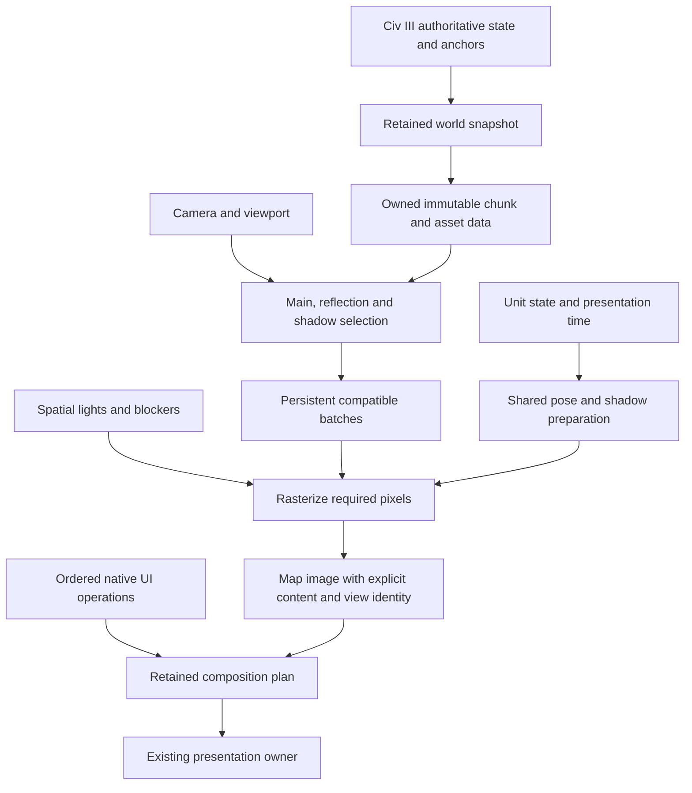

# Performance engineering review — September 29, 2026

## Recommendation

Prioritize the cost of drawing a **busy, changing view**. A quiet scene that
animates at 60 FPS does not establish responsive scrolling, zoom, or a developed
map with cities and units. The architecture should make camera changes select
and project existing world data, with work bounded by contributing objects and
pixels. Native capture and composition then need their own latency budget.

The existing renderer already contains valuable parts of this architecture.
The work is to finish their separation and remove repeated work, while keeping
the current graphics and authoritative Civ III behavior. A new graphics API,
larger caches, or more rendering threads are not prerequisites.

The user reaffirmed that useful production changes and the applicable 0 A.D.
architecture are the priority. Track that alignment through persistent GPU world
data, camera-only view selection, content-based invalidation and preparation
shared across passes. Cached zoom previews and resumable refinement address
responsiveness; they do not close the separate full-quality rendering-cost goal.
Treat the reviewed 0 A.D. ownership and frame organization as the default
reference: persistent terrain/model data, rebuilds on content changes, selected
pass contributors, compatible material/mesh grouping and model preparation shared
across passes. D3D11 does not block those mechanisms. Civ III-specific requirements
belong at authoritative capture, exact native projection/visibility and ordered
composition boundaries; they do not establish a necessary slow full-render floor.
Existing retained owners should be completed and reused rather than duplicated.
Cached camera images improve responsiveness, while reducing the cost of a genuine
full-quality draw remains a separate required outcome. Directly importing 0 A.D.'s
renderer would also require adapting its terrain, asset/material/shader and scene
interfaces; this review does not authorize a wholesale engine replacement.

Each bounded experiment must decide a concrete runtime change. Stop broad
measurement expansion once a production blocker is established. Pixel/depth
identity is diagnostic: the acceptance policy requires preserved visual quality,
correct visibility/occlusion and native ownership, not elimination of every
imperceptible numerical difference.

### Civ III turn and visibility behavior

Optimization follows the game's actual lifecycle: a persistent world, a player's
visible/explored/unseen areas, player actions, and interturn AI actions that are
often hidden. Caches can be included in the solution; architecture and delivered
performance remain the objective. Use the reviewed 0 A.D. persistent data,
dirty-update, pass selection and shared-preparation mechanisms as the reference.

- Preserve authoritative gameplay, turn progression and native action timing.
  Avoidable renderer work is separate from simulation work that must still run.
- Hidden AI moves and offscreen changes need not generate poses, draws, map
  publications or full-view invalidations when they cannot affect any permitted
  visible output. Keep required lifecycle/visibility facts current, and coalesce
  intermediate visual-only updates where intermediate states need not be shown.
  Do not coalesce visible movement/combat events or erase required ordering.
- Select work using actual output dependencies, including eligible shadows,
  reflections, lights, terrain boundaries and attached UI. Offscreen bounds alone
  do not prove that an object cannot affect the view. Hidden objects must not
  reveal themselves through these passes.
- Distinguish content changes from a turn boundary, new capture, changed selection
  or camera movement. Invalidate affected regions/objects and their dependency
  closure; do not rebuild a view merely because another player's hidden unit
  moved. Preserve last-known explored appearance and visibility-frozen animation;
  background preparation never grants visibility or leaks hidden changes.
- Maintain current visible water, effects and eligible animation during interturns.
  When the visible output has not changed and no eligible animation is active,
  reuse the completed frame. On reveal, update newly visible content from
  authoritative observations and validate its dependencies before display.
- Use initialization/background preparation for stable world content when useful,
  subordinate to current player-visible work. A native reconciliation/audit may
  still be required for mutation coverage; do not mistake its occurrence for a
  requirement to recompile or redraw all of its unchanged observations.

These rules guide the substantive camera and rendering changes. They do not
expand the currently frozen zoom comparison into another benchmark campaign.

### Delivery sequence and end state

The auditor owns convergence toward the end architecture and tangible game
improvements. The user explicitly permits caches when they serve that design;
cache count is neither progress nor a reason to reject useful work. Judge each
change by the responsibility it improves, the repeated work or latency it removes,
its measured user-visible result and its integration path. Keep individual slices
bounded while allowing evidence to change the sequence. The cancellation guard
may be deferred and resumed later if finishing it would delay the main delivery.
Closing every small patch is not a prerequisite for delivering the larger result.

The end state is an ordinary fast frame path: authoritative changes update one
persistent render world; a camera selects existing geometry; main/shadow/reflection
passes share preparation; the completed map enters the existing native compositor.
Camera-image reuse is an optional saving. Its misses must not expose the current
roughly 100-plus-ms full-render cost. No wholesale engine replacement is assigned.

1. **Close and deliver the current navigation work.** Review the combined live-
   dynamic zoom plus integrated scrolling patch, then stage the matching tuple
   and run the already authorized bounded game check. Close or defer the small
   cancellation fix separately, preserving its patch and evidence. Keep this
   delivery's agreed scope; any additional camera-image cache or refinement
   mechanism needs a specific architectural role and expected user-visible gain. A failed acceptance test must name the remaining
   blocker and stop that slice; preserve useful tested gains for integration.
2. **Make the normal rendering and camera paths fast.** Implementer next owns
   full-quality terrain/material/pass execution; Implementer 2 next owns native
   camera preparation, readiness and adoption. Treat these as two parts of one
   delivery. The earlier scissor and underlay probes locate substantial raster/
   shading work; they are diagnostic upper bounds, not recoverable-time promises.
   Prioritize a coherent reduction of repeated/hidden terrain shading and
   camera-independent preparation. Do not return to draw-count polishing or the
   rejected global-coarsening prototype without new evidence. Keep normal water,
   lighting, shadows and settled quality. On the camera side, reuse existing world
   owners and prove first-visit preparation coverage; remove avoidable waits and
   duplicate processing while preserving native action timing, projection,
   canonical publications and ordered UI. A tiny cancellation fix is not this
   delivery. A missing frame budget cannot be declared solved by adding another
   image cache.
3. **Qualify and install the combined game build.** Use the representative
   2240x1260 VM with fixed, disclosed busy city/unit counts, normal effects and
   day/night, covering idle, pan, zoom/reversal/settle, map jumps, wrap and updates
   during motion. Reuse the existing busy-scene contract and tools. Scrolling and
   idle target sustained 60 FPS; zoom accepts 40–50 FPS. Report missed deadlines,
   consequential stalls, first-correct destination and full-quality recovery,
   including cold/evicted cases. A held image, a warm subset, reduced effects or
   average FPS alone cannot pass. Cold destination work must be prepared ahead
   or use the user-permitted brief transition detail reduction with measured
   recovery. Keep the installed/source/evidence identities explicit.

After the current navigation delivery, completion is measured against outcomes
2 and 3, rather than the number of local patches or caches. If a chosen structural
change cannot materially close its assigned cost, reassess that rendering or
camera stage as a whole and state the remaining gap. Do not open an indefinite
sequence of nearby experiments. This is a finite acceptance sequence, not a claim
that the exact patch count or a completion date is already known.

### Preparing user playtesting

Before asking the user to test a staged build, verify that the existing Renderer64
short-capture launcher/receipt matches the exact bridge, DLL and helper, using the
established capture qualification and preflight. Reuse these tools; no new profiler
project is assigned. Timestamped game-window samples, renderer inputs, presentation
intervals, camera handoffs and process memory let the auditor correlate the user's
visible symptom with recorded work. Preserve a lightweight timing control because
recording/profiling has overhead. Guest presentation counts are not physical host
scanout, and current VM GPU pass timestamps are unqualified. State any remaining
attribution gaps; replay does not reproduce every native scheduling decision.

### Progress reporting

Lead user updates with concrete implementation progress and direction: what
runtime behavior changed, which repeated work was removed, whether the change
is implemented, validated, merged or installed, and the next useful game delivery.
State remaining blockers and any evidence that changed the approach. Apply the
relevant 0 A.D. lessons to C3X's constraints without treating its design as a recipe.

Include the latest comparable performance by activity when available: idle
animation, scrolling at relevant zooms, zoom transitions, map jumps and busy
scenes at the representative full VM size. Distinguish fresh measurements from
unchanged prior results, and state what remains unmeasured. Report FPS only when
the measurement supports it; include frame times, consequential stalls and time
to the correct destination. Held-image presentation does not certify fresh scene
animation. Summarize experiments when they decide a production change or expose
a blocker; routine fixture work and test counts are supporting evidence, not the
main progress report. No additional benchmark matrix is required solely to fill
every reporting category.

**Current delivery: reduce full-quality terrain/material/pass cost and measure
native camera handoff latency. Live-dynamic zoom is preserved but unqualified.**
The [private presentation experiment](zoom_presentation_step.md) covers each
observed guest refresh with a cheap retained preview, but refinement still causes
133–150 ms observed delivery gaps and admission waits up to 164 ms. Animation
can remain about 540 ms old. The game already has the tested frame-readiness
contract; this experiment does not qualify a new installed-game optimization.
The current zoom comparison uses the game's independent cadence and
unchanged-frame suppression. A preliminary paced synchronous pilot still found
long full-detail submissions, and the shared runtime now has a bounded-refinement
candidate. Its first GPU oracle completed 389 batches across 390 paced
opportunities in 6.606 seconds, which fails useful full-detail recovery latency.
It also differs from the synchronous output at 23,456 color pixels and 11 D24
samples; stencil and all 117 submitted-work rows match. Equal submission counts
do not establish correct state or ordering. The repeated-unsliced same-time
control differs at 789 color pixels and one D24 sample; comparison of the repeat
against the bounded result still differs at 23,230 color pixels and 12 D24
samples. The broader color discrepancy remains unexplained. This candidate is
stopped before a performance matrix or integration. The batch count alone imposes approximately
6.5 seconds when only one batch advances per 60 Hz opportunity; diagnose that
scheduling cost separately from total rendering work. Treat the earlier paced
pilot as provisional: missing start times for two accidental VM test dispatches
prevent conclusively excluding overlap. Guest cleanup is verified; the new
candidate oracle ran after the quiet-process audit. Preserve the distinction between
API returns, guest delivery observations and physical scanout.

Independent rejection review verified all 31 source identities and the review
patch hash, and reproduced both oracle timing/counter totals from raw logs.
The receipt is `Renderer/.cache/zoom-refinement-step/auditor-review.json`.
Readiness at the next paced query observation does not establish immediate GPU
completion after submission. The next zoom slice starts from the accepted
runtime without the failed emission-plan refactor: transform retained static
HDR color/depth, draw current units and effects through shared dynamic routines,
and wire the native projected-map sampler. Preserve canonical native output,
reflection correctness, visibility, picking and original pass ordering. The
first slice retains synchronous full-quality refresh and must report its
remaining interruption; neither lower-resolution variants nor another scheduler
sweep is assigned. The static/live split is implemented privately, with native projected-map wiring.
Review caught a settled-view regression that restored unchanged terrain each
animation frame. The correction preserves ordinary full-viewport reuse and
retires only the shared writer proof after a transformed preview. Combined
source and host checks passed, and the isolated Windows builds compiled. The
focused GPU diagnostic then exposed severe horizontal striping in live water
at 1.25x retained zoom; the same-pose full render was smooth. The suspected
interaction between transformed static depth and current water remains an
explanation to verify. The candidate is not visually qualified, merged or
installed. Implementer stopped before the native busy matched comparison and
released its VM reservation after confirming both owned clients absent.
Independent review verified 34 source files, 21 evidence files and the review
patch, inspected the water comparison and recomputed final raw-log intervals.
There are six intervals above 100 ms, maximum 169.158 ms, all on frames with no
new full static draw. Five are dominated by Present-return spans; another has
140.278 ms in unit calls. This corrects the earlier attribution to full-quality
refreshes. Earlier GPU submissions may contribute to later stalls; the observed
CPU phase does not establish GPU causality. No delivered FPS is established.
The review receipt is `Renderer/.cache/zoom-live-step/auditor-review.json`.
This zoom slice is closed without integration; further depth/preview tuning is
deferred while the normal full-quality rendering path becomes the priority.

Full-quality redraw cost remains a separate measurement. The private underlay
correction saves 15.8–22.2 ms, leaving 123.5–129.0 ms per changing-projection
redraw; promotion remains pending on its unexplained depth-pixel exception.
Preview work continues from C7. Density and further underlay tuning stay stopped.

### Parallel implementation and integration

The user authorized a second implementation task for scrolling and map jumps,
using GPT-6.1 Sol with Ultra reasoning. The work divides as follows:

- **Implementer:** one coherent reduction of repeated or hidden terrain/material
  evaluation in the executed full-quality path, starting from accepted source.
  Share camera-independent preparation where its dependencies permit, preserve
  depth/coverage and current visual quality, and validate complete-frame cost.
  Failed zoom/refinement candidates remain isolated.
- **Implementer 2:** two bounded canonical/display static-region states to remove
  projection thrash, followed by remaining scrolling and map-jump preparation,
  residency and adoption latency. Uses an isolated managed worktree from the
  authoritative project commit, with required current source hashes checked.
- **Astra Perf Auditor:** reviews evidence, coordinates changes to shared files
  and integrates successful patches into the authoritative runtime. Neither
  implementer overwrites the other's checkout, private sources or output folder.

Only one task may run Windows VM builds, GPU fixtures or performance tests at a
time. Implementer 2 completed the two-state validation and explicitly released
its reservation after all 17 owned launcher children exited and the guest process
inventory was clean. The reviewed patch is integrated as `37688c1f` (from
`a519be23`); all six integrated file identities match the tested candidate.
Independent review verified frozen sources, binaries, shaders and scene identity,
recomputed the raw timing/count results, and inspected the moving-unit crops.
The review receipt is
`Renderer/.cache/static-raster-step/auditor-source-review/final-review.json`.

Both matched 18-view traces reduce full static draws from 36 to 18, with one
additional 54.599 MiB region at the measured sample setting. Ordinary 4/2 camera
steps at 1.25x still require display redraws because the projected Y step is
fractional; integral 8/4 steps reuse both regions. Quiet request-through-Present-
return means improve from 438 to 307 ms at noon and 332 to 292 ms at night for
ordinary steps, and from 214 to 115 ms / 208 to 110 ms for integral steps. These
are tiny samples with mixed results in other groups and substantial stalls,
not FPS or a general speedup estimate. The admitted 16-actor diagnostic checks
current movement, reflections, shadows and vegetation occlusion during reuse;
it does not qualify realistic worst-case busy performance. Nothing was staged
or installed. See [the scrolling result](scroll_reuse_step.md) for limits.

Implementer released `zoom-live-dynamics-01` after the focused water visual
failure. Its completed evidence handoff passes source/evidence identity review;
the candidate fails visual qualification. The intended busy native comparison
of zoom reversal, settling and pan-after-zoom remains unexecuted. Implementer
completed the bounded full-quality material comparison and explicitly released
`full-quality-frame-01` after owned client/compiler cleanup. No installation or
gameplay launch occurred. Its final source/evidence handoff remains pending.
The selected implementation skips texture contributors whose material weights
are exactly zero in the executed full-quality shaders. It preserves blend order
and keeps biased anisotropic samples unchanged. Source review caught unrelated
terrain-feature branches disappearing during shader regeneration. The correction
restores the richer Lab shader and delegates the affected variants to original
sampling; independent source checks confirm the restored directives/includes
and unchanged older native generator/output. Implementer reports 15 host tests
passing, repeat generation identical across 140 files, and an optimized hardware
D3D11 shore-support probe passing all 16 quad masks (64 pixels, zero mismatches).
The auditor inspected those receipts; final full-scene appearance review is pending.
Explicit gradients do not alone establish identical filtering, so material
boundaries, shore support and atlas/wrap edges remain part of the focused
appearance check. The first control completed its timed loop but failed before
fixed-pose captures: the common test harness retired units and then attempted to
observe the same IDs without spawning a new lifecycle. Independent source review
confirmed that production correctly rejects this sequence regardless of timestamp.
The bounded correction uses the existing spawn API in both arms and fixes the
analyzer's API success value (`OK=1`, distinct from harness completion `0`).
Attempt 01 is preserved; its 1087.441 ms control pan API span includes two actual
full/reflection draws but does not establish their causal GPU cost. The corrected control completes with
seven cities and 64 admitted units, with no additional synthetic actors. Its 74
API opportunities contain 15 successful and 59 pending returns, independently
recounted from the raw log. Full-repeat and warm depth/stencil are exact; color
repeat differs at 144 pixels (maximum channel difference 10), and warm versus
full differs at 50 pixels (maximum 10). The largest API span is 396.16025 ms;
zero one-second spans in this invocation does not establish a tail improvement.
An initial candidate fails before workload admission on a reserved
`sampler_state` parameter; an identifier-only correction and shader regeneration
allow the final comparison. The unchanged successful control is reused with
linkage to its original manifest; final identity verification remains pending.
The candidate is unqualified: seven successful and 80 pending API returns, a
1367.094833 ms pan call and a 1417.870 ms successful-return gap. During the
requested zoom window it returns successfully twice versus eight control and
holds its presented projection near the starting scale for most of that window.
Lower successful-call averages therefore do not show smoother zoom or a gain.
Matched depth/stencil is exact at 1.0 and 1.25; color differs at 398,670 and
507,382 pixels respectively, exceeding within-arm repeat noise. Initial coast
and biome crops show mostly subtle differences, not evidence of a large visual
failure; spatial characterization is pending. Keep this candidate isolated,
with no more shader tuning or VM runs in this assignment. The preliminary
raw-log review is `Renderer/.cache/full-quality-material-step/auditor-preliminary-review.json`.
Implementer 2 completed the narrow canonical
FRESH cancellation guard as `01cfd914`. Independent source/identity review and
execution of its actual production branch passed nine cancellation cases, normal
success and four real failures. The candidate remains isolated: native build,
performance benefit and integration are pending. It does not block zoom delivery
or receive a separate performance campaign. The primary review receipt is
`Renderer/.cache/map-jump-preparation-step/auditor-review.json`.

The first-jump ownership fixture's `WHOLE_WORLD` option supplied a complete source
inventory and compact topology, but only selected appearances reached the runtime.
It registered no appearance-page bootstrap and logged no background-region work.
The 385 new owners / 81.6 MB upload therefore describe a deliberately unprepared
fixture destination, not installed behavior after world readiness. Installed code
has paged appearance capture and background preparation; its completion, capacity
and interrupted/evicted cases still need actual evidence. Resident fixture returns
already build/upload zero, so their remaining costs stay relevant.

Implementer 2 completed source review in `77bf2be6`: canonical rendering has
required consumers, adoption does not duplicate that draw, and the bridge's
ready inspection followed by a later caller poll is real but unmeasured. The
auditor verified all 20 source/document and four evidence hashes and reviewed
the three guarded host-contract receipts. No production shortcut was selected.
The opt-in correlation is now implemented in `59b35656`, from request through
readiness/adoption to the committed screen's first successful Present return.
Independent review verified all 16 source and nine evidence hashes and reran
seven host contracts successfully. Superseded requests, older retained screens,
actual projected samples and unresolved/mixed origins remain distinguishable.
Present return is not GPU completion or scanout. Source review accepts the
diagnostic design; Windows compilation, PowerShell execution and real composed
screen coverage remain pending. Native overlays may leave the complete screen's
origin unresolved, and the bounded first-event ledger may overflow; either must
remain explicit rather than attributing a screen to the newest camera request.
The next native checkpoint must establish useful correlation and complete
buffered trace coverage before interpreting latency. One existing developed-save
scroll scenario and a quiet control are specified, with native menu teardown
outside the measured window and exact owned-child cleanup. Default scenarios
remain unchanged. No performance improvement is claimed for this instrumentation.
Implementer 2 now owns `camera-handoff-native-01` after the material comparison's
explicit release. The assignment covers affected Windows/PowerShell checks,
matched three-binary evaluation staging, and the single documented 75-second
developed-save trace/control scroll pair. Use the reviewed scroll/cancellation/
diagnostic source only; unqualified zoom/material candidates stay excluded.
Require complete trace coverage, inspect actual window samples, report supported
latency attribution and remaining gaps, then clean up, release and stop. No new
production camera optimization is assigned. The primary source audit receipt is
`Renderer/.cache/camera-handoff-markers-step/auditor-review.json`.

Host-only work uses a verified process guard that rejects VM dispatch. A slot
ends after exact child-process cleanup and a completion report; a timeout does
not automatically transfer ownership.

Keep each candidate as a small production-source patch with focused tests and
private benchmark evidence. Review and integrate independently successful changes
without waiting for both streams to finish. Changes touching the shared FRESH
pipeline require review of overlapping sections, followed by combined zoom/pan/
ownership checks. Stage a matching bridge/DLL/helper tuple only after that review;
preserve existing staging/installation rules, game-session safety and references.
No task may treat a private diagnostic gain as an installed game improvement.

This review supplements the [earlier measurements](renderer_performance_audit.md)
and [0 A.D. review](0ad_renderer_review.md). It checks the current working tree,
including pre-existing uncommitted work. It does not implement performance fixes
or create a new milestone ladder. Wonders and District renderer work remain
deferred.

### Performance and perceptual quality target

The current acceptance target is sustained 60 FPS for scrolling, idle animation
and other supported activity in realistic busy scenes. The user subsequently
accepted 40–50 FPS during zoom as good enough (20–25 ms per displayed frame);
60 FPS zoom remains desirable. Preserve live animation and full settled quality.
Report cadence, stalls and time to the correct/full-quality view separately:
an acceptable average does not hide long refresh interruptions. Use 16.67 ms
frame deadlines for scrolling and idle, and the accepted zoom band when judging
zoom delivery. Intermediate improvements do not establish either target.

The user also permits imperceptible differences and very brief detail reductions
during transitions, such as showing a less detailed destination for a few frames
after a map jump. Preserve the full-quality settled appearance. Screen-space LOD,
progressive refinement and similar techniques are valid candidates when their
perceptual benefit and recovery are demonstrated. Pixel identity on every
transition frame is not required. Assess sequences at normal playback speed,
and measure both frames and milliseconds to full quality, including repeated
input that might otherwise prevent refinement. Preserve authoritative placement,
visibility, selection and interaction correctness throughout. Persistent visible
degradation does not meet this policy. These clarifications supersede stricter
blanket statements about temporary detail reductions in earlier audit guidance.

The user specifically proposed scaling the last completed image during zoom,
then refreshing full quality as the motion settles. A private standalone prototype
now demonstrates a substantial interaction gain, with exact settled same-process
color checks. Native composition and sustained 60 FPS remain unqualified.
Keep map preview transforms, authoritative anchors and hit testing aligned, with
HUD/text/selection handled by their existing ownership contracts. Prefer current
dynamic objects over retained static terrain where the depth/composition contract
allows it. Zoom-out needs valid surrounding coverage; an unrelated map jump
cannot be synthesized by stretching the previous view.

Separate requested display transform from completed scene quality. Coalesce
obsolete zoom requests, retain a valid preview while a current full-quality result
is prepared, and prevent that expensive work from blocking presentation on the
same GPU. Continued/reversed input must not leave the scene indefinitely stale.
Measure input-to-display delay, displayed cadence, dynamic-state age, and both
frames and milliseconds to settled full quality. The full-redraw benchmark remains
a separate cost measurement. A 60 FPS transformed preview can satisfy transition
responsiveness without requiring a fresh full-quality scene every 16.67 ms, but
does not certify settled busy-unit, mutation, scrolling or map-jump performance.

## Evidence and limitations

### Implementation review: spatial city lighting

The bounded [city-light indexing step](city_light_spatial_index.md) is accepted
after independent source review, receipt/hash checks, recomputation of the raw
timing distributions, visual comparison inspection, and reruns of four focused
CPU/adapter/D3D tests. GPU indexed/full-scan irradiance matched exactly at the
tested receivers. Conservative ranges, original accumulation order, cross-city
blockers, count-aware copied-content identity and complete-scan fallback are
preserved. No correctness blocker was found in this review.

Two uninterrupted six-city night pairs reduce mean draw-plus-Present time from
610.04/631.58 ms to 148.04/143.63 ms: about 76–77%. Complete warmed trace time
falls from 53.07/54.95 seconds to 12.88/12.50 seconds. The original second pair
has a misleading 43.40 ms median because short calls alternate with very long
waits; use the complete distribution and trace, not its median alone. Candidate
p95 is 299.77/230.69 ms. Noon/no-city means remain about 130–136 ms. Every
measured nighttime candidate frame still misses 16.67 ms.

This acceptance covers the lighting optimization, not 60 FPS, live scrolling,
many-unit qualification or all city densities. The broader category still has
a documented missing historical provenance artifact. Cold preparation/priming
and first-transition stalls remain significant. The richer recipe changes only
620 to 622 lights and is not evidence for substantially more city sites.

**Priority following the lighting step:** establish a correct production-camera witness
and identify/reduce the remaining main/reflection redraw work. The roughly
130–150 ms floor already occurs while zooming an already prepared scene, so
separating world mesh lifetime from camera selection cannot alone explain or
remove that floor. Retain the world-lifetime work for production navigation,
but choose the next rendering change from actual submitted work and bounded
causal measurements. Lighting's per-frame serialized field comparison remains
a smaller follow-up opportunity, rather than the next major target.

Evidence remains in `Renderer/.cache/city-light-index-step/`; the evaluated
candidate is `ec7c439db5d802dbfe79eb25c19c8192567c50c4d1ae87c4e9853aa918709b9a`.

### Implementation review: redraw accounting and HDR copies

The [redraw/navigation step](redraw_navigation_step.md) passes independent review
for its single-sample HDR alias and submitted-work accounting. The existing color
texture already supports shader reads. Each alias holds its own COM reference;
reset, resize and swap preserve ownership, and the multisample path retains a
separate resolve texture. This removes 45,607,424 bytes of duplicate HDR storage
and the corresponding logical copy footprint on each changing-zoom frame at
2240×1260. It does not reduce geometry or change the lighting equations.

Review verified all 192 compiled source hashes, both candidate binary hashes,
1,514 evidence-file hashes and the unchanged staged Renderer64 tuple. Independent
raw-log calculations reproduce the paired results. All 14 same-frame color/depth
file pairs are byte-identical. Both focused camera/HDR tests pass on rerun. The
small HDR test proves single-sample pixel equality and separate two-sample
allocation; it does not test multisample resolved pixel equality.

Two reversed-order full-guest-area pairs give these warmed frame-call results:

| Workload | Copy-reference mean | Alias mean | Alias p95 | Alias worst |
| --- | ---: | ---: | ---: | ---: |
| Noon changing zoom | 144.46 ms | 132.15 ms | 165.94 ms | 408.20 ms |
| Night changing zoom | 143.00 ms | 141.23 ms | 268.78 ms | 446.94 ms |

All 174 samples per candidate case miss 16.67 ms. The noon mean difference is
mostly reference-run stalls; medians are essentially unchanged. This is an exact
work/storage reduction, not evidence of a large consistent speedup. Borderless
client area and swapchain are both 2240×1260 on the 60 Hz guest. The smaller
windowed control retains a similar redraw floor. Submission counters are enabled
in these runs, so their overhead is included; collect diagnostic counts separately
from primary timings in the next step.

The new camera witness submits changed copied anchors through the production
preparation/readiness/adoption APIs, verifies returned frame/ticket identity, and
shows the expected depth translation. It fixes the old witness's unused-offset
problem. Its capture scope remains a stress approximation: it retains RENDER
flags throughout a halo of twelve full tile widths/heights. Native capture uses
twelve tile-coordinate units and distinguishes topology-only and appearance
prefetch records from RENDER occurrences. The measured 1.7–21.4 second first-view
waits therefore establish expensive preparation in this fixture, not equivalent
gameplay latency. They include legitimately new or possibly evicted content;
aggregate upload bytes alone do not prove redundant uploads. The fixture still
has only four synthetic actors and does not qualify busy native composition.

**Priority assigned after the redraw step: begin the persistent-world/view
ownership split.** The bounded implementation and independent review are recorded
at the end of this document; that first slice is now accepted.
Existing world preparation, shared meshes, dependency tracking and generational
handles are prerequisites, not a completed separation. `ResidentContent` is
explicitly non-owning; `GeometryDrawRecord` borrows raw chunk pointers. Changes
to occurrence membership still replace the selected geometry generation, whose
epoch also invalidates FRESH's references and pixel/shadow state. Preserve that
safety until explicit content ownership and view lifetime replace it.

The next bounded implementation should retain immutable world mesh generations
independently of camera occurrence lists in the active FRESH path. Correct the
fixture's native capture roles, establish baseline rebuild reasons, then implement
one complete, measured slice. Resident unchanged content must keep its generation
and avoid geometry construction/uploads when the camera changes. Canonical world
identity and per-occurrence anchors/wrap/visibility must remain distinct. Real
content changes, procedural detail requirements and neighborhood dependencies
still invalidate the required content; a weaker key is not a substitute for
correct ownership. Active/pending view leases must remain within the existing
memory budget and retire safely on cancellation, eviction and reset.

This is the next major structural priority, not a promise to remove the roughly
130–150 ms rerasterization floor by itself. Full-detail changing zoom already
exposes a separate rendering/queue cost with prepared geometry. Pass batching,
valid fixed-zoom pixel reuse and reliable asynchronous GPU/queue attribution remain
subsequent targets. Preserve a continuous-zoom control to detect regressions while
working on navigation preparation.

Evidence remains in `Renderer/.cache/redraw-navigation-step/`; candidate DLL
`6b68d398331a8552e1b376e5a3d9767aec3b62a73995c9e418a23a16a8f6efd1`
and common client
`76ddbe9cdf194faa376a81b23a963e6701d7ba545a8bfa9f442eb52fcca78cd7`
were reviewed. This step is not staged or installed. Earlier measurements and
findings below describe the original audited build unless marked otherwise.

Reviewed paths include injected map capture and camera handoff, scene publication,
x86/x64 transport, worker scheduling, geometry preparation and residency, main/
reflection/shadow/water passes, unit selection and animation, city lights,
retained native composition, GPU presentation, asset representation, and the
measurement harnesses. Offline importer work matters to load time and resident
data size; it is not counted as per-frame execution. This is a rendering and
interaction audit, not a benchmark of Civ III AI or turn processing.

The checkout is at `6e73b668` plus local changes. The isolated build uses the
production `C3X_RENDERER64_FRESH` translation unit, optimized x64 compilation,
and the existing standalone client. It is not installed or staged. Local
receipts are under `Renderer/native/build/performance-review-current/`.
`source-before.json` records 440 C/C++/shader inputs; its sorted `path:hash`
fingerprint is `b35c3a7356f4df807fc9ad4918b3eb674436091e582f7982faf3bc25fb8a6c33`.
The DLL SHA-256 is
`bafb4e85359286ac61957e0e8d513fdbce70ca3be4609d58c12fccb03a411821`.

Source findings below are confirmed behavior; their individual time savings
remain estimates until measured. Existing live results belong to their recorded
binary and scene. They must not be relabeled as measurements of this build.
0 A.D. was inspected locally at
`0ed48b3a1fb1b4b718a78869fa497185af55e086`; it was not benchmarked alongside C3X.

### New isolated measurements

These runs use the Windows 11 Parallels VM at 2240×1260, one scene sample,
the existing full-detail packs/control shader tree, water/waves/reflections on,
and normal `Present(1,0)`. No game, compiler or second GPU test ran concurrently.
The source hashes still matched after these runs. Pack contents were not frozen
and fingerprinted before these runs, so these are diagnostic measurements rather
than a complete release-acceptance receipt. The run scripts preserve the selected
definitions, shader root and scene identity.

| Workload | Warm samples | Median ms | p95 ms | Worst ms |
| --- | ---: | ---: | ---: | ---: |
| Terrain-heavy idle, 1× | 177 | 16.66 | 17.14 | 34.28 |
| Same scene held at 1.25× | 117 | 16.67 | 17.38 | 215.30 |
| Same scene, changing 1×–1.25×, A | 87 | 133.24 | 188.71 | 401.87 |
| Changing zoom repeat B | 87 | 132.71 | 192.20 | 441.09 |
| Existing developed-object generator, noon, changing zoom | 87 | 133.30 | 155.93 | 402.73 |
| Same object generator, midnight, idle | 117 | 16.66 | 33.44 | 217.99 |
| Same object generator, midnight, changing zoom | 87 | 184.01 | 366.29 | 421.43 |
| Six-city developed fixture, noon, changing zoom | 87 | 133.34 | 232.84 | 300.06 |
| Six-city developed fixture, midnight, changing zoom A | 87 | 601.05 | 1393.29 | 1839.00 |
| Six-city midnight repeat B | 87 | 600.36 | 1249.99 | 1316.58 |

These are wall-clock `draw + Present` call durations. The synthetic clock advances
one 30 Hz source step per call; the loop is not a real-time input replay. In-place
zoom changes the real projection. The roughly 133 ms median reproduces the earlier
severe zoom result on current source. Held zoom versus changing zoom demonstrates
how much the quiet result depends on retained pixels. The midnight zoom median
is about eleven 16.7 ms frame budgets.

In zoom A, median CPU/driver draw span is 21.08 ms and median `Present` span is
110.75 ms. Selection/shadows, reflection, static redraw and water spans are
2.47/6.04/8.49/3.33 ms respectively. In midnight object zoom, draw/Present medians
are 26.29/158.68 ms. Do not infer that `Present` itself performs all that work:
GPU backpressure, synchronization and VM presentation behavior can surface there.
Pass quantiles do not add to total quantiles.

The existing supposedly dense generator actually produces nine city sites in
this world, with just **two city tile rectangles intersecting the initial view**.
That count comes from the CSV and generator predicate, not GPU visibility.
It supplies many improvements/resources but is insufficient for the requested
many-city case. `dense-city-sites.json` records the check. Its object variant
raises reported records from 23,709 to 28,964 and cached geometry from about
1.17 GB to 1.29 GB. It still has at most four synthetic actors.

An additional synthetic developed-map fixture permits six city sites in the
initial view. Eight planned nonwater city sites across the world were changed
to their existing base terrain so the generator could place cities there;
coastline and relief elsewhere were retained. The initial image was inspected.
This is a controlled workload, not a recorded save. The fixture, changed sites,
and hash are in `developed-scene.csv` and `developed-scene.json`. It raises records
to 29,441 and reported cached geometry to 1.30 GB. The night run demonstrates a
much worse populated-scene failure than the two-city result. It still does not
exercise the production many-unit path or native labels/composition.

The midnight/noon difference changes lighting, shadows and emissive state
together; it is not an isolated timing of the local-light loop. A further control
copied the shader tree into the ignored audit directory and made only
`q8_local_irradiance` return zero in its ten scene-sized shader copies. Nighttime
environment, geometry, emission and all other features stayed enabled. Complete
shader source participates in the compiled shader cache key, so the changed
copies compiled independently. Production sources and packs were not edited.

That diagnostic control measured **129.74 ms median, 293.82 ms p95 and 1057.33 ms
worst** over 87 warmed calls, compared with the repeated approximately 600 ms
night baseline. It also had 25.9 seconds of scene/swapchain priming and a
2264.37 ms initial transition at frame 2, preserved in the receipt. This is
strong causal evidence that local-light shading causes
most of the additional median night cost in this fixture. It is not a precise
GPU timer, a measured speedup from spatial indexing, or a quality-preserving fix.
It also leaves approximately 130 ms of full-scene cost to address. The scripts,
shader changes and source-tree identities are recorded in `light-ablation.json`
and `run-light-check.bat`.

Many-unit production costs remain unmeasured here, and the busy-scene contract
below must remain an open requirement.

The 1.25× synthetic pan branch measured 126.37 ms median/134.08 ms p95, versus
16.67 ms median while held. Because of the camera-path defect below, this is
evidence that the invalidation branch is costly, not a verified scrolling FPS
or pixel-correct camera result. Do not use its 1× counterpart as a live baseline.

Process-cold preparation was roughly 17–40 seconds across the unmodified diagnostic
workloads, uploading about 872 MiB for the original scene or 986–998 MiB for the
developed scenes, followed by priming. That is whole-fixture preparation;
it is not a measured live-game loading time.

### Measurement corrections

1. **Standalone camera motion is not the production camera path.**
   `client_x64.cpp` copies `prepared_frame`, changes its clock, and passes separate
   camera offsets to `c3x_sandbox_draw_fresh`. In `fresh_pipeline.h`, applying those
   offsets to `geometry_viewport_settings` is inside
   `#ifndef C3X_RENDERER64_FRESH`. The audit build defines that macro. Production
   obtains the view transform from authoritative frame preparation instead.
   Thus these standalone scroll/jump arms exercise invalidation and cache motion
   without establishing equivalent geometry movement or camera adoption. Their
   timings can expose expensive branches, but cannot qualify live scrolling.
   This also qualifies the earlier audit's standalone scroll/jump conclusions.
2. **Initial stalls now have separate records.** The current client logs its
   first three frames as `CLIENT_TRANSITION`; the warmed distribution still
   excludes them. Preserve both. The earlier report's statement that those frames
   were simply discarded describes its older client.
3. **Verify the input actually changed.** The held-zoom option clamps a supplied
   value to at least 1. Clearing that environment variable selects animated zoom;
   setting it to zero holds 1×. The first two nominal zoom arms in this review
   exposed that setup error and are preserved as `fixed1-control-*`, excluded
   from changing-zoom results. Corrected arms have their actual zoom trace.
4. The first launch used a noninteractive guest session and failed swapchain
   creation with `0x887a0022`. Its `noninteractive-*` receipts are excluded.
   Subsequent runs use the repository's current-user VM dispatcher.
5. The standalone synthetic unit path draws at most four actors. It does not
   exercise the full production `UnitInstances` selection and `draw_real` path.
   Its small unit timing cannot establish the cost of 64 or 128 visible units.
6. CPU/driver spans and `Present` waits are not GPU pass timings. Submission FPS
   is not physical scanout or input-to-correct-view latency. The virtual adapter's
   timestamps need the existing validity checks; forced completion probes alter
   scheduling and are diagnostic only.

### Changes already present

Do not schedule these again as newly discovered fixes:

- Native operation/transaction success logs are now gated by diagnostic level.
- `RetainedComposition::draw` no longer performs the extra mid-frame `Flush`.
- Geometry-projected 1× image conversion has a single-fetch path.
- Vegetation already uses hardware instancing, an append/discard instance stream,
  and an alpha depth pass. Draw constants already have a D3D11.1 stream.
- Reflection has guarded visible-water bounds; retired views release live recipes.
- Meshes, materials, animation palettes and shader compilation are already cached.

These changes do not eliminate the remaining full display copy, broad pass lists,
camera-dependent invalidation, or dense-unit/city scaling costs.

## Findings and changes needed

### 1. World content, view selection, and pixel validity are coupled

**High confidence; highest general navigation priority.**

`RendererState::geometry_matches` compares selection, geometry signature, tile
count, each tile's content and each anchor delta. When a viewport changes its
tile membership, reuse can fail even though most world meshes are resident.
The replacement path clears selected geometry records and increments
`tile_geometry_epoch`. `SandboxFreshPipeline::scene_revision` incorporates that
epoch, so a lifetime/selection change can invalidate the resident occurrence
list, static pixels and shadow references together.

The epoch protects real pointer lifetimes. Removing it or weakening its key is
unsafe. Instead, give immutable mesh generations stable owned handles and keep
separate revisions for world content, visibility/occurrence selection, light
inputs, and raster projection. Use the existing publication journal to dirty
affected chunks. A camera entering a new strip should acquire those chunks and
change transforms; unchanged chunks should retain their data and pass batches.

Native 64/128 tile-width changes remain another preparation route. Normalized
mesh data already exists in some providers; extend that representation where
geometry is truly scale-independent. Do not assume all procedural relief,
placement, depth and raster-phase inputs can share a key without checking them.

**Acceptance:** resident pan, zoom, wrap and jump build/upload no unchanged static
mesh data; a real local edit invalidates the affected dependency closure; old
views remain safe until retirement. Test the actual native camera route and the
first correct frame, including city-centered native zoom.

Sources: `native/c3x_renderer.cpp` (`geometry_matches`, geometry replacement near
line 7460); `sandbox/fresh_pipeline.h` (`scene_revision`, `capture`).

### 2. Fixed zoom above 1× also loses scrolling pixel reuse

**Confirmed expensive branch; a separate issue from changing zoom.**

`SandboxFreshPipeline::draw` invalidates static and reflected state both when
projection zoom changes **and whenever the camera moves at any zoom other than
exactly 1×**. Consequently, even a settled 1.25× view abandons the scrolling cache
on the next camera step.

Full-quality zoom requires a render at the new projection. A temporary affine
preview of retained map pixels is explicitly allowed during the transition,
provided its coverage, dynamic-state age and recovery are measured and it is not
reported as a fresh scene render. At a fixed zoom, an orthographic camera
translation is still a translation. Investigate a cache in projected coordinates
with correct fractional phase, guarded coverage and depth offsets. Preserve
subpixel motion and distinguish transformed preview depth from current geometry.

This is a potentially focused improvement beside the larger world-data work.
Full-redraw cost still matters for refinement, newly exposed content and mutations;
presentation and refinement need separate scheduling budgets.

**Acceptance:** fixed 1.25×/1.5×/3× pans match independent renders for seams,
depth, wrap and fractional phases; distinguish reused pixels from full redraws.
Continuous zoom must meet the displayed-frame budget, with preview age and time
to current full quality reported separately. Real-geometry redraw timings remain
part of the performance report.

Source: `sandbox/fresh_pipeline.h`, invalidation near line 1990 and region fill/
restore near lines 2075–2150; `native/scene_projection.h`.

### 3. Select contributors before building and uploading pass batches

**High confidence; impact grows with busy forests, cities and coasts.**

`capture` copies records into a resident list, adds horizontal wrap occurrences,
then scans for main and reflection candidates. It is a broad selection; later
draw calls apply inverse-projection bounds again. Reflection's water rectangle
is computed after that selection. Shadow receiver input includes the union of
main and reflected candidates, including repeated occurrences. Scissors limit
rasterization but do not eliminate submitted vertex or CPU work.

Vegetation admits a record by bounds and then uploads all its instances. Rigid
objects batch only adjacent compatible records in a 256-record flush. City
material records bind material state and issue individual draws, often followed
by an emission draw. A busy view amplifies these costs across multiple passes.

Use a coarse world grid or chunk index, then conservative per-object tests for
main view, reflected-water coverage, and shadow receivers/casters. World wrapping
should select occurrence transforms for intersecting chunks. Preserve tree tops,
cross-tile geometry, reflection distortion and offscreen shadow reach. Group
compatible opaque/cutout draws by pipeline, mesh and material, retaining those
groups across camera changes when possible. Keep ordering for transparent draws.

Retain static instance attributes on the GPU; change compact selections and
per-view constants when possible. Existing append/no-overwrite streams are a
good fallback for genuinely dynamic data. Do not replace them with frequent
synchronous buffer creation or readback.

**Acceptance:** report candidates versus submitted records, instances, triangles,
draws, binding changes and upload bytes per pass. Demonstrate smaller submitted
work and identical contributing geometry, not merely fewer vector entries.

Sources: `sandbox/fresh_pipeline.h` (`capture`, `reflected_water_bounds`,
`issue_records`, `draw_vegetation_instances`, `SandboxSceneShadow::render`);
`native/render_core/instance_stream.h`, `draw_parameter_stream.h`.

### 4. Nighttime city lighting has a multiplicative worst case

**Update:** the conservative spatial index described above now replaces the
global loops on the indexed path. The analysis below records the original
bottleneck and rationale; complete scan remains the correctness fallback.

**Confirmed algorithm; high priority for a developed nighttime map.**

The six-city zoom repeated at roughly 600 ms median; removing only this shader
contribution in a disposable control reduced the median to roughly 130 ms.
Treat spatial light/blocker selection as immediate work alongside navigation
costs, without waiting for the larger world-data refactor.

`update_city_lights` gathers lights from selected city records. `SceneLights::upload`
rebuilds/uploads the selected light and blocker field, including unchanged inputs.
The local-light shader first rejects pixels outside a single scene envelope,
then loops over **every selected light**. For a light that passes distance and
orientation tests, it can loop over **every selected blocker**. Early exits help,
but do not bound each pixel to nearby lights and buildings. Two distant cities
also enlarge the empty area enclosed by the global bounds.

The work has an upper-bound structure of `pixels × lights × blockers`, with
distance/orientation/occlusion rejection reducing actual work. This is not a
claim that every pixel always executes every test. Daylight sets the local light
count to zero, so noon measurements entirely miss this risk.

Build spatial light lists for receiver chunks or screen tiles. Preselect each
light's possible blockers from its finite influence volume and preserve exact
ray/box tests for that smaller set. Cache immutable light/blocker data and update
selection only when scene/view/light state changes. A small CPU-built spatial
grid may suffice before adding a GPU clustered implementation. Keep all lights
that can contribute; do not impose a lossy per-city light cap.

This follows the established idea of assigning lights to affected regions in
[clustered shading](https://research.chalmers.se/en/publication/161725). The C3X
adaptation is a proposal, not a claim that 0 A.D. implements this lighting path.

**Acceptance:** the same developed scene at noon, dusk and night; several nearby
cities and separated cities; unchanged lighting and blocker results; measured
light/blocker tests and upload bytes. Reuse cached pixels where valid, while
also measuring camera/zoom frames that must shade again.

Sources: `native/city_fidelity/scene_lights.h`, `local_lights.hlsl`, `gpu.h`;
`sandbox/fresh_pipeline.h::update_city_lights`. The preserved control shaders
contain the same nested local-light/blocker loops.

### 5. Busy units require a different assessment from four synthetic actors

**Confirmed repeated work; exact frame-time share is unmeasured at busy density.**

- `UnitInstances::scene_poses` scans captured tiles to find each eligible unit's
  visible occurrence. This is up to `eligible units × captured tiles`, including
  wrap comparisons. Build one indexed occurrence selection per authoritative
  view and preserve native visibility and stack representative rules.
- `UnitPoseTransitions::retain` searches the visible vector for each saved facing
  and pose state. It runs at the start of reflected and main `draw_real` calls.
  Replace repeated membership scans with one incarnation-aware set or mark pass.
- `draw_real` repeats ground sampling, action checks, facing access, shadow fitting
  and self-shadow rendering for reflected and main views. Joint palette sampling
  already caches the same timestamp; the rest is not automatically shared.
- Reflection considers the real-unit list with a broad viewport guard. Give it
  conservative reflected-water contributor selection before pose/shadow work.
- Unit/material parts still require multiple draws and updates. Count actual
  figures, parts, skinned vertices and distinct rigs in addition to logical units.

Prepare each visible pose and light-dependent self-shadow once per relevant
revision, then consume it in the necessary passes. The current shared scratch
self-shadow texture cannot simply be reused later for every unit: use a bounded
atlas/pool or schedule each unit's consumers while its shadow remains valid.
Cache frozen/explored poses according to native animation rules; preserve action
events, ID reuse, death, reveal, stack selection and accepted movement.

Compute skinning may amortize repeated vertex transforms for many multipart
units, but should follow measurements. The current vertex skinning and immutable
palettes are already useful. CPU animation membership fixes and shared preparation
can be done without a compute rewrite or changes to gameplay progression.

**Acceptance:** at least 32/64/128 visible body selections, mixed authored rigs,
workers, native moves and combat transitions; count reflected contributors
separately. Record selection, pose preparation, self-shadow and body costs.
The total roster and hidden stacked units are separate from rendered bodies.

Sources: `native/render_core/unit_instances.h::scene_poses`,
`native/render_core/unit_pose_transition.h::{retain,sample}`,
`sandbox/direct_units.h::{draw_real,draw_self_shadow,unit_low_ground}`.

### 6. The native composition graph can amplify a small animated change

**Confirmed dependency mechanism; sparse live evidence makes this a core priority.**

An advancing map sample changes node revisions. Dependent native copy, mask,
format-conversion, projected-selection and overlay operations may then rerun.
`RetainedComposition::draw` collects/evaluates dependencies, assembles the front,
displays it, and copies the full display to a retained buffer. Existing pools,
direct-input shortcuts and partition optimizations already avoid some work.
They do not imply a minimal per-frame execution plan.

Compile stable graph topology into a reusable plan, cache map-independent UI,
and propagate changed rectangles through the operations that actually depend on
them. Compact overwritten history while preserving read-before-write aliases.
Count full-surface sweeps, copies and assembly pixels. Investigate making the
retained display copy demand-driven for explicit readback/handoff; preserve
`trial_surface_pixels` and ownership transitions that consume it.

Batch compatible operations and fuse compatible output conversions only when
their integer rounding, dithering, blending and ordering remain exact. Native
555/565 behavior and fixed-size text are real requirements. Globally sorting
native operations by texture or flattening every layer would violate them.

At 2240×1260, a BGRA read/write sweep is about 22.6 MB, or 1.35 GB/s at 60 Hz.
FP16 RGBA doubles that. These are traffic estimates, not measured bandwidth.
Several passes can be expensive on the VM despite small CPU submission spans.

**Acceptance:** dense city labels, selection, unit HUD, route text, advisor/menu
transitions and partial updates; exact composition pixels and bounded retired
history; lower operations/copies/pixels for the same final output.

Sources: `native/retained_composition.h::{collect,evaluate,assemble,draw}`,
`native/gpu_composition_session.h`, `native/gpu_view_transform.h`,
`native/c3x_renderer.cpp` direct visual and diagnostic surface paths.

### 7. Asynchronous publication does not by itself bound camera latency

**Confirmed serialization; scheduling contribution needs matched measurement.**

The game thread copies and posts work. The transport thread executes ordered
request/response RPCs through one shared channel; each call waits for a helper
reply. The helper then services renderer work through the existing owner.
Camera requests are replaceable; reliable image/action/lifetime events are not.
An already executing obsolete request also survives queue coalescing until its
next cancellation boundary.

The 128 MiB/8,192-packet queue limit is a failure bound, not an interactive latency
budget. A fast producer can still leave the display far behind. Batch native
operations into bounded ordered packets, with barriers at observable reads,
aliases, lifetimes and final transfers. Keep the latest replaceable camera
request; maintain reliable gameplay/UI order and a scoped reconciliation path.
Make background preparation yield at bounded work boundaries.

The cadence tries every 16,667 microseconds and retries BUSY sooner. A DXGI
not-ready opportunity returns PENDING instead. Coordinate input availability,
presentation readiness and the timer in one scheduler so an available frame
does not wait needlessly for another period. Keep one immediate-context owner;
Microsoft's [D3D11 threading guidance](https://learn.microsoft.com/en-us/windows/win32/direct3d11/overviews-direct3d-11-render-multi-thread-intro)
supports parallel preparation with serialized context/DXGI use.

**Acceptance:** one clock from input/accepted native camera decision through
capture, queue, preparation, adoption and first correct presentation. Report
oldest queue age/bytes, service spans, BUSY/PENDING reasons and frame intervals.
Continuous animation of the old camera must not count as a responsive new view.

Sources: `sandbox/async_publication.h`, `async_scene_client.h`,
`native/helper_trial/scene_client.h`, `scene_workload.cpp`,
`native/visual_cadence.h`, `presentation_permit.h`.

### 8. Native capture still expands small map redraws into broad work

`patch_Map_Renderer_m71_Draw_Tiles` expands the clip for asynchronous rendering
and traverses the full visible native map. `capture_custom_renderer_topology`
validates anchors and captures a 12-tile topology halo plus an appearance halo,
using a temporary occupancy allocation. `prepare_custom_renderer_frame` also
expands the asynchronous frame clip to the full surface.

These choices preserve a coherent view; deleting them would reintroduce partial
capture bugs. Instead, separate a retained authoritative snapshot from dirty
updates, keep a reusable bounded capture workspace, and use existing accepted
mutation/visibility notifications for scoped updates. Authoritative coordinates
and native UI ordering remain the source of truth. Whole-world topology audits
are conditional already; there is no evidence of one on every ambient frame.

Source: `injected_code.c`, functions above. This is a follow-on integration
change after renderer-side costs are isolated; no new patch-table symbol has
been established as necessary by this review.

### 9. Residency needs a total budget and useful preparation outside interaction

Keep separate: authoritative known state, compiled CPU/streamable data, GPU
residency, and completed pixel caches. A known world is not necessarily drawable
without preparation. Cold asset/action loads and native reduced city zoom need
their own results. Warm cache performance must not hide seconds of first use.

The terrain-heavy fixture has about 1.17 GB of reported cached geometry before
all targets, materials and composition resources. These accounting fields are
not a complete GPU allocation inventory. Larger cities, unit rigs, shadows,
retained history and queued input compete for the same machine's memory.
Track shared allocation identity to avoid counting one mesh once per instance.

Preserve CPU/streamable backing where it avoids expensive reconstruction after
GPU eviction, but budget it too. Compile independent immutable chunks in existing
workers, prewarm likely unit actions, and admit/uploads in bounded batches.
Do not hold the display transaction across a cold world's entire preparation.
Keep background work subordinate to current visible demand.

Vertex formats are already specialized (including 32-byte shared meshes,
48-byte features, 88-byte city and 92-byte natural vertices). Other terrain
records remain wider. Audit the active pass's consumed channels and index/cache
ordering before changing representation. Remove redundant fields and share
immutable data without discarding authored normals, UVs or detail. DDS compressed
textures and mip data already exist; texture compression is not a missing basic.

### 10. Secondary CPU overhead and maintenance

Reuse selection/batching container capacity or a bounded frame arena, and cache
city-light selections by revision. Avoid repeated global shader-resource table
bindings where a pass binds its own material closure. Retain append-only dynamic
streams and check feature support for no-overwrite constant buffers.

Diagnostic cleanup is partly complete. `RendererTrace` still defaults to level 1;
`fresh-callback`, `fresh-scene-phases`, and `fresh-unit-snapshot` use important
records that bypass its ordinary throttling. Some formatting happens before the
trace checks its level. Native map-complete/handoff records also remain. Aggregate
ordinary success counters and keep detailed records opt-in; benchmark attached
and unattached collectors. This is a small, bounded cleanup, not an explanation
for a hundred-millisecond standalone full redraw.

The production DLL includes a 15,000-line legacy implementation through the
sandbox translation unit. That makes active versus retired paths hard to audit.
After the critical fixes, extract explicit preparation/drawing interfaces and
rename production owners. Do not treat deleting unused code as an FPS win, or
replace established lifetime/correctness tests with tests of obsolete paths.

## What to borrow from 0 A.D.

| Source behavior at the inspected revision | C3X application |
| --- | --- |
| `TerrainRenderer::Submit` reuses patch render data; `CPatchRData::Update` rebuilds on dirty flags | Keep world mesh ownership independent of the current camera's records. Local mutation changes chunks; camera movement changes selection. |
| `SceneRenderer::EnumerateSceneObjects` selects main, shadow, reflection and refraction groups separately; water bounds constrain reflection | Select each pass's contributors before upload and draw. C3X's orthographic/native basis determines its bounds. |
| `ModelRenderer` buckets opaque models by technique/mesh/material and preserves distance order for transparency | Extend compatible object/city batches; preserve native operation ordering separately. |
| Model preparation deduplicates dirty skinned submissions across cull groups | Prepare unit pose/light/shadow inputs once, reuse across passes. |
| Terrain/model batching uses a scoped linear allocator; frame submission lists are cleared while render data survives | Reuse bounded frame storage while keeping asset/chunk lifetimes explicit. |
| GPU skinning has resident source/output buffers and upload phases | Consider shared skinned output when repeated multipass vertex work is demonstrated at busy density. |

Primary source links: [terrain patches](https://gitea.wildfiregames.com/0ad/0ad/src/commit/0ed48b3a1fb1b4b718a78869fa497185af55e086/source/renderer/PatchRData.cpp#L826),
[pass enumeration](https://gitea.wildfiregames.com/0ad/0ad/src/commit/0ed48b3a1fb1b4b718a78869fa497185af55e086/source/renderer/SceneRenderer.cpp#L1152),
[model batching](https://gitea.wildfiregames.com/0ad/0ad/src/commit/0ed48b3a1fb1b4b718a78869fa497185af55e086/source/renderer/ModelRenderer.cpp#L298),
[unique model preparation](https://gitea.wildfiregames.com/0ad/0ad/src/commit/0ed48b3a1fb1b4b718a78869fa497185af55e086/source/renderer/SceneRenderer.cpp#L189).
These files were read from the local pinned checkout; the web mirror was
unavailable to the browsing tool during this review.

Do not idealize the reference engine. Its unit renderer still scans units and
has explicit TODOs for spatial selection/offscreen animation. Its texture cache
still notes missing expiration. `InstancingModelRenderer::RenderModel` at this
revision issues a draw per model; that class name is not proof of hardware
instancing, which C3X vegetation already has. It also does not have to preserve
Civ III's cross-process native image semantics.

The transferable advantage is disciplined ownership, submission and data reuse.
The visual/unit-count comparison does not establish a hardware-matched speed
ratio. C3X's compatibility layer adds work, but does not require rebuilding world
data on a camera change or testing unrelated lights at every pixel.

## Priority and implementation order

The intended separation is:

Cache identity must express the dependencies of each box. A changed view should
not imply changed world meshes; a changed unit pose should not invalidate static
city geometry; a changed map sample should not redraw independent UI. Pixel
caches additionally depend on projection, lighting, depth and covered region.
The full uncached path must remain fast enough for continuous zoom and mutations.

| Order | Work | Expected reach | Effort / principal risk |
| --- | --- | --- | --- |
| 0, partly complete | Production preparation/adoption witness and submitted-work counters now execute; align capture roles with native behavior and add busy-scene qualification | Makes subsequent claims reliable; keep this a small extension of existing tools | Remaining timestamp validity, workload identity and live coverage |
| Bounded slice accepted | Immutable mesh generations and bounded view leases; canonical shared FRESH world construction | Removes duplicate equivalent-wrap construction at native 128; resident ordinary returns were already retained | Native 64, all-map appearance and complete physical GPU budgeting remain unqualified |
| Bounded step accepted | Spatial city-light/blocker lists | Night mean reduced about 76–77% in the six-city fixture; wider qualification remains | Implemented; preserve fallback and regression coverage |
| Bounded step accepted | Single-sample HDR aliases | Removes about 43.5 MiB of duplicate storage/copy footprint on zoom redraw; no consistent large timing gain | Implemented; preserve independent alias references and multisample resolve |
| Private gain reviewed; promotion pending | Underlay coverage with early depth/stencil rejection | Saves 15.8–22.2 ms per zoom redraw and 21.6 ms at 1.25× pan | One unreproduced depth-pixel exception; two roughly one-second Present stalls remain in reported tails |
| Private prototype reviewed; unpromoted | Affine cached-map preview with full-quality refinement | Ordinary gesture averages 21.2–21.4 ms; bounded busy case 22.4 ms | Roughly 160 ms stalls, content age up to 556 ms, native composition not wired |
| Private experiment reviewed | Existing frame-readiness contract in the private preview presenter | Cheap preview covers observed guest refreshes; refinement still has 133–150 ms delivery gaps | Game already has this contract; private submission cadence differs from production |
| Unqualified zoom slice; preserved | Retained static color/depth with current dynamic rendering, wired into native projected sampling | Avoids intermediate static redraws and whole-map animation freezing in the source fixture | Visible water striping; six >100 ms return intervals without new static draws; native busy comparison stopped |
| Rejected zoom candidate | Fine-grained whole-scene refinement plan | Diagnostic establishes excessive scheduling and repeated setup | 389 batches across 390 paced opportunities take 6.606 seconds; broader color differences unresolved; isolated and unmerged |
| Correctness fix integrated | Restore cached scenery using its actual depth basis and preserve clear depth | Removes broad baseline occlusion corruption during tested native 1× pans | Sparse edge residuals remain; no non-1× performance qualification |
| Integrated as `37688c1f` | Keep canonical and display static regions resident independently | Full static draws reduced 36 to 18 in each matched trace | Not installed; fractional phase and preparation/presentation costs remain |
| 3 | Indexed unit occurrence selection and shared dense-unit preparation | Many visible unit parts, main/reflected passes | Medium; native actions, incarnation and self-shadow lifetime |
| 4 | Compact the native composition execution plan; reduce full-surface copies; batch ordered IPC and coordinate cadence | Sparse and busy live integration; input responsiveness | Medium–large; native alias/order/format contracts |
| 5 | Bounded cold preparation, residency and native scale reuse | First jumps, city zoom, large maps and long sessions | Large; incomplete authority/residency and memory pressure |
| Alongside | Aggregate diagnostics, reuse transient storage, remove proven redundant bindings | Small cumulative CPU savings | Small; preserve failure evidence and GPU hazards |

Lighting, unit preparation and native composition can progress independently of
the main scene refactor. Dense native UI may put composition first for a live
case even when the standalone scene is fast. This is a dependency-aware
recommendation, not a claim that one universal ordering fits every frame. Keep
changes small enough to compare against the same control.

Do not start with a Vulkan/D3D12 migration, a second presenter, a full ECS rewrite,
more immediate-context threads or unlimited whole-world caching. Eliminate work
that cannot affect the requested image. Evaluate perceptual LOD and brief
progressive refinement under the quality policy above when they materially help
meet the frame deadline; their place in the order should follow the evidence.
More sophisticated occlusion and compute skinning remain candidates when measured
costs justify them.

## Busy-scene qualification contract

These are proposed realistic stress workloads, not claimed existing passes.
Use an actual developed save when available, augmented by deterministic fixtures
for reproducible counts. Count **visible bodies and multipart figures**, not
every unit hidden in a Civ III stack. Preserve native stack representatives.

| Workload | Required contents and actions |
| --- | --- |
| Developed urban/coastal view | Target 6–12 cities where legal visible spacing permits; developed roads/rail/farms/mines/resources, forest/relief, water and reflections, city labels and borders; mixed unit types |
| Busy unit view | 32, 64 and 128 visible body selections; report multipart figures, bones, materials and triangles; ambient/work actions plus accepted motion/combat transitions; preserve realistic native concurrency |
| Dense night | The same populated view at dusk/night, including separated cities and overlapping local lights/blockers; continuous pan/zoom while the light field is active |
| Navigation | Pan at 1× and settled 1.25×/1.5×/3×, continuous zoom and reversals, diagonal pan, wrap, minimap jump, selected-unit centering, action following, native city 64/128 zoom |
| Mutation under motion | Fog reveal/hide, unit birth/death/reused ID, one improvement/city change, labels/selection/route updates while scrolling |
| Capacity | Standard 100×100 map (5,000 actual tiles), then Huge (12,800); resident, first visit, evicted revisit and post-edit; longer traversal and UI opening/closing to expose history growth |

Use the current full-quality appearance as the control, including geometry
projection, materials, normals, shadows, water, waves, reflections, animation and
native UI. Evaluate permitted perceptual or transient detail changes against
that control with the recovery measurements above. Simply leaving an effect off
does not pass this contract. The existing
`--dense-scene` fixture supplies cities/infrastructure; `--visual-units` currently
tops out at 32, and older native benchmark modes must be qualified against the
current asynchronous fresh path before their results are used.

Target a 16.7 ms visual frame budget for stationary views and scrolling, and the
accepted 20–25 ms band during zoom, with p50/p95/p99 and worst intervals reported
separately. The older
under-33 ms p95 prepared-navigation target is a historical diagnostic threshold,
not an exception to the user's 60 FPS objective. Cold/evicted views get explicit
first-correct-frame and full-quality timings. Report
initial preparation and memory peaks separately; never omit transition frames
from the latency result. Use enough frames for tail statistics; a 90-frame
diagnostic is not a p99 qualification.

Every result needs source/binary/pack identity, viewport, camera trace, counts,
clock/presentation mode, normal memory budgets, CPU/driver/GPU distinctions,
and image/depth/ownership checks. Reuse the executable tests for capture,
invalidation, wrapping, native composition, unit lifecycle and config-off.

No performance implementation in this review requires a new patch-table entry.
If later native notification work establishes a concrete missing hook, follow
the existing patch dependency ledger. Do not edit `civ_prog_objects.csv`.

## Code entry points

Paths are relative to `Renderer/` unless stated otherwise. Line numbers describe
the reviewed working tree and are navigation aids, not stable identifiers.

| Topic | File and entry point |
| --- | --- |
| Geometry selection and lifetime | [c3x_renderer.cpp](../native/c3x_renderer.cpp), `geometry_matches` at 6970; replacement at 7450–7463 |
| Selection revision and capture | [fresh_pipeline.h](../sandbox/fresh_pipeline.h), `scene_revision` at 997; `capture` from 1023 |
| Camera pixel invalidation | [fresh_pipeline.h](../sandbox/fresh_pipeline.h), condition at 1989; static cache reuse from 2084 |
| City light gathering | [fresh_pipeline.h](../sandbox/fresh_pipeline.h), `update_city_lights` at 1679 |
| City light uploads | [scene_lights.h](../native/city_fidelity/scene_lights.h), `SceneLights::upload` |
| Light/blocker shader loops | [local_lights.hlsl](../native/city_fidelity/local_lights.hlsl), `q8_local_irradiance`; frozen control copies contain the same loops |
| Native unit occurrence selection | [unit_instances.h](../native/render_core/unit_instances.h), `scene_poses` at 350 |
| Unit membership and pose cache | [unit_pose_transition.h](../native/render_core/unit_pose_transition.h), `retain` at 63 and `sample` |
| Main/reflected unit preparation | [direct_units.h](../sandbox/direct_units.h), `draw_real` at 542 |
| Native composition and retained copy | [retained_composition.h](../native/retained_composition.h), `collect` at 148; draw and full copy at 704–725 |
| Standalone workload and timings | [client_x64.cpp](../sandbox/client_x64.cpp), study options, draw loop and `CLIENT_CYCLE` aggregation |
| Authoritative native capture | [injected_code.c](../../injected_code.c), `patch_Map_Renderer_m71_Draw_Tiles`, `capture_custom_renderer_topology`, `prepare_custom_renderer_frame` |

### Persistent world generations: independent review completed

The bounded ownership slice is accepted for the measured native-128 FRESH path; see
[world_ownership_step.md](world_ownership_step.md) for ownership, parity, lifetime,
input identities and the isolated evidence. Immutable cached chunk generations now
outlive camera occurrence metadata through bounded leases. Bitmap history stays
weak, the geometry epoch guard remains, and active/retired selection charges stay
under the existing logical cache budget. Canonical world seeds remove the former
occurrence-dependent wrap reconstruction; the sampled seam geometry correction
and shadow-field response are explicit visual differences, not reference acceptance.

At 2240×1260, counters/traces off, first equivalent wraps avoid about 302 MB of
uploads: mean preparation wait falls from 5.92–7.58 seconds to 90–97 ms and first
full-quality draw/present submission to 113–121 ms. New strips, local dependency
edits and evicted returns still incur legitimate construction. Most ordinary
resident returns were already cheap in the control. A cold candidate FRESH draw
cost 36 seconds in one primary run; its entire delay is retained in the result.
Full-detail zoom remains about 137.5 ms noon / 147.7 ms night, so the 16.67 ms goal
is unmet. Native-64 full-guest probes fail in both arms, not at the deadline;
source-grounded standalone capture and four synthetic actors are still not native
busy-session or many-unit qualification. No injected changes or staging occurred.

Independent review checked the isolated runtime changes, resource retirement and
budget admission, canonical construction and river coordinates, shader shadow
queries, and the corrected harness. All 200 frozen source files, final binaries,
3,212 evidence files and 1,514 protected prior-step evidence files match their
recorded hashes. Eight focused ownership/camera/HDR/shadow tests pass on rerun,
including the hardware shader-coordinate test. Recalculation of the raw paired
timings reproduces the reported wrap and continuous-zoom results.

Independent pixel calculations confirm exact cold endpoint D24 equality for
ordinary/positive/negative equivalent wraps against the ordinary control. Their
RGB differences are 120/176/248 pixels, with 3/4/3 above eight channel levels.
At the sampled seam midpoint, all 59,112 depth changes lie on the wrapped bank,
x=0–851; the positive bank has no changed depth. Both arms' 2,404 animated return
depth changes match exactly. The noon contact sheet was inspected. This supports
the deterministic wrapped-world correction within the tested scene; it is not
blanket pixel equivalence, proof of every shadow interaction, or reference-image
acceptance. Wider and vertical map appearances remain explicit qualification work.

Raw generation snapshots retain the same existing owners through positive and
negative equivalent wraps. Observed normal cache peaks reproduce 513,962,415
candidate versus 1,263,005,746 control bytes. The pressure snapshots' cache plus
retired/selection charges remain under their 768 MiB cap. This confirms the tested
logical admission contract, not a complete physical VRAM bound. The immutable
resource owner and weak registry remain distinct, and the epoch protection is
preserved. No new correctness blocker was found for this bounded slice.

**Revised priority:** move to full-detail redraw cost. The lifetime change has
removed substantial duplicate world work, but zero static uploads still leave
roughly 90 ms of preparation/readiness and 110 ms to a resident view in this
harness. Continuous zoom remains 137.49 ms noon / 147.70 ms night. Further cache
retention alone cannot meet the deadline. `issue_records` still submits most
non-instanced records separately; existing `batch_terrain_casters` only batches
shadow casters. Main terrain, reflected materials and water submission therefore
remain concrete candidates, subject to current measurements. Do not credit a
shadow-only batch improvement as a main-scene batching change.

The next bounded assignment should validate asynchronous GPU/queue attribution
and implement one resulting full-redraw reduction, keeping the present control
and all effects. Prefer persistent compatible opaque terrain submission if its
driver/submission cost is confirmed. Preserve ordering for transparency and
coplanar surfaces, and charge any additional batch storage and retirement. GPU
timestamps must pass a VM calibration; failed calibration leaves GPU attribution
unknown. Do not substitute pass serialization or a faster stale image for a
normal-frame performance result.

The cold first-view outlier and native-64 probe failure stay open. The latter
fails in both arms; the available trace ends during geometry allocation and does
not establish the cause. Classify it with bounded diagnostics before treating
native-64 as a usable acceptance workload or claiming a gameplay regression.
Real-time navigation latency, populated unit scaling and native composition still
need their own qualification after the standalone frame becomes fast enough.

### Redraw submission: independent review

The [redraw submission step](redraw_submission_step.md) passes technical review as
a small cleanup. Skipping provably zero city emission and inheriting the body's
bindings removes 701.77 noon / 334.78 night draws. Complete captured-frame means
are 142.049→141.625 ms noon and 151.386→151.615 ms night. **No useful redraw speedup
is established.** Every warmed captured frame misses 16.67 ms. The rejected
raw-fetch terrain batch also failed to improve complete-frame time; that rejects
the trial implementation, not all persistent batching.

Independent checks matched 207 frozen source files, five binary identities,
14 completion-linked manifests and all 1,840 evidence files (3.80 GB). All 3,690
raw timing rows and warm mean/p95/worst/miss statistics reproduce. Ninety-six
full BMP pairs and available D24 fields reproduce the submitted comparisons;
zoom depth is exact, while navigation and seam each differ at one depth pixel
per hour. The contact sheet shows no visible reduction at its displayed scale.
Ten focused tests were rerun successfully, including the positive-control D3D
emission proof, camera/HDR checks and mesh lifetime/budget contracts. Review
receipts are in `.cache/redraw-submission-step/auditor-review.json` and its linked
files. Sparse color differences remain documented; there is no global pixel
identity, visual reference approval, staging or live-game qualification.

The timestamp calibration source and results do not establish valid GPU pass
durations: reported intervals depend on time between CPU retrievals, and several
samples remain unavailable. Native64 fails at the existing occurrence-wave cap
in both arms; the candidate trace shows 16,644,096 active bytes plus a 198,144-byte
chunk exceeding 16 MiB by 65,024 bytes, with no device removal. Keep that bounded
representation fix open. Missing historical city layout/provenance inputs also
remain recorded rather than replaced with fabricated artifacts.

**Completed diagnostic assignment:** use a private diagnostic build to distinguish raster work,
geometry submission and common frame overhead on the corrected capture. Keep
the full-size targets, selected geometry, source clock and normal presentation
fixed. Compare late small-scissor raster restriction, suppressed geometry draws
with CPU selection/bind/update work retained, and the existing whole-reflection
omission control against the normal candidate. These are deliberately altered
images for causal diagnosis, not acceptable production output or additive GPU
timings. Verify which operations actually change and retain all raw durations.
Use a small repeated matrix and stop with the supported next code intervention;
do not build a broad telemetry system or spend another full qualification cycle
on a marginal candidate.

Conservative water-coverage selection remains plausible, but the previous
reflection-off controls still cost 120–134 ms. Its 4.60 million reflected triangles
do not prove that it owns most of the frame. Implementing coverage bins waits
for useful measured opportunity on the current capture. Preserve the 64×36
sampling margins, reflected provider/deformation bounds, order, wrap and cache
validity if that intervention is subsequently selected. Full-quality changing
views, populated unit scaling and native composition remain the acceptance work.

### Redraw causal isolation: independent review

The [causal step](redraw_causal_step.md) passes independent review. Normal complete
redraw costs 134.346 ms noon / 145.850 ms night. Empty late geometry scissors
reduce this to 26.269/28.189 ms; suppressing those draws reduces it to
23.929/23.470 ms. The altered outputs are deliberately blank, and drivers may
eliminate geometry work as well as fragments. The results do not attribute
108–118 ms solely to pixel shaders or prove a quality-preserving path to 60 FPS.
Whole-reflection omission saves 12.842/16.268 ms. A constant main-ground material
probe saves about 10.6 ms while retaining depth. None is a production improvement.

Independent raw-log, hash, work-ledger and image/depth calculations reproduce the
results; four focused tests pass. The 39,600 verified scissor scopes belong to
separate instrumented runs, not primary timings; that wording is corrected in
the report. Evidence and the review receipt remain in
`.cache/redraw-causal-step/`.

The next bounded intervention targets terrain representation. Detailed patches
default to 64 subdivisions per side, while ordinary flat interiors already use
16 or fewer. Main natural terrain, decals and mountains account for roughly
1.76 million, 798,000 and 665,000 triangles respectively, with similar material
geometry submitted again for reflection. Compare the existing 32/16 lattice
controls against full quality before writing a new LOD system. Meaningful
complete-frame savings, followed by projected-error and appearance checks, are
the gate to one production candidate. Stable world ownership, accurate edges
and full material/effect output stay required. If the opportunity is small,
stop that branch; do not spend a qualification cycle polishing it. The exact
assignment and remaining limitations are in the causal report above.

### Terrain density: independent review

The [density step](redraw_density_step.md) passes review as a bounded experiment;
its candidate is not promoted. Global 16-subdivision geometry cuts total
submitted triangles from about 10.0 to 4.7 million and saves 27.705/26.007 ms
noon/night, but visibly changes the terrain. The refinement candidate removes
only about 7.5% of triangles and saves 5.225/3.958 ms, with no consistent tail
improvement and slower preparation. Three executable tests pass; independent
timing, identity, work/ownership and six image/depth comparisons reproduce the
report. Review receipts remain with the evidence. Hill-decal geometry also scales
with its receiver lattice; the prior expectation that it would stay unchanged
under global coarsening is corrected.

The next intervention targets hidden shading. `draw_scene` first draws the
underlay through the extensive hydrology `PSMain`, then replacement natural
terrain/mountains. The earlier ~10 ms probe altered only the latter ground
shader. A small constant-underlay diagnostic will establish this layer's cost
before one conservative coverage/depth implementation. Preserve the original
underlay wherever it contributes through coastlines or partial transparency.
Do not equate a constant-color or omitted-layer diagnostic with a production
gain. More LOD tuning and smaller material endpoint work remain deferred.

### Terrain underlay: independent review

The [underlay step](redraw_underlay_step.md) passes review as a diagnostic and
rejected implementation. Full-density normal→constant-shader means are
141.710→77.086 ms noon and 152.212→85.235 ms night. Geometry, work rows and D24
remain exact, but coast/river/lake colors are visibly wrong. These deltas include
visible and hidden underlay shading; they are not guaranteed recoverable savings.

The conservative stencil/depth candidate is 3.322 ms slower than its matched
control and remains unpromoted. Its sampled output is close with exact D24, but
it adds roughly 3 million triangles and 1,168 draws per frame. Actual S8 coverage
at use and reduced shader invocations remain unknown. Independent timing,
source/evidence identities, full-row ownership/work and six color/depth comparisons
reproduce the report; the 24-case D3D test passes on rerun.

One bounded follow-up will capture the real mask before it is overwritten, verify
state/shader bindings and test whether rejection occurs before expensive shading.
If supported, correct the dedicated opaque underlay entry; do not annotate the
discard-based coverage shaders for early stencil updates. No further general LOD
or prepass redesign is assigned. Full-quality continuous zoom remains around
7 FPS, and even the invalid constant-shader output is far above 16.67 ms.

### Underlay rejection correction: independent review

The [follow-up](redraw_underlay_rejection_step.md) establishes actual mask coverage
of 36.5–42.8% of underlay pixels and useful early rejection on the VM. The private
correction reduces mean full redraws from 139.376 to 123.546 ms at noon and
151.280 to 129.037 ms at night. Fixed 1.25× pan improves from 133.875 to
112.257 ms; retained 1× pan stays about 21 ms. Every warmed expensive frame
still misses 16.67 ms. Two roughly one-second candidate Present stalls remain
included and unexplained.

Independent review verifies 1,275 evidence files, source/binary identities,
2,880 raw timings, all distributions, 93 image/depth comparisons, ownership
multiplicity, actual masks/bindings and the shader's sole early-test flag change.
Both focused D3D tests pass on rerun. The frame141 depth exception is confirmed
and did not reproduce; its cause remains unknown. Keep the candidate preserved
and unpromoted while the next assignment works from C7. This closes the bounded
underlay investigation for now.

The next assignment must measure wall-clock zoom input, visible presentation
cadence, displayed scale, dynamic-state age and time to current full quality.
Exercise refinement overlapping new/reversed input: submitting an expensive
frame to the same GPU can stall the preview. Existing output scaling, retained
composition, elapsed-time zoom and presented-only picking provide starting
points. A cheap isolated texture stretch is only an initial performance control.
Keep the scope to one zoom implementation; fixed-zoom scrolling, many-unit
preparation and cold map jumps retain their separate work and qualification.

### Retained-image zoom preview: independent review

The [prototype](zoom_preview_step.md) demonstrates the user's proposed interaction
gain. Review verified 1,320 evidence files, 193 unchanged runtime sources, both
219-file candidate/QA snapshots and binary identities. Independent calculations
reproduce 1,528 frame records across 18 runs, per-run and pooled distributions,
input/recovery timing, source age and eight color/depth comparisons. All six new
policy/WARP tests pass on rerun. Same-process settled RGBA is exact; native
HUD/fog/picking integration remains future work.

Ordinary full-trace intervals fall from 55.1/52.9 ms to 21.2/21.4 ms noon/night;
the busy case falls from 78.3 to 22.4 ms. These traces mix motion and holds.
During ordinary input, candidate intervals average 24.3/23.8 ms. Whole-map
animation remains frozen between refreshes, including settled holds; the 250 ms
refresh-due threshold allows actual age up to 556 ms. Sixteen admitted moving
actors plus four original actors are a useful bounded test, below the planned
32/64/128 visible-body qualification. The prototype remains unpromoted.

The synchronous redraw/snapshot call costs 26.59 ms on average and reaches
56.33 ms. However, the largest 140–161 ms gaps occur in later presentation calls,
after the EVENT reports ready. For example, noon block A reports ready at
677.954 ms; a later no-redraw presentation spans 698.844–858.644 ms. That pattern
does not identify the cause or validate an isolated GPU duration. Frozen preview
also misses refreshes with 35–36 ms tails.

This review led to the frame-readiness experiment below. The old witness's
`present_ms` covered its output/presentation wrapper, not an isolated DXGI call;
the new four-phase split corrects that attribution.

### Private presentation admission: independent review

The [completed experiment](zoom_presentation_step.md) preserves the existing
renderer and refinement policy while using waitable maximum-one-latency admission
in its private HWND presenter. Independent review verifies 728 evidence files
(791,699,208 bytes), 193 unchanged runtime sources, 221 private sources, the
219-source preceding snapshot and two binaries. Raw logs and both CSVs reproduce
all 97,501 records across 22 quiet runs, observation timelines, pooled statistics,
quality recovery and source age. All four host permit tests pass on rerun.
The reported 29-test run includes WARP/composition checks; independent GPU reruns
are deferred while Implementer 2 holds the VM. The review receipt is
`Renderer/.cache/zoom-presentation-step/auditor-review.json`.

Cheap preview observations average 16.668/16.674 ms noon/night, with no skipped
observed refreshes and worst intervals below 18.7 ms. With refinement, means are
18.894/19.152 ms and worst intervals 133.342/149.943 ms. Refresh/image-ID steps
establish at least 20/23 opportunities without a new image in those paired runs.
Busy refinement reaches a 150.015 ms observed interval and a 164.213 ms admission
wait. Source age reaches about 540 ms, so independently fresh animation is still
required. Guest observations do not establish host physical scanout; control
observations can miss intermediate deliveries, and final submission delivery
remains unclosed after the bounded observation tail.

The private candidate submits thousands of held images, with roughly 0.23 ms
cheap API return intervals. Those returns are not displayed FPS. The game already
combines the readiness permit with `VisualCadence` and unchanged-frame suppression.
Consequently this is a reviewed private experiment, not a qualified production
improvement. The next comparison must use that production scheduling behavior in
both arms. Include a small paced synchronous-refinement control before attributing
any remaining gap to the proposed resumable renderer.

Exact deadline counts should compare integer QPC differences against the clock
frequency. Floating subtraction changes one control count at exactly 1/60 second
(64 versus 65); this does not affect the cadence or long-stall conclusions.
Corrected setup/output/capture/Present phases place cheap control cost mostly in
output drawing and candidate stalls in admission. They do not identify which GPU
operation caused backpressure. Candidate full redraw/snapshot submission averages
about 11.8 ms and reaches 29.4 ms; GPU batch duration remains unmeasured.

The next zoom slice should implement a resumable full-quality job through shared
production drawing routines. Bound examined records, issued work and nested
vegetation batches; keep depth/color ordering and immutable job inputs. Present
the newest valid preview before submitting more refinement, allow at most one
bounded refinement batch outstanding, and publish only a completed coherent result.
Use observed frame deadlines and source recovery to judge success. If one
indivisible operation still blocks presentation, identify that operation before
expanding the refactor. Native preview integration and fresh dynamics follow;
no game staging is qualified by the presentation experiment alone.

### Parallel scrolling: native handoff qualification

Implementer 2's reviewed patch adds fixed-projection static-region reuse with
integral projected shifts and safe fractional-phase fallback. It is integrated
as a bounded retained-depth correctness improvement; no binary staging or game
installation occurred. Normal settled zoom targets
are 1, 1.25, 1.5, 1.75, 2, 2.5 and 3; transient scales remain separate controls.

Source review and the corrected camera pilot confirm two conflicting uses of the single FRESH
pipeline: native camera preparation calls `c3x_renderer64_render_fresh` at default
1×, while retained projected composition later supplies display zoom. Native
preparation discards the retained non-1× raster. All six preparation and six
display stages fully draw static scenery, with no scrolling restores. Occurrence
membership also affects the geometry epoch, independently of projection thrash.
The five changing-view quiet samples average 264.82 ms candidate versus 277.90 ms
control through the first completed draw/Present call. They do not establish a
reliable speedup, continuous FPS or physical display delivery. No units execute
in this pilot; busy actors, night and injected gameplay remain unmeasured.

Independent review verifies five run/source/binary/shader identities, raw timing
summaries and 18 color/depth comparisons, plus both focused host tests on rerun.
The positive 4/2 pan baseline has 2,643,796 changed depth samples and visibly loses
farm/route regions. Using the captured depth basis and preserving clear depth
reduces that to 187,984 samples, all but 31 differing by one D24 code. Candidate
mean absolute BGRA error is 0.01427 versus 9.21710 for control. Sparse edge and
coverage residuals remain; exact output is not claimed. The reviewed hardware
test exercises 18 sample-preserving restore cases and failing legacy controls;
it was not rerun during Implementer's exclusive VM reservation. Evidence and
scope are in [the scrolling step](scroll_reuse_step.md); the independent receipt
is `Renderer/.cache/scroll-reuse-review/auditor-review.json`.

The next implementation retains exactly two static regions: canonical 1× and one
current display projection, with one shared world, asset owner and drawing path.
Viewport restore scratch and reflections remain shared with explicit writer
validity. Lazy display storage adds 54.599 MiB at the measured one-sample layout.
Canonical native publication remains a completed owned image for save/restore
and camera retirement. Normal 4/2 movement at 1.25× still has fractional projected
Y; removing projection thrash does not by itself eliminate that display redraw.
Measure both causes rather than treating two caches as a 60 FPS solution.
