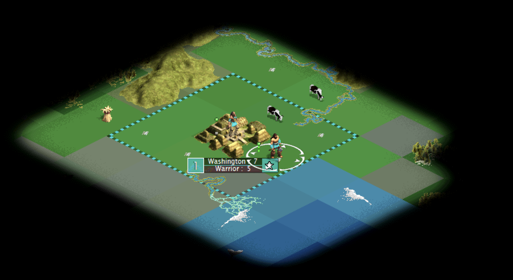
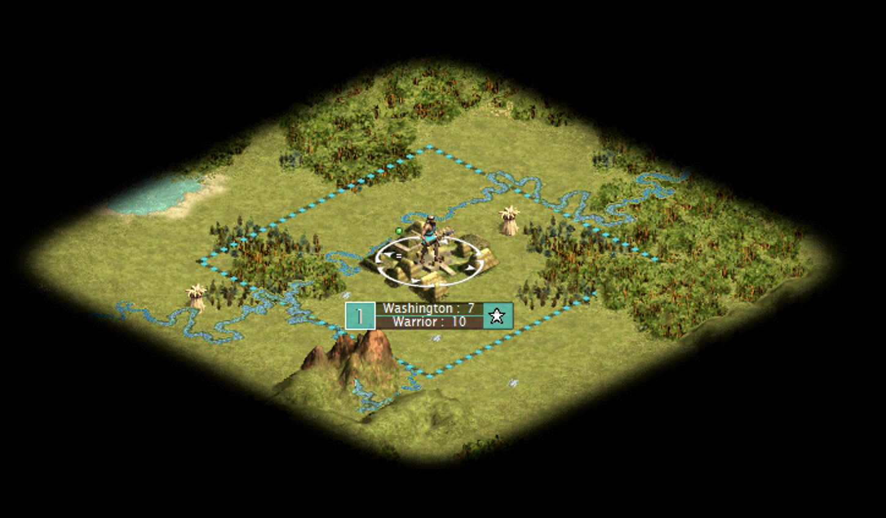
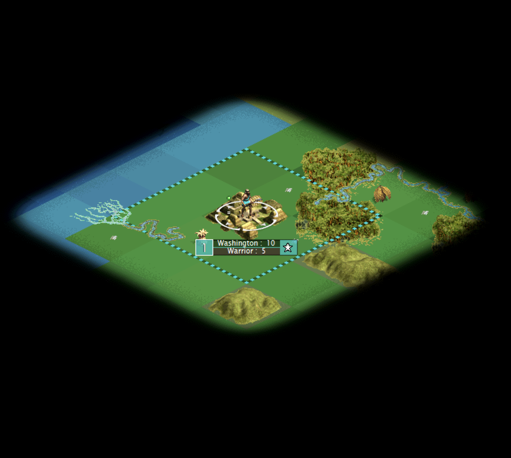

# M5.1 In-Game Evidence

## Configuration-On Capture

- Captured by the user from a live GOG Civ III Conquests session with `enable_custom_rendering = true`.
- Image dimensions: 1554 x 848.
- SHA-256: `A280A0923BA0E3156BF8D9EEA5309F051008C7C56E066FB1D4C45CC8B65886A1`.
- The native 32-bit renderer DLL compiled, loaded, rendered, read back, and composited without a crash.
- The flat diagnostic terrain diamonds follow Civ III's isometric anchors.
- Civ III mountains/terrain features, rivers, resources, borders, city art, unit art, selection ring, labels, fog, and surrounding UI remain visible above the replacement terrain.

The solid colors and hard per-tile transitions are intentional limitations of the first native bridge renderer, not its intended production art direction. Texture/material continuity, relief, water treatment, and terrain transitions remain M6 work.

## Configuration-Off Baseline

- Captured from the same test game with `enable_custom_rendering = false`.
- Image dimensions: 1448 x 848.
- SHA-256: `8AAC9066CF40E82CBE0DF92253FF761336945630B54012834622888A1EC8A987`.
- The map follows the normal textured Civ III terrain path with all normal retained content and fog composition.
- The injected branch returns through the original `m71` path before any renderer initialization or capture call.

## Configuration-On Scrolling Capture

- Captured after scrolling the camera with `enable_custom_rendering = true`.
- Image dimensions: 1438 x 1290.
- SHA-256: `D36A89AF14C51CB3D1B5C2ECD4E327DC962B2AC9231425ED2316F94F88A9EAD6`.
- Replacement terrain remains aligned after the viewport changes, demonstrating that anchors are recaptured per `m71` frame rather than inferred or reused.
- Rivers/coasts, forest/jungle, mountains/hills, resource and improvement art, borders, the city, unit, selection ring, labels, fog, and map bounds remain on their retained Civ III paths.
